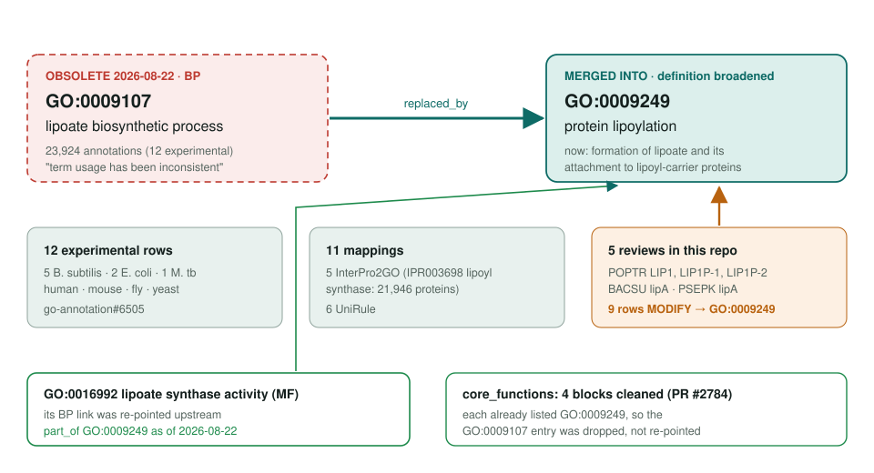
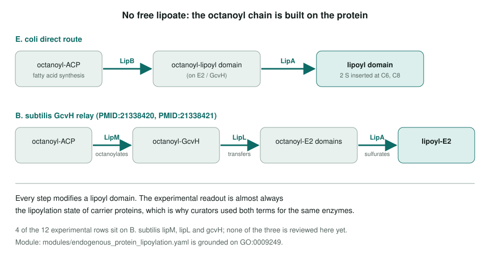

<!-- _class: lead -->

# Lipoate biosynthetic process: merged into protein lipoylation

GO:0009107 → GO:0009249 protein lipoylation (definition broadened)

AI Gene Review · projects/LIPOATE_BIOSYNTHESIS_OBSOLETION · 2026

---

<!-- _class: bluf -->

## Bottom line

- Lipoate is built **on the carrier protein**, so "lipoate biosynthesis" and "protein lipoylation" were the same reactions; GO **merged GO:0009107 into GO:0009249** on 2026-08-22.
- The merge touches **12 experimental rows** and **11 mappings** upstream, and **5 reviews** here: all **9 rows are MODIFY → GO:0009249** and 4 `core_functions` blocks were cleaned (PR #2784).
- **Open:** re-fetch GOA once obsolete GO:0009107 disappears from public GOA, and optionally review B. subtilis lipM / lipL / gcvH.

---

## Old term → merged term

---

## Why the terms collapsed

---

## Upstream impact

- **12 experimental annotations** (QuickGO, 2026-08-15): 5 *B. subtilis*, 2 *E. coli*, 1 *M. tuberculosis*, plus human LIPT2, mouse Lias, fly Las, yeast ACP1.
- **23,924 annotations** in total, most electronic via **IPR003698 lipoyl synthase** (21,946 proteins) and 4 other InterPro families, plus 6 UniRules.
- All 11 mappings redirect cleanly to GO:0009249; the MFs (e.g. GO:0016992) are mapped separately.
- 3 of the 12 rows use `acts_upstream_of_or_within` (E. coli lipA, lipB; mouse Lias) and may move to `involved_in`.

---

## What changed in this repo

| Review | Rows on GO:0009107 | Action | core_functions |
|---|---|---|---|
| POPTR/LIP1 | IBA, IEA | MODIFY → GO:0009249 | GO:0009107 dropped |
| POPTR/LIP1P-1 | IBA, IEA | MODIFY → GO:0009249 | GO:0009107 dropped |
| POPTR/LIP1P-2 | IBA, IEA | MODIFY → GO:0009249 | GO:0009107 dropped |
| BACSU/lipA | IEA, IGI (upstream item #2) | MODIFY → GO:0009249 | GO:0009107 dropped |
| PSEPK/lipA | IEA | MODIFY → GO:0009249 | none listed |

Each `core_functions` block already listed GO:0009249, so the fix was a deletion. 9 reviews carry GO:0009249; GcvH-family rows still need the substrate/relay check.

---

## Status and next steps

- **Done (2026-08-30, PR #2784):** 5 reviews migrated; `cache/ontologies/go.tsv` row refreshed to obsolete.
- **Done upstream:** **GO:0016992 lipoate synthase activity** is now `part_of GO:0009249`.
- **Open:** re-fetch GOA for the 5 genes once GOA reflects the merge.
- **Optional:** review *B. subtilis* **lipM, lipL, gcvH** (4 of the 12 experimental rows), the clearest case for the merge.

**Upstream:** go-annotation#6505 · go-ontology#32418
**Read more:** `projects/LIPOATE_BIOSYNTHESIS_OBSOLETION.md` · `modules/endogenous_protein_lipoylation.yaml`
