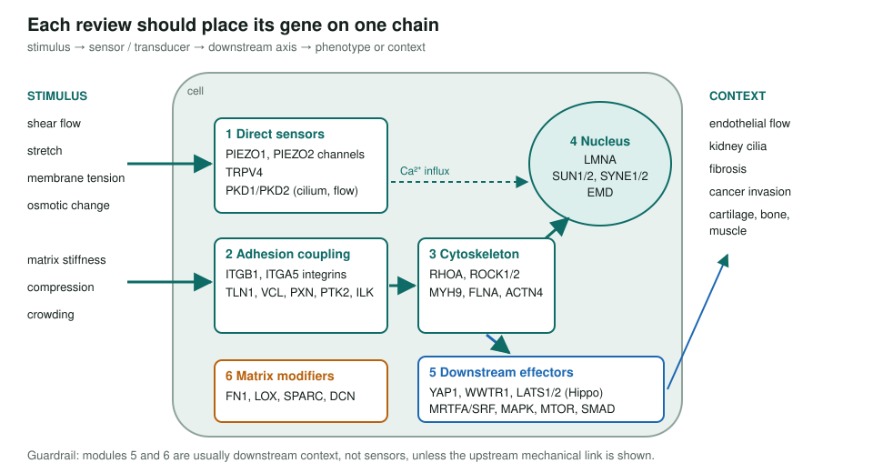
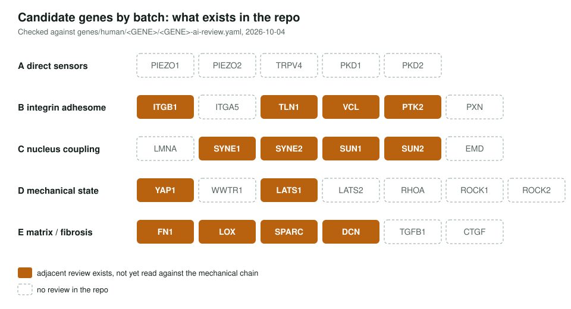

<!-- _class: lead -->

# Mechanobiology

Scoping a GO review of the genes that sense and transmit force

AI Gene Review · projects/MECHANOBIOLOGY · scoping · 2026

---

<!-- _class: bluf -->

## Bottom line

- Cells sense stiffness, shear, stretch and membrane tension through **PIEZO channels, integrin adhesions, the nuclear lamina and YAP/TAZ**; GO mixes true sensors with generic adhesion and ECM terms.
- The page defines **inclusion criteria, six modules and 30 candidate genes** in five batches, and a `stimulus → sensor → axis → phenotype` chain for every review.
- **Scoped, not started.** No Batch A–D gene has a review; four matrix genes (FN1, LOX, SPARC, DCN) were reviewed for other purposes.

---

## The landscape to review

---

## Why scope it this way

- Separate the **few direct sensors** from the many effectors and ECM genes.
- Watch for over-broad terms: `cell adhesion`, `ECM organization`, `actin binding`, `response to mechanical stimulus`.
- Prefer evidence from a **defined mechanical perturbation**, not a generic migration or adhesion assay.
- Use disease anchors (fibrosis, invasion, endothelial flow, kidney cilia) to pick batches, not to make claims.
- Adapted from [cmungall/stuff#671](https://github.com/cmungall/stuff/issues/671), minus the ontology and platform ambitions.

---

## Where the candidates stand

---

## Status and next steps

- ⬜ Batch A: PIEZO1, PIEZO2, TRPV4, PKD1, PKD2 (`just fetch-gene human <GENE>` then review).
- ⬜ Re-read FN1, LOX, SPARC, DCN against the mechanical-chain questions.
- ⬜ Batches B–D, then a stimulus / sensor / axis / phenotype summary table.
- ⬜ List recurring GO pain points only after several batches.

**Read more:** `projects/MECHANOBIOLOGY.md`
