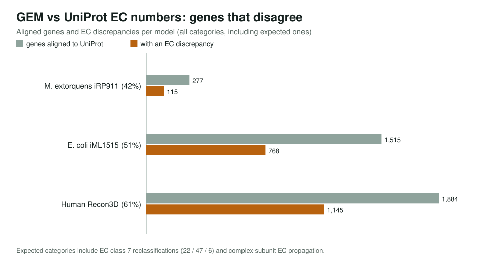
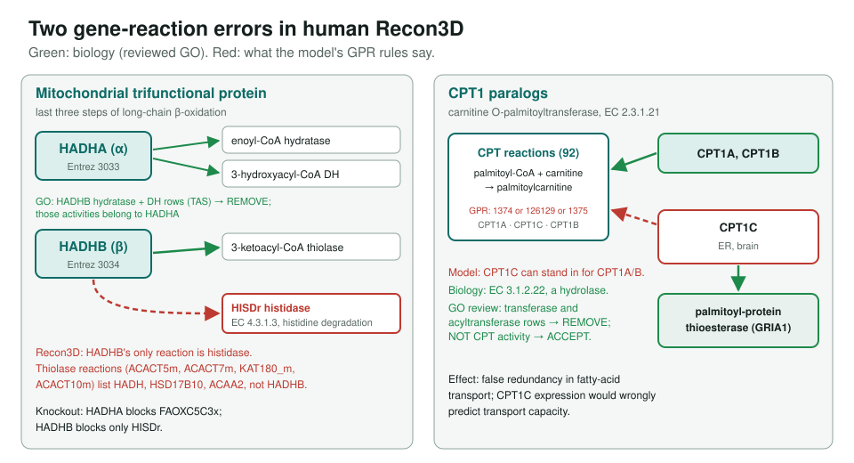

<!-- _class: lead -->

# Metabolic model analysis

Using genome-scale metabolic models to catch GO molecular-function errors

AI Gene Review · projects/METABOLIC_MODEL_ANALYSIS · 2026

---

<!-- _class: bluf -->

## Bottom line

- Compared EC numbers in **3 GEMs** (M. extorquens iRP911, E. coli iML1515, human Recon3D) with UniProt: **42 / 51 / 61%** of aligned genes disagree.
- Much is expected (EC class 7, complex-subunit EC propagation), but **8 gene reviews** found real errors on both sides.
- GO wrong: **mdcD** (7 rows removed), **ecm**, **HADHB**. Model wrong: **rbsD**, **glgX**, **HADHB**, **CPT1C**. FBA shows the errors matter.

---

## How often models and UniProt disagree

---

## Not every disagreement is an error

- **EC class 7** (translocases) was created in 2018; iRP911 is from 2011. Cytochrome c oxidase 1.9.3.1 → 7.1.1.9 is a reclassification.
- **Complex convention:** a GPR lists every subunit, so every EC of the complex lands on each gene. E. coli *lpd* picks up 10 ECs.
- So GEM gene→EC pairs must be **filtered** before they can validate GO MF terms.

---

## When UniProt and GO were wrong

| Gene (organism) | Model says | GO/UniProt said | Review |
|---|---|---|---|
| mdcD (*M. extorquens*) | 4.1.1.89 decarboxylase | 6.4.1.3 carboxylase (ligase) | 7 REMOVE; carboxy-lyase ACCEPT; malonate catabolism NEW |
| ecm (*M. extorquens*) | noEC (2011) | methylmalonyl-CoA mutase | MODIFY to GO:0016866 intramolecular transferase; no GO term for EC 5.4.99.63 yet |
| HADHB (human) | — | hydratase, dehydrogenase (TAS) | REMOVE: those are HADHA's |

mdcD shares 35% identity with an acetyl-CoA carboxylase subunit; one wrong EC cascaded into GO, keywords and family assignments.

---

## When the model was wrong

---

## FBA: do the errors matter?

| Test | Original model | Corrected / reality |
|---|---|---|
| E. coli *rbsD* KO on ribose | 100% growth (rbsD in transporter GPR) | 0% after adding the pyranase step |
| Recon3D HADHA KO, FAOXC5C3x | flux 1000 → 0 | essential, as expected |
| Recon3D HADHB KO | blocks only HISDr (histidase) | should block thiolase steps |

E. coli glgX was also wrong in iML1515: a debranching enzyme modelled as branching enzyme (2.4.1.18 vs 3.2.1.196).

---

## Status and next steps

- Reviews: `genes/METEA/{ecm,sucB,mdcD,gcvP}`, `genes/ECOLI/{rbsD,glgX}`, `genes/human/{HADHB,CPT1C}`.
- Open: *M. extorquens* mdcB, ilvC, purK; remaining Recon3D CLASS_CHANGE genes.
- Caveat: the `models/metabolic/` files and FBA scripts cited on the page are **not in this repository**.

**Read more:** `projects/METABOLIC_MODEL_ANALYSIS.md`
