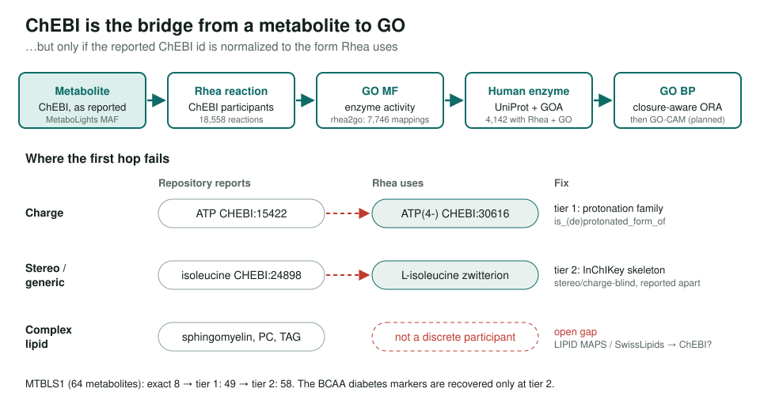
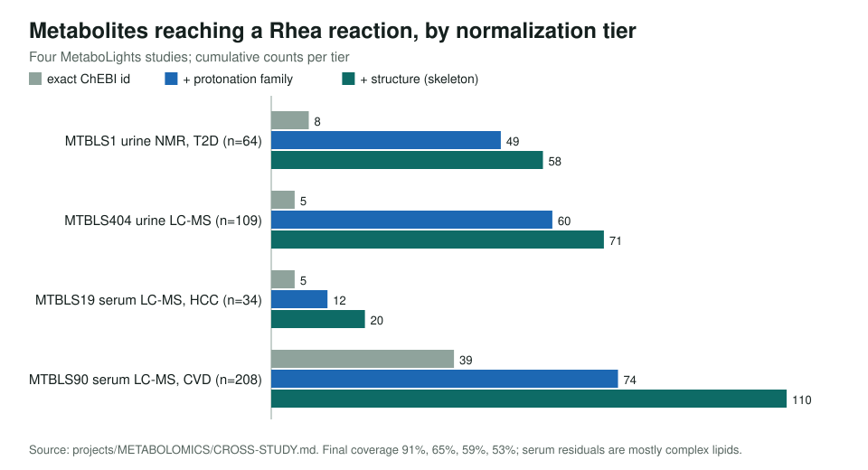

<!-- _class: lead -->

# Metabolomics with GO and GO-CAM

Bridging metabolite lists to GO functions and processes through ChEBI and Rhea

AI Gene Review · projects/METABOLOMICS · 2026

---

<!-- _class: bluf -->

## Bottom line

- A working bridge: **metabolite → Rhea → GO MF → human enzymes → GO BP**, with closure-aware enrichment.
- The obstacle is **identifiers**: exact ChEBI matching connects **8/64** MTBLS1 metabolites; protonation + structure normalization reaches **58/64**.
- Four MetaboLights studies: **53–91%** coverage, study-specific GO processes. Remaining lipid, Reactome, GO-CAM and demo work is tracked in #4125.

---

## Why GO is absent from metabolomics

- Standard interpretation: **KEGG / SMPDB** pathway ORA, MSEA, **mummichog** for untargeted MS (packaged in MetaboAnalyst).
- GO annotates **gene products**, so it says nothing about a list of ChEBI ids out of the box.
- But GO MF terms *are* enzyme activities, and Rhea reactions are written in ChEBI. ChEBI is the bridge.

---

## The bridge and where it breaks

---

## Normalization is decisive in every study

---

## What GO adds over KEGG (MTBLS1, same test)

| KEGG pathway | GO molecular function | GO biological process |
|---|---|---|
| Ala, Asp & Glu metabolism | amino-acid transaminase | amino acid metabolic process (4.3×, FDR 9e-44) |
| Citrate cycle (TCA) | L-/D-amino-acid oxidase | dicarboxylic acid metabolic process (6.0×) |
| Pyruvate metabolism | amino-acid racemase | amino acid transport (5–7×) |
| Nicotinate & nicotinamide | primary methylamine oxidase | proteinogenic amino acid metabolism (4.2×) |

Serum LC-MS study MTBLS90 instead returns lipid metabolic process (2.9×, FDR 3e-89). GO resolves specific activities and processes, not only pathway buckets.

---

## Status and next steps

- Done: probe pipeline (`projects/METABOLOMICS/probe/`), two-tier normalization, KEGG / GO-MF / GO-BP enrichment, 4 studies.
- Next: complex lipids (LIPID MAPS / SwissLipids); Reactome as a curated BP cross-check; GO-CAM causal trace (Approach B); feed implicated reactions to Reactome black-box gap filling.
- Planned: interactive demo (static showcase + Streamlit app), see `DEMO-PLAN.md`.

**Read more:** `projects/METABOLOMICS.md` · `projects/METABOLOMICS/CROSS-STUDY.md`
