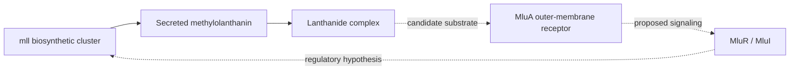

# Methylorubrum extorquens MLL Cluster Curation Project

The methylolanthanin cluster of *Methylorubrum extorquens* AM1 contributes to
lanthanide acquisition. The primary study established the secreted metallophore,
lanthanide binding, and cluster-level growth and bioaccumulation phenotypes.
Individual enzyme reactions, receptor specificity, and regulatory connections
remain partly inferred from homology and gene context.
[Primary study, PMID:39078674](https://pmc.ncbi.nlm.nih.gov/articles/PMC11317620/).

## Current Review Inventory

Snapshot: 2026-10-04, after the AM1 audit corrections. Status values are copied
from the review YAML, not inferred from the presence of a review or research file.
Annotation rows include proposed NEW annotations, not just imported GOA rows.

| Gene | UniProt | Review Status | Annotation Rows | Supported Or Predicted Role |
|------|---------|---------------|-----------------|-----------------------------|
| mllA | C5B1I4 | DRAFT | 2 | AsbA-like NIS synthetase |
| mllBC | C5B1I5 | DRAFT | 4 | AsbB-like NIS synthetase plus AsbC-like adenylation domain |
| mllDE | C5B1I6 | COMPLETE | 3 | AsbD-like aryl carrier protein plus AsbE-like ligase |
| mllF | C5B1I7 | INITIALIZED | 2 | AsbF-like biosynthetic protein; precise product assignment needs care |
| mllG | C5B1I8 | DRAFT | 0 | DUF2218 protein; no established molecular function |
| mllH | C5B1I9 | DRAFT | 2 | Putative acetyltransferase |
| mllJ | C5B1J0 | INITIALIZED | 1 | Ferritin-like DUF4142 protein, putatively periplasmic |
| mluA | C5B1I1 | DRAFT | 8 | Predicted TonB-dependent receptor; exact ligand unresolved |
| mluI | C5B1I3 | DRAFT | 6 | Predicted ECF sigma factor, META1p4131 |
| mluR | C5B1I2 | DRAFT | 2 | Putative sigma-factor regulator |

The primary paper's Table 1 distinguishes the MllBC and MllDE fusions and maps
mluI to META1p4131. These identities do not establish every reaction or regulatory
edge assigned by homology. In particular, MllG must not be described as an
experimentally characterized aldolase.

## Pathway Context

The established cluster-level sequence is biosynthesis of methylolanthanin,
secretion, and binding of lanthanides. The candidate receptor and regulatory
connections remain predictions; the diagram does not assign every reaction
to an individual Mll protein.

| Property | Siderophore Homologues | AM1 Methylolanthanin System |
|----------|------------------------|----------------------------|
| Metal relationship | Characterized examples support iron acquisition | Lanthanide binding is demonstrated; an additional iron role remains unresolved |
| Biosynthetic machinery | NRPS-independent synthetases and related domains | Homologous Mll proteins support pathway assignment, not every individual reaction |
| Uptake and signaling | TonB-dependent receptors can couple uptake to cell-surface signaling | MluA/MluR/MluI are candidate counterparts; exact ligand and interactions require testing |
| Metal-responsive regulation | Iron limitation commonly regulates siderophore systems | The mll promoter responds to iron and neodymium under the tested conditions |

This comparison follows the primary study's homology analysis and experiments,
not an assumption that lanthanide binding excludes iron biology.
[PMID:39078674](https://pmc.ncbi.nlm.nih.gov/articles/PMC11317620/).

## Annotation Decisions

The ten reviews contain 30 annotation rows:

| Action | Count |
|--------|-------|
| ACCEPT | 8 |
| KEEP_AS_NON_CORE | 5 |
| UNDECIDED | 5 |
| REMOVE | 1 |
| MODIFY | 3 |
| MARK_AS_OVER_ANNOTATED | 1 |
| NEW | 7 |

An unknown molecular function is left unassigned rather than represented by a
positive NAS annotation to the GO molecular-function root. MluA's ancillary
signaling annotation is not simultaneously included among its core functions.

## Metal Specificity

Methylolanthanin's lanthanide binding is established, but it does not prove
exclusive lanthanide specificity in vivo. The primary paper discusses possible
Fe/Ln biology and iron-responsive regulation. Iron-specific biosynthesis or
transport cannot be accepted merely because the proteins resemble siderophore
machinery, nor rejected merely because lanthanide involvement is demonstrated.

The iron-specific process assignments for MllA, MllBC, and MluA are therefore
UNDECIDED. MluA's over-specific transporter MFs are generalized to the supported
family-level transporter activity. Direct ligand and metal-transport measurements
are needed to settle substrate specificity.

## Ontology Proposals

The gene reviews retain proposed lanthanophore terms where justified. These are
proposals, not GO accessions. Do not invent identifiers for them.
A lanthanide process should not be placed under a cobalt-specific or toxin
process, and outer-membrane uptake into the periplasm must not be described as
plasma-membrane uptake into the cytosol.

## Remaining Experimental Questions

- Determine reactions and substrates of the individual Mll enzymes rather than
  inferring all steps from cluster deletion and product structure.
- Test whether methylolanthanin supports iron acquisition under defined conditions.
- Measure MluA ligand specificity and distinguish transport from signaling.
- Define MluI promoter targets and MluR regulation directly.
- Establish the functions of MllG and MllJ without treating domain names as assays.

## Audit And Follow-Up

The broader AM1 audit covers 51 reviews, not only this ten-gene cluster:
[baseline audit](../reports/METEA-AM1-audit-2026-10-04.yaml).
Corrections are tracked in [PR #4279](https://github.com/ai4curation/ai-gene-review/pull/4279),
[issue #4282](https://github.com/ai4curation/ai-gene-review/issues/4282), and
[issue #4284](https://github.com/ai4curation/ai-gene-review/issues/4284).
The older, broader [cluster follow-up #4126](https://github.com/ai4curation/ai-gene-review/issues/4126)
remains relevant to unresolved mechanistic work.

Historical project slides and the external brief linked in the metadata predate
these corrections; use the current YAML and primary literature for gene identities
and annotation decisions.
