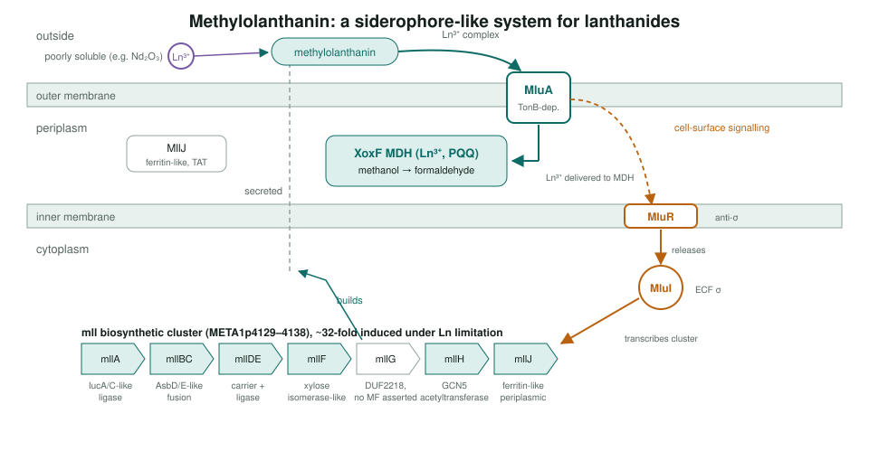
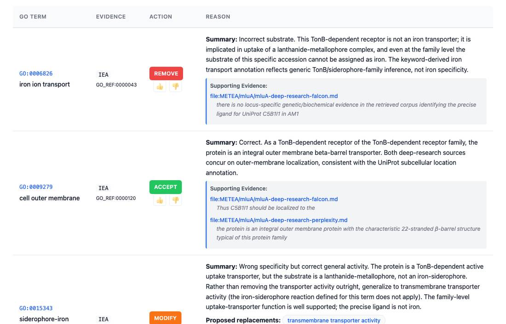

<!-- _class: lead -->

# The *mll* lanthanophore cluster

Re-annotating an "iron-siderophore" system in *Methylorubrum extorquens* AM1 as lanthanide acquisition

AI Gene Review · projects/METEA_MLL_CLUSTER · 2026

---

<!-- _class: bluf -->

## Bottom line

- The *mll* cluster makes and imports **methylolanthanin**, a lanthanide chelator that feeds the **XoxF methanol dehydrogenase**.
- Databases call it **iron-siderophore** machinery (homology to aerobactin and petrobactin genes). We reviewed all **10 genes** to replace that story.
- **31 rows**: iron-transport rows on MluA removed or generalised, 8 NEW rows for genes with little or no GOA; GO has **no lanthanophore term**, so one is proposed.

---

## How the system works

---

## Why it was misannotated

| Feature | Iron siderophores | Methylolanthanin |
|---|---|---|
| Metal | Fe³⁺ | La³⁺, Ce³⁺, Nd³⁺ ... |
| Induced by | iron limitation | lanthanide limitation (~32-fold) |
| Enzyme families | IucA/IucC, AsbD/AsbE | MllA (IucA-like), MllBC (AsbD/E-like) |
| Receptor | FepA, FpvA (TonB) | MluA (TonB) |
| Regulation | Fur | MluI / MluR (ECF σ / anti-σ) |

Homology to the iron enzymes is real; the substrate and product are not iron.

---

## Correcting MluA

mluA review: `iron ion transport` removed; `siderophore-iron transmembrane transporter activity` generalised to transmembrane transporter activity.

---

## What changed across 10 genes

| Action | Rows | Where |
|---|---|---|
| ACCEPT | 8 | acid-amino acid ligase (MllA, MllBC), outer membrane, sigma / anti-sigma |
| KEEP_AS_NON_CORE | 7 | e.g. MllA siderophore biosynthesis (analogous chemistry) |
| NEW | 8 | mllDE, mllF, mllJ had no GOA; one on mllH |
| REMOVE | 4 | 3 iron rows on MluA; wrong EC ligase on MllBC |
| MODIFY | 3 | 2 iron-transporter MF on MluA; MllH acyltransferase |
| MARK_AS_OVER_ANNOTATED | 1 | MluI generic TF activity |

mllG has no GOA and no molecular function asserted: DUF2218, and the only name is a machine prediction.

---

## Status and next steps

- ✅ 10/10 reviews exist; deep research from Perplexity and Falcon for each gene.
- ⬜ Review files are `DRAFT` or `INITIALIZED` except mllDE; six per-gene follow-ups plus mllF/mllG/mllJ finishing work are tracked in #4126.
- ⬜ Consolidate the **lanthanophore biosynthetic process** NTR; decide whether MluA can support a lanthanide-metallophore transport term.

**Read more:** `projects/METEA_MLL_CLUSTER.md` · `genes/METEA/mll*/` · `genes/METEA/mlu*/` · related: `projects/REE.md`
