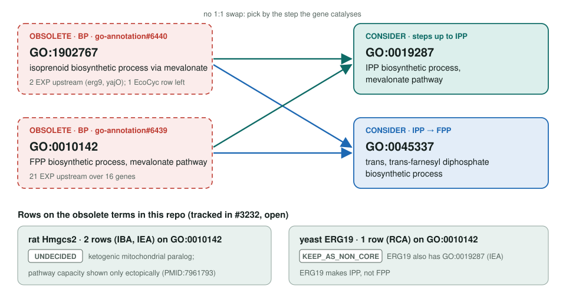
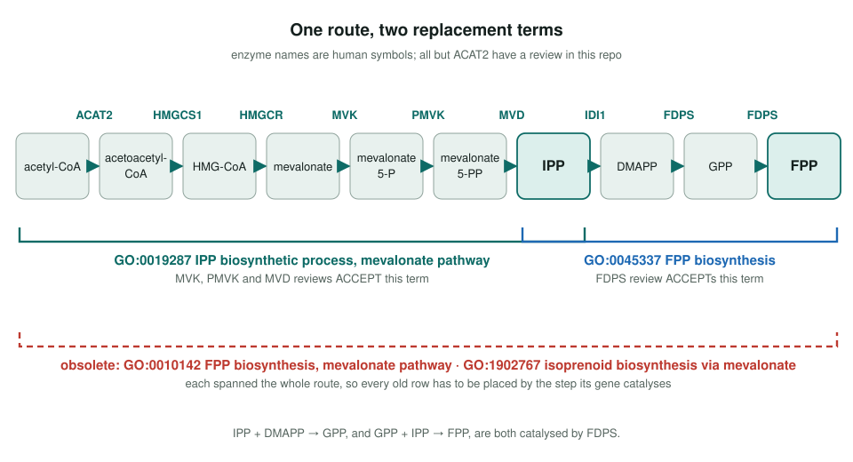

<!-- _class: lead -->

# Mevalonate pathway terms: obsoletion

GO:1902767 and GO:0010142 → GO:0019287 (to IPP) or GO:0045337 (IPP → FPP)

AI Gene Review · projects/MEVALONATE_PATHWAY_OBSOLETION · 2026

---

<!-- _class: bluf -->

## Bottom line

- GO **obsoleted two overlapping mevalonate-route terms**; each old row must go to **GO:0019287** or **GO:0045337** depending on the step the gene catalyses.
- The human pathway is now **reviewed here** (HMGCS1, HMGCR, MVK, PMVK, MVD, IDI1, FDPS; PRs #1998, #2153): MVK, PMVK, MVD accept GO:0019287 and FDPS accepts GO:0045337.
- **Last 3 rows fixed in #3232 (open):** yeast **ERG19** (1 RCA row) KEEP_AS_NON_CORE → **MODIFY to GO:0019287**; rat **Hmgcs2** (2 rows) stays **UNDECIDED** with the obsoletion noted.

---

## Old terms → replacements

---

## One route, two replacement terms

---

## Why it is a judgement, not a relabel

- Both obsolete terms covered the **whole route** from acetyl-CoA through mevalonate to FPP.
- The replacements split it at **IPP**: GO:0019287 for the upper steps, GO:0045337 for FDPS chemistry.
- A kinase or decarboxylase row belongs on GO:0019287; an FDPS row on GO:0045337; some genes may need both.
- Upstream lists: **2 EXP** on GO:1902767 (1 EcoCyc left), **21 EXP** on GO:0010142 across 16 genes.
- *E. coli* uses the MEP pathway, so the **yajO** row is a removal candidate, not a remap.

---

## What is in the repo

| Gene | Relevant rows | Action |
|---|---|---|
| human MVK, PMVK, MVD | GO:0019287 IBA + IEA | ACCEPT |
| human FDPS | GO:0045337 IBA + IEA | ACCEPT |
| human HMGCS1, HMGCR, IDI1 | reviewed; no row on either replacement | – |
| rat Hmgcs2 | GO:0010142 IBA + IEA | UNDECIDED (obsoletion noted; #3232, open) |
| yeast ERG19 | GO:0010142 RCA; GO:0019287 IEA | MODIFY → GO:0019287 (#3232, open); ACCEPT |

Modules: `modules/mevalonate_pathway.yaml` (grounded on GO:0019287) and `modules/isoprenoid_diphosphate_biosynthesis.yaml`.

---

## Status and next steps

- **2026-06-06:** project created; only rat Hmgcs2 then carried an obsolete-term row.
- **2026-07:** human pathway reviews and modules added (PRs #1998, #2153).
- **2026-09-26:** OLS lists **both terms obsolete**.
- **2026-09-26 (later):** ERG19 and Hmgcs2 rows settled in #3232 (open).
- Next: identify the remaining EcoCyc row (possibly yajO).

**Upstream:** go-annotation#6440, #6439 · go-ontology#32082
**Read more:** `projects/MEVALONATE_PATHWAY_OBSOLETION.md`
