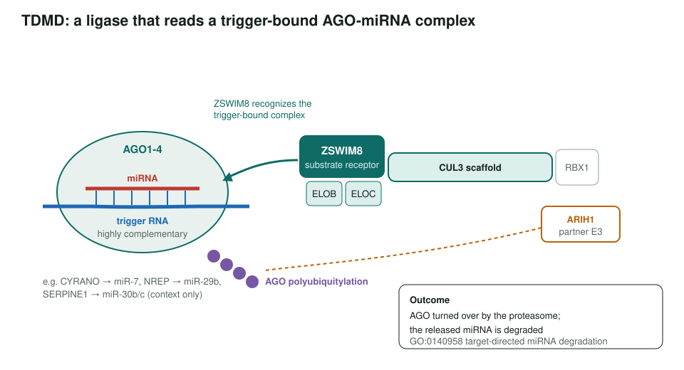
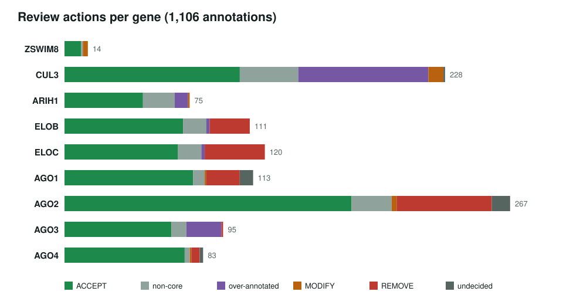
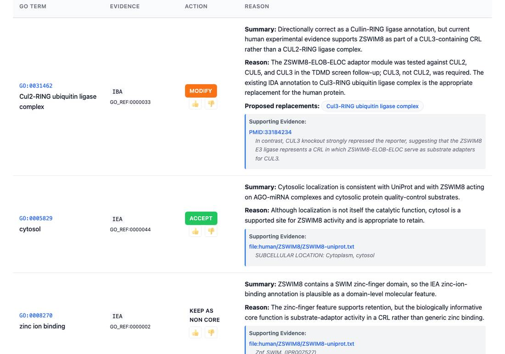

<!-- _class: lead -->

# Target-directed microRNA degradation

Reviewing the ZSWIM8 ligase axis and its Argonaute substrates

AI Gene Review · projects/MIRNA_DEGRADATION · 2026

---

<!-- _class: bluf -->

## Bottom line

- In **TDMD**, the **ZSWIM8–CUL3** ligase recognizes AGO-miRNA complexes bound to a highly complementary **trigger RNA** and ubiquitylates AGO, which leads to loss of the miRNA.
- We reviewed the **9 human proteins** of that layer (ZSWIM8, CUL3, ARIH1, ELOB, ELOC, AGO1–4): **1,106 annotations**.
- ZSWIM8 now points at **`GO:0140958` target-directed miRNA degradation** and a **Cul3**-RING complex; 139 of 143 removals are bare `protein binding` rows.

---

## The mechanism

---

## Scope: the dedicated protein layer only

- **In:** ZSWIM8, CUL3, ARIH1, ELOB, ELOC (the ligase) and AGO1–4 (the substrate layer).
- **Context, not reviewed:** trigger RNAs and trigger-bearing transcripts (CYRANO, NREP, SERPINE1, HSUR1, fly AGO1 mRNA).
- **Out:** miRNA biogenesis (DROSHA, DICER1…), effector repression (TNRC6, CCR4-NOT), generic CRL/proteasome parts, and the TUT4/7–DIS3L2 tailing branch.
- Aim: keep **core TDMD function** separate from generic silencing and ubiquitin biology.

---

## What the reviews concluded

---

## A TDMD-specific correction

ZSWIM8: the IBA Cul2-RING complex row is modified to Cul3-RING, because CUL3, not CUL2, was required in the TDMD screen follow-up (PMID:33184234).

---

## Key changes

- **ZSWIM8**: `positive regulation of miRNA catabolic process` (IDA ×2) → **`GO:0140958`** target-directed miRNA degradation; core MF `GO:1990756` ligase-substrate adaptor.
- **CUL3**: ligase and transferase activity rows → **`GO:0160072`** ubiquitin ligase complex scaffold activity; 78 rows over-annotated.
- **AGO4**: IBA **RNA endonuclease activity removed**, not supported as a physiological activity.
- **ELOB / ELOC**: 58 `protein binding` IPIs and two Pol II transcription-initiation rows, one per gene, removed.

---

## Status and next steps

- ✅ 9/9 human reviews exist; all are fully actioned; 6 are `COMPLETE`.
- ⬜ Finalize CUL3, AGO1 and AGO2 statuses.
- ⬜ Comparative fly / worm / mouse TDMD machinery.
- ⬜ Deferred: TUT4/TUT7–DIS3L2 branch; viral trigger subproject.
- ⬜ Track phase-2 decisions in ai4curation/ai-gene-review#4224.

**Read more:** `projects/MIRNA_DEGRADATION.md` · `projects/MIRNA_DEGRADATION/sources.md` · `genes/human/ZSWIM8/`
