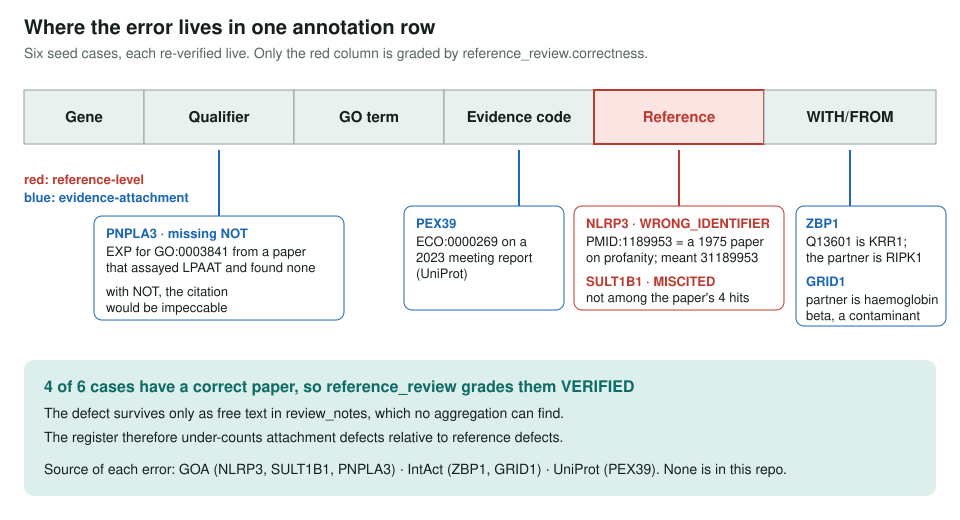
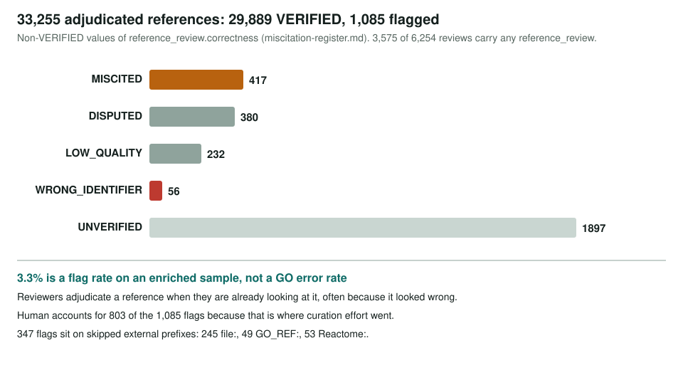

<!-- _class: lead -->

# Miscitations

Citations that resolve, match their title, quote verbatim, and are still wrong

AI Gene Review · projects/MISCITATIONS · 2026

---

<!-- _class: bluf -->

## Bottom line

- We aggregated every `reference_review` in the repo: **33,255** adjudicated references, **1,085 flagged** (3.3% of an enriched sample, not an error rate).
- Six seed cases re-verified live: **all six stand**, and all six errors live in **GOA, IntAct or UniProt**, not in this repo.
- **4 of 6** are defects in how a correct paper was **attached** (WITH/FROM, evidence code, missing `NOT`), and the schema has **no field** for that yet.

---

## Why the validators cannot see this

- **Check 1:** fetched title must match recorded title. A wrong PMID imported with its own title passes.
- **Check 2:** every quote must be verbatim in the cached paper. A verbatim quote can support the **opposite** conclusion.
- **Skipped prefixes:** `file:`, `GO_REF:`, `Reactome:` are not checked by the external snippet validator; **347 of 1,085** flags are on them.

So the flag is a manual judgement, recorded in `references[].reference_review.correctness`.

---

## Where the error lives

---

## NLRP3: a dropped digit

- Two IDA rows (`GO:0060090`, `GO:0030674`) cite **PMID:1189953**.
- That PMID is *"[Profanities and the profane person]"*, a 1975 psychiatry abstract.
- Intended: **PMID:31189953**, the 2019 NEK7-NLRP3 structure paper, already cited for five other NLRP3 rows.
- Live QuickGO returns the same two rows: current GOA, not a stale snapshot.

The review records the correct title for 1189953. Internally perfect, externally absurd.

---

## PNPLA3: the paper reports the negative

- GOA: `GO:0003841` LPAAT activity, **EXP** from PMID:21878620, no `NOT`.
- The paper assayed that exact reaction with a positive control:

> "Neither the wild-type nor mutant enzyme catalyzed transfer of oleic acid from oleoyl-CoA to glycerophosphate, lysophosphatidic acid, or diacylglycerol"

- The quote is verbatim, so check 2 passes; the annotation asserts the reverse of what was measured.

---

## What the register holds

---

## Patterns

- **A wrong identifier is rarely wrong once:** 27 of 56 `WRONG_IDENTIFIER` rows come from twelve PMIDs.
  - paralog spread: ELOVL1/ELOVL3 ← an ELOVL5 paper; NAA10/NAA40 ← a NAA60 paper
  - complex-partner spread: NPLOC4/UFD1, SERP1/SRPRB, UPF1/UPF2, CUL1/RBX1
- **Symbol collision:** ADPRH ← "ARH1" hypercholesterolaemia; BRIP1 ← transcription factor BACH1.
- **Not only PMIDs:** P2RX7 takes a localisation from a Reactome **P2X1** event.

---

## Status and next steps

- ✅ Aggregator, generated register and TSV; six seed cases verified and written up.
- ✅ Two-kind taxonomy: reference-level vs evidence-attachment miscitation.
- ⬜ **Decide where attachment defects go** (per-annotation flag, `FindingReviewStatusEnum`, or an `evidence_review` slot).
- ⬜ Triage 417 `MISCITED` + 56 `WRONG_IDENTIFIER`; neighbour sweep on recurring PMIDs.
- ⬜ Track schema and upstream-reporting follow-ups in ai4curation/ai-gene-review#4225.

**Read more:** `projects/MISCITATIONS.md` · `MISCITATIONS/miscitation-register.md` · sibling `projects/MISCITATION_AUDIT.md`
