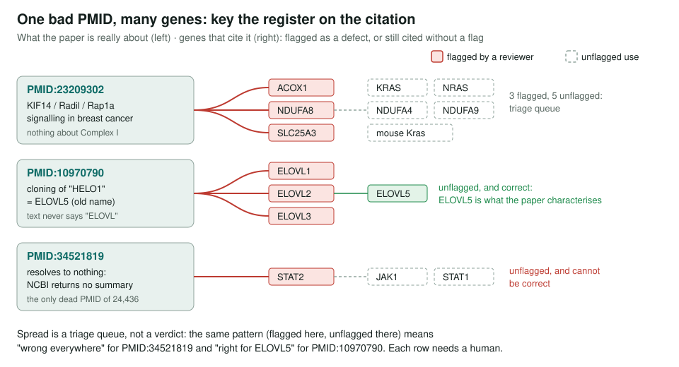
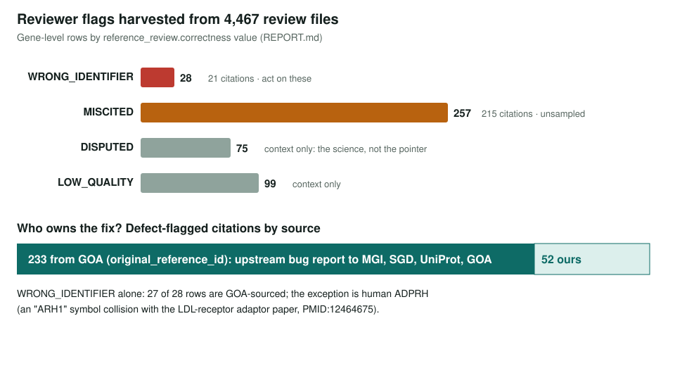

<!-- _class: lead -->

# Miscitation Audit

A register of GO citations that resolve to the wrong paper, keyed on the citation

AI Gene Review · projects/MISCITATION_AUDIT · 2026

---

<!-- _class: bluf -->

## Bottom line

- Reviewers had flagged wrong-paper citations **one gene at a time**; nobody had aggregated them.
- `harvest_citations.py` now collects every flag across **5,625 reviews**: **45 `WRONG_IDENTIFIER` rows on 35 citations**, 9 carry that flag on more than one gene, plus **360 `MISCITED`** rows not yet precision-checked.
- **344 of 405** wrong-paper or miscited rows came from GOA, so the real deliverable is **upstream bug reports**, which are **not filed yet**.

---

## Why the validators cannot see this

- CI checks that the **title matches the PMID** and that each quote is **verbatim in the cached paper**.
- A wrong PMID imported **together with its own title** passes both.
- Example: MGI's `protein farnesylation` IDA on yeast **COX17** cites **PMID:8078902**, the cloning of **COX10** (one digit away). The term is wrong even for COX10, which farnesylates heme, not protein.
- Only a human reading the paper catches it, and that judgement lives in `reference_review.correctness`.

---

## Key on the citation, not the gene

---

## What the register holds

---

## Failure modes seen so far

| Mode | Example |
|---|---|
| Off-by-one gene symbol | COX17 ← a COX10 paper |
| Paralog substitution | ELOVL1/ELOVL3 ← an ELOVL5 paper; NAA10/NAA40 ← a NAA60 paper |
| Gene-symbol collision | ADPRH ← an "ARH1" hypercholesterolaemia paper; BRIP1 ← a BACH1 paper |
| Wholly unrelated paper | DICDI gbpC ← a *Legionella* SidC study; TIM9/TIM10 ← colorectal surgery |
| Identifier resolves to nothing | `PMID:34521819`; `PMID:33831160` |
| Wrong organism or subject | DROME insc ← a review of zebrafish cardiac development |

---

## Two detectors for unflagged defects

**Check A now finds 2 of 33,167** cited PMIDs dead: `PMID:33831160` on CYP71A12/CYP71A13 and `PMID:34521819` on STAT2/JAK1/STAT1. Should run in CI.

**Check B: paralog mismatch.** Opt-in and low precision, recorded so nobody rebuilds it as a literal symbol matcher.
- Misses ELOVL: the paper says "HELO1", never "ELOVL".
- Hits are dominated by legitimate complex-wide papers (ESCRT, Complex I, PEX, EMC).

---

## Status and next steps

- ✅ Register and anomaly detectors built; reports in `projects/MISCITATION_AUDIT/reports/`.
- ⬜ Adjudicate 30 unflagged uses of 10 spreading citations.
- ⬜ File 41 GOA-sourced `WRONG_IDENTIFIER` rows upstream per database.
- ⬜ Fix 4 review-only wrong IDs; put Check A in CI; track shared work in #4225/#1415.
- Sibling project: `projects/MISCITATIONS.md` (taxonomy and seed cases).

**Read more:** `projects/MISCITATION_AUDIT.md` · `MISCITATION_AUDIT/reports/REPORT.md` · `harvest_citations.py`
