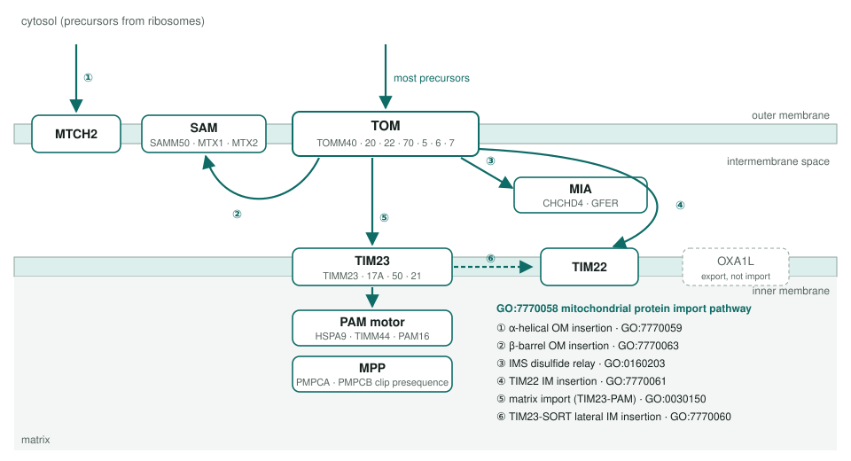
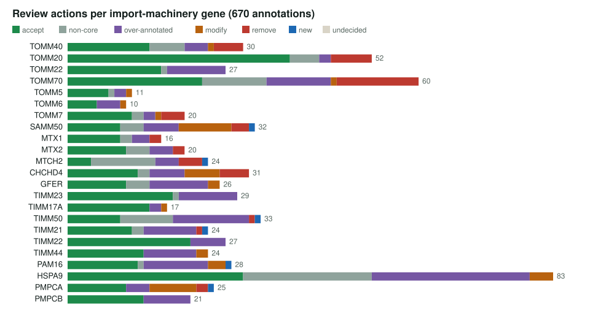
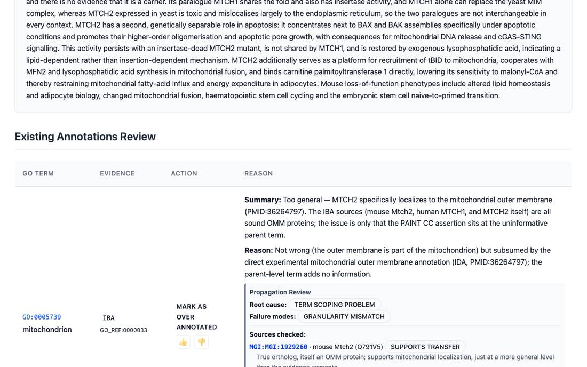

<!-- _class: lead -->

# Mitochondrial import pathways

One GO process term per import route, and a review of the human import machinery

AI Gene Review · projects/MITOCHONDRIAL_IMPORT_PATHWAYS · 2026

---

<!-- _class: bluf -->

## Bottom line

- Mitochondrial proteins reach their compartment by **six import routes**, but GO grouped them inconsistently; **GO issue #31711** proposed one term per route.
- GO has **added the route terms** (`GO:7770058`–`GO:7770063`) and reworded `GO:0030150` and `GO:0160203`.
- We reviewed **670 annotations on 23 human genes** of the machinery; only **MTCH2** yet carries a new route term.

---

## Six routes, six terms

---

## Why this project

- GO-CAM models of import need **one process per route**, so that TOM → SAM and TOM → TIM23 → PAM are not the same step.
- Old terms mixed **destination** and **machinery**, and grouping terms (e.g. `GO:0070585` protein localization to mitochondrion) collected annotations that belong to a specific route.
- Reviewing the machinery shows which annotations would move to the new terms.

---

## Actions per gene

---

## Findings

1. **`protein binding` IPI** rows removed on TOMM70 (11), CHCHD4 (5), TOMM40 (3), MTCH2 (3).
2. **Localization refined**: SAMM50 *mitochondrion* → *mitochondrial outer membrane*; PMPCA → *mitochondrial matrix*.
3. **Wrong route**: SAMM50 *protein import into mitochondrial matrix* → *protein insertion into mitochondrial outer membrane*.
4. **CHCHD4** *protein-disulfide reductase* → *disulfide oxidoreductase activity*: MIA40 oxidises its substrates.
5. **MTCH2** gains NEW `GO:7770059` α-helical OM insertion, matching MTCH1 and yeast MIM1.

---

## What a review looks like

MTCH2 review: the IBA <em>mitochondrion</em> row is marked over-annotated because the direct outer-membrane annotation says more; the propagation review records why.

---

## Status and next steps

- ✅ Issue #31711 read; 23 priority genes fetched and reviewed (the page checklist predated most of them).
- ✅ GO added the route terms and reworded the matrix and IMS terms.
- ⬜ Move reviews onto the new terms: TIMM22 → `GO:7770061`, SAMM50/MTX → `GO:7770063`, TIMM21 → `GO:7770060`.
- ⬜ Two grouping terms proposed for obsoletion, `GO:0070585` and `GO:0072656`, are still live in GO.

**Read more:** `projects/MITOCHONDRIAL_IMPORT_PATHWAYS.md` · `genes/human/<GENE>/`
