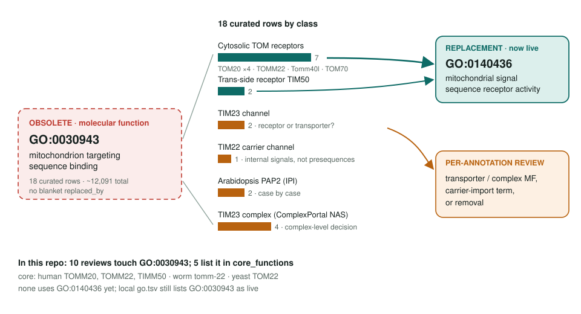
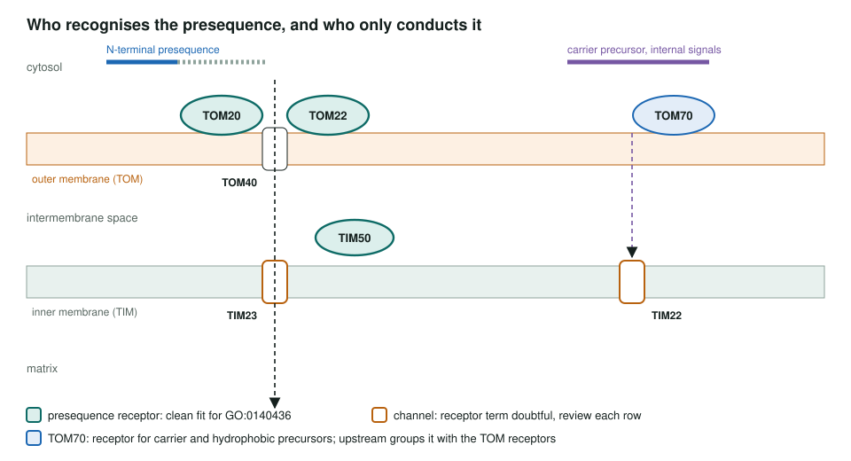

<!-- _class: lead -->

# Mitochondrion targeting sequence binding: obsoletion

GO:0030943 → GO:0140436 mitochondrial signal sequence receptor activity, row by row

AI Gene Review · projects/MITOCHONDRION_TARGETING_SEQUENCE_BINDING_OBSOLETION · 2026

---

<!-- _class: bluf -->

## Bottom line

- GO **obsoleted GO:0030943**; the receptor term the project waited for now exists as **GO:0140436** (OLS, 2026-09-26).
- Only some of the **18 curated rows** are true presequence receptors (TOM20/22, likely TIM50); channels, a plant protein and the TIM23 complex need individual calls.
- **10 reviews** here touch the old term, **5 in `core_functions`**. Remapping done in **#3234**: receptors → **GO:0140436**, channels TOMM40 and TIM22 → **GO:0008320**.

---

## Old term → replacement, by class

---

## Receptors versus channels

---

## Why no blanket replaced_by

- **TOM20 / TOM22** read the amphipathic presequence on the cytosolic face: a receptor, a clean fit.
- **TIM50** hands the presequence to TIM23 in the intermembrane space: receptor-like.
- **TIM23** is the channel: receptor MF, or a transporter feeding the import process?
- **TIM22** imports carriers with **internal** signals, not presequences.
- **PAP2** (Arabidopsis, IPI) and the **TIM23 complex** records need case-by-case calls.
- About **12,091** IEA/IBA rows sit on the term; pipelines will need reseeding.

---

## The 10 reviews that touch GO:0030943: before and after #3234

| Review | Rows on GO:0030943 | Before | After #3234 |
|---|---|---|---|
| human TOMM20 | IDA, IBA; replacement target | ACCEPT | MODIFY → GO:0140436 |
| human TOMM22 | IDA | ACCEPT | MODIFY → GO:0140436 |
| human TOMM70 | IBA, ISS | ACCEPT | MODIFY → GO:0140436 |
| human TIMM50 | NAS | NEW | NEW on GO:0140436 |
| worm tomm-22 | ISS | NEW | NEW on GO:0140436 |
| yeast TOM22 | none (core MF) | | NEW on GO:0140436 |
| human TOMM40 | IBA | ACCEPT | MODIFY → GO:0008320 |
| yeast TIM22 | IDA, IBA | ACCEPT | MODIFY → GO:0008320 |
| human TIMM22 | IBA | MARK_AS_OVER_ANNOTATED | MODIFY → GO:0008320 |
| yeast ACL4 | IBA | UNDECIDED | UNDECIDED, no replacement |

Core MFs of TOMM20, TOMM22, TIMM50, tomm-22 and TOM22 now use GO:0140436.

---

## Status and next steps

- **2026-05-28:** project created; the replacement term was not yet in OLS.
- **2026-09-26:** GO:0030943 obsolete, **GO:0140436 live**. Local `cache/ontologies/go.tsv` still lists the old term as live, so validation is quiet.
- **#3234:** MODIFY pass across all ten reviews: receptors → GO:0140436, channels → GO:0008320, ACL4 left UNDECIDED.
- Next: upstream PAP2 and TIM23-complex rows are for GO curators.
- Coordinate with the **MITOCHONDRIAL_IMPORT_PATHWAYS** project.

**Upstream:** go-annotation#6437 · go-ontology#32142 · #31711
**Read more:** `projects/MITOCHONDRION_TARGETING_SEQUENCE_BINDING_OBSOLETION.md`
