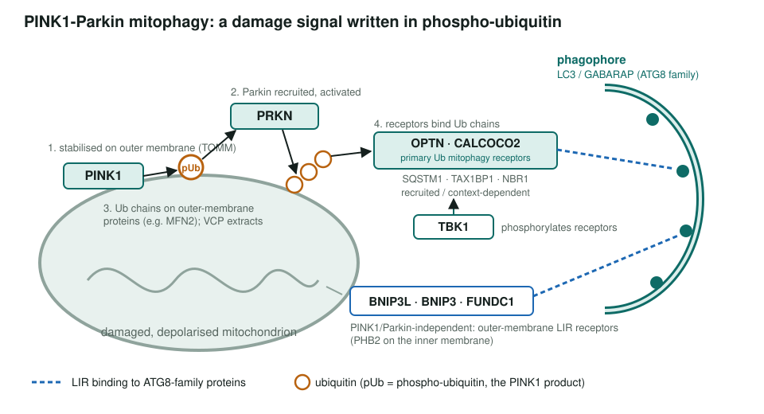
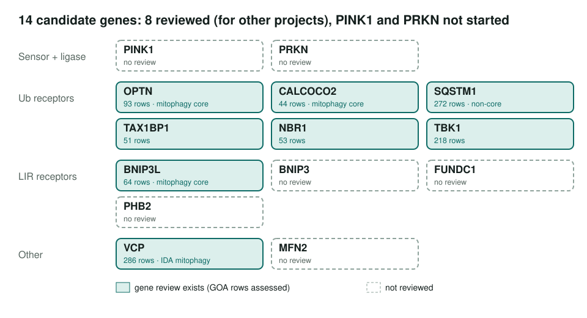

<!-- _class: lead -->

# PINK1-Parkin mitophagy

Selective autophagy of damaged mitochondria in human: a scoped project

AI Gene Review · projects/MITOPHAGY · SCOPING · 2026

---

<!-- _class: bluf -->

## Bottom line

- **Scoped; kinase/E3 center still missing.** No mitophagy module; **PINK1 and PRKN are not reviewed**.
- **8 of 14 listed candidates** already have reviews made for other projects (mostly Proteostasis).
- Those reviews make mitophagy **core** for OPTN, CALCOCO2, BNIP3L and VCP and **non-core** for SQSTM1.

---

## The pathway

Schematic from the pathway architecture on the project page.

---

## Why this is worth doing

- The best-characterised mitophagy pathway, with **Parkinson's disease** (PINK1, PRKN) and **ALS** (OPTN, TBK1) genetics.
- Receptors are shared with xenophagy and aggrephagy, so **which selective-autophagy process is core** is the real curation question.
- A worm counterpart, **CAEEL_MITOPHAGY**, is already mature and could be compared ortholog by ortholog.

---

## Where the candidate genes stand

---

## What the existing reviews say about mitophagy

| Gene | Mitophagy row | Evidence | Action |
|---|---|---|---|
| OPTN | GO:0061734 type 2 mitophagy | IMP | ACCEPT |
| CALCOCO2 | GO:0000423 mitophagy | IMP | NEW |
| SQSTM1 | GO:0000423 mitophagy | IGI, IBA | KEEP_AS_NON_CORE |
| BNIP3L | GO:1901524 regulation of mitophagy | IEA | ACCEPT |
| VCP | GO:0000423 mitophagy | IDA | ACCEPT |

---

## Next steps

1. `just fetch-gene human PINK1` and `PRKN`; review them first.
2. Review BNIP3, FUNDC1, PHB2 and MFN2.
3. Build a PINK1-Parkin mitophagy module from the reviewed genes, checking against the worm project.

**Read more:** `projects/MITOPHAGY.md` · `genes/human/OPTN/` · `projects/CAEEL_MITOPHAGY.md`
