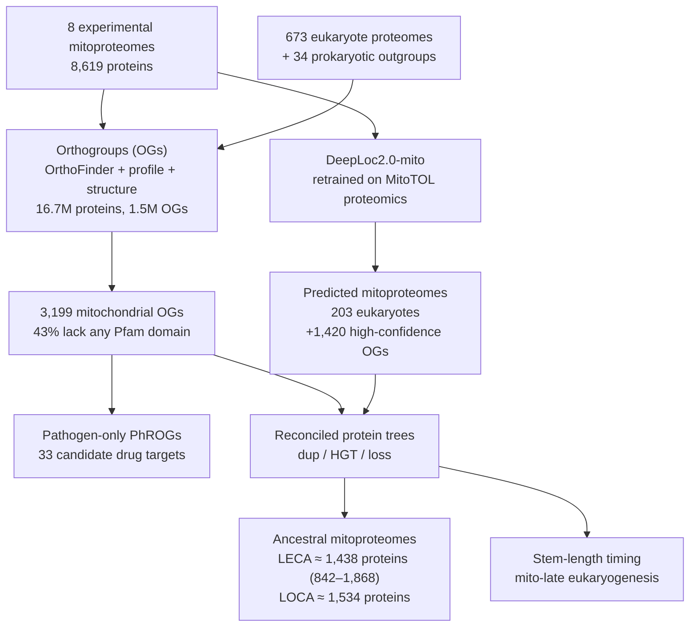

# MitoTOL: Mitochondrial Proteomes Across the Tree of Life

**Bottom line:** Chen et al. (Cell 2026, [PMID:42822426](https://pubmed.ncbi.nlm.nih.gov/42822426/))
take eight experimentally defined mitoproteomes (human, yeast, *Arabidopsis*, *Acanthamoeba*,
*Giardia*, *Trypanosoma*, *Leishmania*, *Babesia*) and place them on a phylogeny of 673
eukaryotes and 34 prokaryotic outgroups. From this they reconstruct a mitochondrion in the last
eukaryotic common ancestor (LECA) of about 1,438 proteins, with 70% of human mitochondrial
proteins tracing back to it, and nominate 33 mitochondrial protein families that are shared by
protozoan pathogens and absent from humans. For this repository the paper is a **comparative and
computational** resource. Its predicted localizations are hypotheses, not annotation evidence.
What it is good for is checking where an IBA "mitochondrion" (or a mitochondrial pathway term)
can and cannot be inherited: which mitochondrial systems are ancestral, which were gained in
animals, and which were lost in human or yeast. The experimental proteomes behind it are in five
companion MitoTOL papers, which are where any HDA-grade evidence for protist mitochondria lives.
Eight genes chosen from the paper have now been reviewed: human **FH**, **CRLS1** and **CLPP**
(the human halves of three of the paper's non-homologous enzyme pairs), yeast **NDI1** (NDH2), and
the four yeast **ERMES** subunits. All eight passed the lineage-loss and same-activity checks below.
The paper is cited in each review as evolutionary context only.

## The paper

> Chen MZ, Stefely JA, Bardon EG, MitoCarta Tree of Life Consortium, Calvo SE, Mootha VK.
> *Comparative analysis of mitochondrial proteomes across the tree of life.* Cell 189(20):6285–6306
> (2026). [doi:10.1016/j.cell.2026.08.029](https://doi.org/10.1016/j.cell.2026.08.029). Open access
> (CC BY).

Cached as `publications/PMID_42822426.md`. PubMed only had the abstract, so the full text
(summary, main text, limitations and methods) was added from the publisher PDF, tagged
`full_text_provider: user_upload`. `supporting_text` quotes from it can therefore be
machine-verified.

Code is at [michaelzhuchen/mito-evolution](https://github.com/michaelzhuchen/mito-evolution) and
data at [Zenodo 17823713](https://doi.org/10.5281/zenodo.17823713). The data archive is ~3.8 GB
(plus tens of GB of trees), so it is **not** mirrored here. Mitoproteome inventories are served at
[mitocarta.org](https://mitocarta.org/).

### Companion MitoTOL papers (the experimental proteomes)

| Organism | Reference | DOI |
|---|---|---|
| *Arabidopsis* (protein correlation profiling) | Kim et al., Cell 2026 | [10.1016/j.cell.2026.08.027](https://doi.org/10.1016/j.cell.2026.08.027) |
| *Acanthamoeba* (aerobic and anaerobic pathways, O₂-regulated) | Stefely et al., Cell 2026 | [10.1016/j.cell.2026.08.056](https://doi.org/10.1016/j.cell.2026.08.056) |
| *Babesia divergens* | Betsinger et al., Curr Biol 2026 | [10.1016/j.cub.2026.08.072](https://doi.org/10.1016/j.cub.2026.08.072) |
| *Giardia* (mitochondrion-related organelle) | Goyal et al., Curr Biol 2026 | [10.1016/j.cub.2026.07.074](https://doi.org/10.1016/j.cub.2026.07.074) |
| Kinetoplastids (*T. brucei*, *L. tarentolae*) | Vacas et al., Mol Cell 2026 | [10.1016/j.molcel.2026.08.032](https://doi.org/10.1016/j.molcel.2026.08.032) |

The human and yeast inventories are MitoCarta3.0 ([PMID:33174596](https://pubmed.ncbi.nlm.nih.gov/33174596/))
and the yeast high-confidence proteome of Morgenstern et al. These companion papers are not cached
here yet. They, not Chen et al., would back a `mitochondrion` annotation for a protist protein.

## What the paper did

| Result | Number |
|---|---|
| Experimentally defined mitochondrial proteins (8 species) | 8,619 in 3,199 OGs |
| Mitoproteome size range | 59 (*Giardia*) to 1,666 (*Trypanosoma*) |
| Universally conserved mitochondrial OGs | 13 (ISC pathway, protein import) |
| Shared by all except *Giardia* | 132 (solute transport, mitoribosome, TCA, complexes II–V) |
| Mitochondrial OGs seen in one clade only | 2,278 (71%), but 1,265 of these are not powered to detect outgroup homologs |
| Mitochondrial OGs with no Pfam domain | 1,381 (43%); 384 powered, so plausibly truly novel families |
| Human mitochondrial OGs shared with another mitoproteome | 660 of 852 (77%) |
| Candidate pan-pathogen targets absent in humans | 33 (13 of 17 with a *P. knowlesi* homolog are essential) |
| Additional predicted mitochondrial OGs (203 eukaryotes) | 1,420 high-confidence |
| Human mitochondrial proteins derived from LECA mitochondria | 790 of 1,135 (~70%) |
| Human mitochondrial disease genes derived from LECA mitochondria | 205 of 266 (~77%) |

## Curation implications

### 1. Predictions are not annotation evidence

DeepLoc2.0-mito predictions, and ancestral localizations inferred on reconciled trees, are
computational. As with [MitoMatch](MITO_INTERACTOME.md):

- **Never write a DeepLoc2.0-mito call or an ancestral-reconstruction inference into
  `existing_annotations`.** If worth recording, it goes in `GENE-predictions-review.yaml` (source:
  DeepLoc2.0-mito) or a bioinformatics `RESULTS.md`.
- The training set is deliberately restricted to experimental proteomics "to avoid circularity",
  and the authors filter predictions to OGs predicted mitochondrial in at least 5 of 203 species
  because rarer calls were enriched in false positives. Any single-protein call should be read
  with that threshold in mind.
- The experimental proteomes in the companion papers are a different matter. A mitochondrial
  protein from those inventories is HDA-grade evidence for the protist protein itself. It is
  not evidence for its human or yeast homolog.

### 2. Where IBA "mitochondrion" can be inherited, and where it cannot

An IBA asserts that a PAINT curator placed the function at an ancestral node (see the IBA section
of `CLAUDE.md`). This paper gives an independent, proteome-scale estimate of which mitochondrial
systems are ancestral, which makes it a useful check on node placement.

- **Deep placements are expected for core systems.** The human pathways with the highest LECA
  share are translation factors, ISC, TCA cycle, solute transport, protein import and sorting,
  OXPHOS and the mitoribosome. An IBA `mitochondrion` or pathway term from a LECA-level node for
  these is consistent with the paper.
- **Animal-gained systems should not carry pan-eukaryotic mitochondrial nodes.** Apoptosis,
  fission, mitophagy, immune response and organelle contact sites have only a small LECA share,
  and 192 human mitochondrial OGs are Metazoa-specific. An IBA that puts a mitochondrial term for
  one of these on a node above Metazoa (or Opisthokonta) is worth checking.
- **Known lineage losses** (Figure 5B) give testable predictions for propagation errors:

  | Lost in | Systems | Wrong if annotated by inheritance |
  |---|---|---|
  | Human | NDH2, ERMES, AOX, γ-carbonic anhydrase subunit of complex I | ERMES complex (GO:0032865) or alternative oxidase activity on a human gene |
  | *S. cerevisiae* | Complex I, calcium uniporter (MCU), mitochondrial β-oxidation | Complex I or uniporter complex terms on a yeast gene |
  | Both | AOX (present in LOCA) | — |

  **Checked against the cached GOA files in this repo (2026-10-03):** no human gene carries
  GO:0032865 ERMES complex; GO:1990246 uniporter complex appears only on human MICU1; GO:0045271
  respiratory chain complex I and GO:0003954 NADH dehydrogenase activity appear only on human,
  mouse, bacterial and plant (chloroplast *ndh*) genes, never on a yeast gene. So none of the
  predicted propagation errors is present among the genes reviewed so far. This should be
  re-checked as yeast coverage grows.

### 3. Same activity, unrelated families

LECA had several pairs of non-homologous enzymes with the same activity, which were later lost in
complementary patterns:

| Activity | Human form | Pathogen-only form (candidate target) |
|---|---|---|
| Fumarate hydratase | Class II FH (iron-independent) | Class I FH ([4Fe–4S], O₂-sensitive) |
| Cardiolipin synthase | CDP-type (CRLS1) | PLD-type CLS |
| Mitochondrial ATP-dependent protease | ClpXP (CLPX/CLPP) | ClpYQ (HslUV) |

Two consequences for curation:

- An MF term such as fumarate hydratase activity is correct for both members of a pair, but any
  family-based transfer (InterPro2GO, PANTHER) is only valid within one family. A protist protein
  annotated "fumarate hydratase" should be checked for which class it is before its other
  properties (cofactor, O₂ sensitivity) are assumed.
- "Absent in humans" in this paper means **the family** is absent, not the activity. The
  Discussion lists "CCA-adding enzyme" among LECA mitochondrial proteins absent from humans, but
  human TRNT1 provides CCA addition in mitochondria. This is presumably a PhROG-level distinction
  (a separate lineage of the enzyme), not a claim that human mitochondria lack the activity. A
  review should not cite this paper for the latter.

### 4. "Lineage-specific" and "unknown" need power estimates

Most single-clade mitochondrial OGs (56%) were not powered to detect outgroup homologs, so they may
be remote homologs rather than innovations. When a review says a mitochondrial protein is
"lineage-specific" or "has no homologs outside X", it should say whether detection power was
assessed. The 384 powered, Pfam-less OGs (Table S2) are the paper's best list of real unknown
mitochondrial families.

### 5. GO annotations were an input to the paper

To time cellular components (Figure 7D), the authors assigned GO cellular component terms to
ancestral PhROGs from "the literature/curation-based GO annotations of its extant descendants",
weighted per species. The mito-late conclusion (mitochondria acquired after the nucleus,
proteasome, cytoskeleton, Golgi and ER, at a similar time to peroxisomes) therefore rests partly on
GO CC curation quality. Over-annotated CC terms in well-studied species feed into this kind of
analysis directly.

## Genes in this repository touched by the paper

Already reviewed here and discussed in the paper or its LECA model (Figure 6C):

| Gene | Relevance in this paper |
|---|---|
| ATAD3A | Recovered in LECA mitochondria; named as a disease gene with conserved function back to LECA |
| MICU1 | Calcium uniporter and EF-hand proteins recovered in LECA; calcium handling proposed as ancestral |
| TOMM40, SAMM50 | Among the most conserved OGs across mtDNA-lacking lineages; homologs found in *Skoliomonas litria*, suggesting it retains a reduced organelle |
| SLC25A4 | SLC25 carrier family is a pre-LECA eukaryotic innovation, conserved even in organelle-reduced lineages |
| ATP5IF1 | Pre-LECA eukaryotic addition to the endosymbiont-derived ETC |
| NFS1, ISCU, FXN, HSCB | ISC pathway OGs are among the 13 universally conserved mitochondrial OGs |
| CLPX | ClpXP in human; the non-homologous ClpYQ is a candidate pathogen target |
| COQ7 | Absent from land plants; candidate target for plant pathogens |
| SUOX | Sulfite oxidase in the LECA model; with SQOR, sulfur oxidation proposed for the ancestral organelle |
| DHODH, ETFDH, GPD2, PRODH | Quinone-reducing branches of the highly branched LECA ETC |
| AIFM1 | Not named in the paper. A flavoprotein NADH oxidoreductase distantly related to NDH2 (yeast Ndi1 has been described as an AMID/AIF homologue, PMID:16436509), but not the NDH2 orthogroup the paper says humans lack |

### Reviewed from this paper

| Gene | GOA rows | Accept | Non-core | Over-annot. | Modify | Remove | Other | MitoTOL check |
|---|---|---|---|---|---|---|---|---|
| human FH | 59 | 37 | 2 | 5 | 2 | 13 | 2 NEW | Class II only; no class I ([4Fe–4S]) properties inherited |
| human CRLS1 | 30 | 27 | 0 | 0 | 0 | 2 | 1 UNDECIDED | All MF rows are the CDP-type reaction; no PLD-type (GO:0008808) leak |
| human CLPP | 55 | 26 | 2 | 0 | 5 | 22 | — | ClpXP only; nothing from the ClpYQ (HslUV) family |
| yeast NDI1 | 22 | 18 | 0 | 1 | 2 | 1 | 2 NEW | No proton-pumping complex I MF (GO:0008137) or CC (GO:0045271) |
| yeast MMM1 | 43 | 28 | 7 | 3 | 0 | 5 | — | ERMES IBA stays in fungi; no human gene carries GO:0032865 |
| yeast MDM10 | 43 | 27 | 6 | 0 | 0 | 10 | — | As MMM1 |
| yeast MDM12 | 42 | 23 | 11 | 2 | 0 | 6 | — | As MMM1 |
| yeast MDM34 | 24 | 17 | 7 | 0 | 0 | 0 | — | As MMM1 |

Most removals are bare `protein binding` rows from high-throughput screens. The substantive calls:

- **FH.** Two NEW terms from PMID:26237645: positive regulation of NHEJ (GO:2001034) and site of
  double-strand break (GO:0035861). Nuclear FH binds H2A.Z at breaks and its local fumarate inhibits
  KDM2B. Urea cycle kept as non-core: cytosolic FH clears fumarate released by argininosuccinate
  lyase but does no step of the cycle.
- **CRLS1.** Two Reactome TAS rows removed (GO:0003841, GO:0047144). They map an unreplicated
  lysophosphatidylglycerol acyltransferase claim (Nie 2010, PMID:20025994) onto lysophosphatidic
  acid acyltransferase terms. PG acyl-chain remodeling, which rests on the same study, is undecided.
- **CLPP.** Endopeptidase Clp complex IDA/IPI made specific to the mitochondrial complex
  (GO:0009841); the IBA row keeps the family-level term because that node spans bacteria and
  plastids. No mitochondrial UPR term: mouse data show mammalian CLPP is dispensable for it.
- **NDI1.** Cytosol RCA (from a YeastPathways GO-CAM conversion) removed, since NDI1 faces the
  matrix and the external NDE1/NDE2 handle cytosolic NADH. Positive regulation of apoptosis
  marked over-annotated as an overexpression/ROS effect.
- **ERMES.** Tether activity (GO:0140474), ERMES complex and intermembrane lipid transfer accepted
  for all four. Inheritance, morphology, mtDNA and peroxisome phenotypes kept as non-core, because
  artificial tethers and VPS13 bypass alleles rescue them. Lipid transfer is core only for Mmm1 and
  Mdm12. The MMM1 mitochondrial outer membrane IDA (PMID:11266455) is removed: Kornmann et al.
  2009 (PMID:19556461, full text cached) show Mmm1 is an ER protein "misannotated as a mitochondrial
  protein".

Not yet reviewed here, and prominent in the paper: human **MCU**, **SMDT1** (EMRE), **RHOT1/2**
(MIRO), **SFXN1–5**, **HCCS**, **SQOR**, **CIAO3** (the Nar1/NARF paralog of HydA), **MPC1/2**;
yeast **NDE1/NDE2** (external NDH2) and **GEM1** (MIRO).

## Possible next steps

1. Cache the five companion papers and check whether GO consortium groups (TAIR, TriTrypDB,
   PlasmoDB-style resources) are ingesting them as HDA evidence.
2. Review the remaining genes listed above, starting with **MCU**/**SMDT1** (the uniporter lost in
   yeast) and yeast **GEM1**, which links ERMES to the MIRO family the paper calls ancestral.
3. If Table S7 (per-OG gains and losses) can be obtained without the full 3.8 GB archive, join it
   to `genes/human/*` to list reviewed genes whose IBA `mitochondrion` node conflicts with the
   paper's inferred origin. Without that table, nothing in this page should be used to change an
   IBA action.
