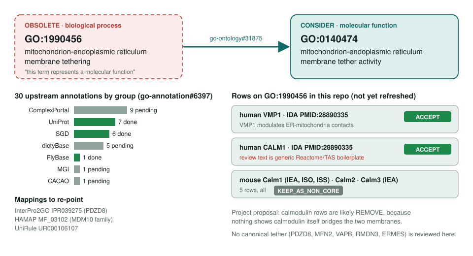
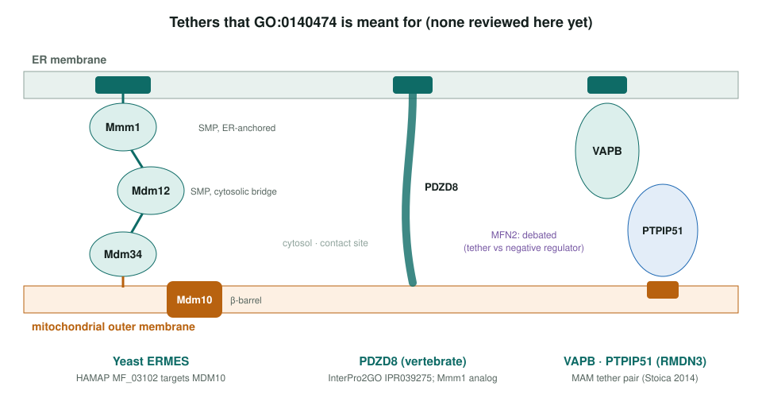

<!-- _class: lead -->

# Mitochondrion–ER membrane tethering: obsoletion

GO:1990456 (BP) → GO:0140474 mitochondrion-ER membrane tether activity (MF)

AI Gene Review · projects/MITO_ER_TETHERING_OBSOLETION · 2026

---

<!-- _class: bluf -->

## Bottom line

- GO **obsoleted GO:1990456** because tethering is a molecular function; curators should consider **GO:0140474** instead.
- **30 upstream annotations** (16 still pending) and **3 mappings** move; **5 reviews** here carry the old term (human VMP1, CALM1; mouse Calm1/2/3).
- **Scoped, not yet started:** none of those rows has been refreshed, and no canonical tether (PDZD8, MFN2, VAPB, ERMES) is reviewed here.

---

## Old term → replacement

---

## What a tether is

---

## Why it moved to MF

- A tether **physically bridges** the ER and outer mitochondrial membranes: a binding activity of one gene product or complex.
- The parallel **ER–PM** and **peroxisome–chloroplast** tether terms went the same way.
- GO:0140474's definition: brings the two membranes together "via membrane lipid binding or by interacting with a mitochondrial outer membrane protein".
- So a review should ask of each row: **does the gene product itself bridge the membranes?**

---

## The five affected reviews

| Review | Row(s) | Current action | Note |
|---|---|---|---|
| human VMP1 | IDA PMID:28890335 | ACCEPT | modulates ER–mito contacts |
| human CALM1 | IDA PMID:28890335 | ACCEPT | review text is Reactome/TAS boilerplate |
| mouse Calm1 | IEA, ISO, ISS | KEEP_AS_NON_CORE | propagated |
| mouse Calm2, Calm3 | IEA | KEEP_AS_NON_CORE | propagated |

The project proposes **REMOVE** for the calmodulin rows at refresh: nothing shows calmodulin itself bridges the membranes. VMP1 needs a check against the GO:0140474 definition.

---

## Status and next steps

- **2026-05-09:** project created. Upstream, SGD, UniProt and FlyBase are marked done.
- **2026-09-26:** OLS lists GO:1990456 obsolete; the 5 reviews still show pre-obsoletion actions.
- Next: refresh VMP1, CALM1, Calm1/2/3; then review **PDZD8** (the IPR039275 target) and **MFN2**, and yeast **MMM1 + MDM12**.

**Upstream:** go-annotation#6397 · go-ontology#31875
**Read more:** `projects/MITO_ER_TETHERING_OBSOLETION.md`
