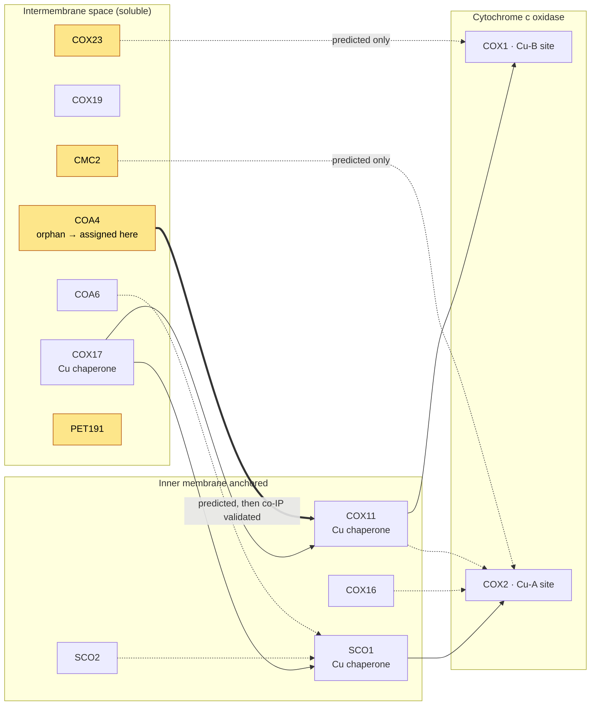

# MitoMatch: The AlphaFold-Multimer Interactome of the Human Mitochondrial Proteome

## Overview

Swaminathan et al. repurposed AlphaFold-Multimer (AFM) as a **binary classifier** for
protein–protein interaction (PPI) prediction and applied it exhaustively to the human
mitochondrial proteome, screening all 630,003 heteromeric pairs among 1123 MitoCarta3.0
proteins. The resulting compendium — **MitoMatch** ([mitomatch.web.app](https://mitomatch.web.app),
structures and confidence metrics at [Zenodo 21232148](https://doi.org/10.5281/zenodo.21232148)) —
reports 2895 predicted interactions and supplies at least one interacting partner for 85 of the
101 completely uncharacterized ("orphan") mitochondrial proteins.

> Swaminathan AB, Zulkifli M, Guerra RM, Calabrese SM, Kalafatis DT, Pagliarini DJ, Gohil VM.
> *The predicted interactome of the human mitochondrial proteome.* Nature Communications (2026),
> Article in Press. [doi:10.1038/s41467-026-77112-z](https://doi.org/10.1038/s41467-026-77112-z).
> **No PMID is assigned yet** (accepted 2026-08-17), so cite it by DOI. It caches cleanly as
> `publications/DOI_10.1038_s41467-026-77112-z.md` (full text via OpenAlex, CC-BY), so its
> `supporting_text` quotes are machine-verifiable like any PMID reference — do not create a
> `publications/PMID_*.md` stub.

For this repository the paper matters in two distinct ways, which should not be conflated:

1. **As a prediction resource.** A large body of *computational* PPI hypotheses covering genes we
   review. These are hypotheses — see [Curation implications](#curation-implications) — and belong
   in `-predictions-review.yaml` or bioinformatics `RESULTS.md`, never directly in
   `existing_annotations`.
2. **As a primary experimental paper.** The authors ran their own co-IP/MS, CRISPR knockout,
   ICP-MS, BN-PAGE and respirometry experiments. Those results *are* annotation-grade evidence,
   most consequentially for **COA4** (previously an orphan) and for the composition of the yeast
   coenzyme Q metabolon.

## The method, and what its numbers actually mean

AFM outputs an **interface predicted TM-score (ipTM)** per model. The authors ran all five multimer
models with one seed and asked whether the ipTM separates interacting from non-interacting pairs.

**Benchmark (recent-PDB hold-out).** 1338 interacting and 15,005 non-interacting binary pairs, all
from structures deposited after the AFM v2.2 training cutoff (2018-04-30) and filtered to <40%
identity against training sequences. Interacting pairs are bimodal (peaks at ipTM > 0.8 and
< 0.2); non-interacting pairs are unimodal at ipTM < 0.2. The **mean** of the five models
outperforms the **max**: at 90% precision, mean-ipTM recovers ~40% of true positives versus ~30%
for max-ipTM. Averaging suppresses the right shoulder of the non-interacting peak — i.e. it is a
false-positive control, and this is why the screen uses mean ipTM.

**Determinants of success.** Median per-residue effective (Neff) MSA depth of the *paired* MSA is
the primary driver: pairs with >25 diverse sequences reach median ipTM > 0.6, rising with depth.
More than 20 total interface residues and lower global stoichiometry also raise ipTM. Over 97% of
human mitochondrial pairs clear the MSA-depth threshold, which is why the mitochondrial proteome
is a tractable target.

**Threshold.** Against a hand-curated set of 12 experimentally validated copper-delivery
interactions in a background of 805 deliberately non-interacting pairs (copper-metabolism proteins
× complex I/II/III/V subunits, which contain no copper), the first false positive appears near
mean ipTM 0.5. The screen therefore uses **mean ipTM ≥ 0.5**, giving ~67% recall at ~15% apparent
FDR (≈85% precision).

**Scale of the screen.** Of 630,003 pairs, 541,758 (86%) score below ipTM 0.2. 2895 pairs (0.46%)
clear the cutoff, involving 1004 of the 1123 proteins, with a median of 4.0 partners per protein.

### Recovery of known biology

| Check | Result |
|---|---|
| Predicted interactions already in STRING / BioGRID / IntAct / BioPlex / HuRI / PDB | 43% (the other 57% are previously unreported) |
| Complex Portal mitochondrial complexes completely recapitulated | 56% |
| Mean subunit coverage per complex | 77% |

Structures are predicted for interactions that have none experimentally, including the
mitochondrial processing peptidase (PMPCA–PMPCB), the glutamyl-tRNA(Gln) amidotransferase complex
(all three subunits), the Fe–S transfer pair BOLA3–GLRX5, and the COX2–COX20 assembly intermediate.
Two independently published orphan assignments were recovered blind: TCAIM–OGDH
([PMID:39889707](https://pubmed.ncbi.nlm.nih.gov/39889707/)) and C16ORF91/UQCC4–MT-CYB
([PMID:35977508](https://pubmed.ncbi.nlm.nih.gov/35977508/)).

### Cross-species conservation

The 2895 human pairs were mapped by reciprocal-best-hit to 11 other eukaryotes (chimpanzee, mouse,
rat, *X. laevis*, zebrafish, *Drosophila*, *C. elegans*, *Dictyostelium*, *Arabidopsis*,
*S. pombe*, *S. cerevisiae*). Mappable pairs and the fraction predicted to interact fall with
distance: 2787 pairs / 93% in chimpanzee, 2768 / 87% in mouse, 383 / 44% in yeast. Note the
relaxed criterion for the homolog screen — an orthologous pair counts as interacting if **at least
one** of the five models exceeds 0.5, not the mean.

Two derived metrics accompany each interaction and are the useful prioritization handles:

- **Species score** — sum of ipTM scores across all species where both homologs exist.
- **Conservation score** — fraction of homologous pairs that are hits (ipTM ≥ 0.5).

Pathway-level heatmaps show a strong diagonal (within-pathway interactions are the most conserved)
plus off-diagonal blocks that are conserved to yeast: OxPhos subunits with their assembly factors,
and both with copper, Fe–S cluster and heme cofactor pathways.

## Experimental vignette 1: membership and binary wiring of complex Q

Coenzyme Q head-group modification is carried out by a dynamic metabolon ("complex Q" /
CoQ-synthome) on the matrix face of the inner membrane ([PMID:36702698](https://pubmed.ncbi.nlm.nih.gov/36702698/)).

**Co-IP/MS from DSSO-crosslinked yeast mitochondria** (endogenously tagged baits, n = 3):

- Coq3, Coq4, Coq5, Coq6, Coq9 and Coq11 each reciprocally pulled down Coq3–Coq7, Coq9 and Coq11 —
  defining a core membership.
- **Coq1 and Coq2 co-immunoprecipitated no other Coq protein**, consistent with the metabolon being
  restricted to head-group modification and excluding tail synthesis/attachment.
- Coq8 recovered only Coq3 and itself — consistent with its ATPase activity being required for
  metabolon formation while its own contacts stay transient.
- Auxiliary factors Yah1 and Coq21 appeared in some pulldowns.

Co-IP cannot distinguish direct from indirect association, so AFM was run pairwise over the full
Coq1–Coq11 set, yielding **nine high-confidence binary interactions among Coq3–Coq10**, notably:

| Predicted binary pair | Corroboration |
|---|---|
| Coq7–Coq9 | Reproduces the experimentally solved human COQ7:COQ9 interface ([PMID:36306796](https://pubmed.ncbi.nlm.nih.gov/36306796/)), released **after** the AFM training cutoff — an unbiased positive control |
| Coq3–Coq6 | Sequential steps in the pathway; independently reported in a 2025 preprint ([doi:10.1101/2025.05.24.655883](https://doi.org/10.1101/2025.05.24.655883)) |
| Coq3–Coq5, Coq4–Coq7 | Head-group–modifying enzyme pairs |
| Coq6–Coq8, Coq5–Coq9, Coq7–Coq8 | Enzyme–auxiliary factor; may rationalize Coq8 augmentation of the Coq6 reaction ([PMID:38425362](https://pubmed.ncbi.nlm.nih.gov/38425362/)) |
| Coq6–Coq10 | Nominates a function for the poorly understood CoQ-binding protein Coq10 |

The authors are explicit that complex Q is most likely a *statistical* complex with multiple
conformations built on a small number of robust binary contacts; the predictions nominate the
anchoring contacts rather than a fixed stoichiometric assembly.

## Experimental vignette 2: COA4 enters the copper delivery pathway

*Solid arrows: copper transfer by metallochaperones. Dotted arrows: accessory/assisting
interactions. Amber nodes are the four IMS-localized CcO assembly factors whose role was
unresolved; PET191 and COX19 carry no edge here because none is asserted by this paper. Only the
COA4–COX11 edge was taken past prediction to experimental validation.*

AFM recovered **8 of 12** known interactions in the human copper delivery pathway, most of them
conserved in yeast, and supplied structural models for steps that have evaded structural biology
(COX17/SCO1/SCO2/COA6/COX16 routing copper to COX2). It then placed three of the four orphan IMS
assembly factors: COX23–COX1, CMC2–COX2, and **COA4–COX11**.

COA4–COX11 was followed up experimentally:

| Experiment | Result |
|---|---|
| Co-IP/MS of yeast Coa4-V5 from crosslinked mitochondria (n = 3) | Cox11 recovered; also the IMS phosphatase Ptc5, suggesting phospho-regulation of Coa4 |
| Co-IP of COX11-FLAG from 293T mitochondria (n = 3) | Recovers COA4-V5, plus COX1 (positive control) and COX2 (reproducing [PMID:35750769](https://pubmed.ncbi.nlm.nih.gov/35750769/)) |
| Reciprocal anti-V5 IP of COA4-V5 (n = 3) | Recovers COX11-FLAG; **does not** recover COX1 or COX2 — matching the prediction of no direct COA4–COX1/COX2 contact |
| CRISPR *COA4* KO in MCH58 fibroblasts | Two independent clones, COA4 absent |
| COA4-KO effect on COX11 | Striking reduction in COX11 abundance |
| ICP-MS of COA4-KO mitochondria (n = 3) | Reduced mitochondrial Cu; Fe, Zn, Mn unaffected |
| BCS (copper chelator) titration | COX1 loss more pronounced in COA4-KO than WT |
| BN-PAGE/western (n = 2) | Drastic, specific reduction of complex IV–containing supercomplexes |
| Seahorse OCR (n = 3) | Reduced respiration in COA4-KO |

Together these place COA4 at a **COX11-dependent step of copper delivery to cytochrome c oxidase**,
and give a biochemical basis for the earlier genetic observation that Cox11 overexpression rescues
the respiratory growth defect of yeast *coa4Δ* ([PMID:35666203](https://pubmed.ncbi.nlm.nih.gov/35666203/)).

## Curation implications

### Predicted interactions are not annotation evidence

A MitoMatch hit is an AFM prediction. It carries no experimental evidence code, and by itself it
does not license a GO annotation. Three specific rules for this repository:

1. **Never write a MitoMatch hit into `existing_annotations`.** If a predicted interaction is worth
   recording, it belongs in `GENE-predictions-review.yaml` (source: AlphaFold-Multimer/MitoMatch)
   under the COR/CNN/LSP/UNC/PLI/NPI/REP taxonomy, or as a line of evidence in a
   `GENE-bioinformatics/RESULTS.md` cited as `file:human/GENE/bioinformatics/RESULTS.md`.
2. **A predicted interaction is not a reason to add `protein binding` (GO:0005515).** Per the
   repository curation guidelines, that term is uninformative regardless of evidence strength. The
   useful output of a predicted interaction is a *hypothesis about molecular function* — subunit,
   chaperone, assembly factor, or regulator of the partner's pathway — which is what the paper's
   own discussion recommends.
3. **The experiments, not the prediction, license the annotation.** For COA4, the annotatable
   claims come from the co-IP, KO, ICP-MS, BN-PAGE and respirometry data. The AFM model is what
   made the experiment worth doing.

### Caveats to carry into any review that cites this resource

- **~15% FDR at the cutoff.** Roughly one in seven hits at mean ipTM 0.5 is expected to be wrong.
  Confidence should scale with the actual ipTM, the species score, and the conservation score, not
  with membership in the hit list.
- **Absence is not evidence of absence.** Recall at the cutoff is ~67%, and AFM performance tracks
  paired-MSA depth. A missing prediction says little, especially for lineage-restricted proteins —
  the same false-negative caveat already recorded in [ALPHAFOLD.md](ALPHAFOLD.md) and
  [BGC.md](BGC.md).
- **No affinity, no conditions, no stoichiometry.** AFM reads coevolutionary signal and is agnostic
  to thermodynamics. A predicted pair may only ever meet inside a larger complex, transiently, or
  in a cell state the prediction cannot name.
- **Binary pairs ≠ complexes.** The paper builds complexes from pairwise predictions; do not read a
  predicted dimer as a claim that the heterodimer is the physiological species. Complex Q is the
  worked example of exactly this distinction.
- **Screen boundary is MitoCarta3.0.** Only mitochondrial × mitochondrial pairs were scored (and
  proteins >2000 aa or with non-canonical residues were dropped). Interactions with non-
  mitochondrial partners are outside the screen by construction, not disfavoured by it. The
  ~20-fold enrichment in true interactions that makes the screen work comes precisely from this
  restriction.

### Genes in this repository touched by the paper

Already reviewed here, and appearing in the paper's figures or validated interactions:

| Gene | Relevance in this paper |
|---|---|
| COX11 | Direct COA4 partner; co-IP validated in yeast and human; destabilized in COA4-KO |
| SCO1, SCO2, COA6, COX16 | Copper routing to COX2; AFM structural models for steps lacking structures |
| COX20 | Predicted COX2–COX20 assembly intermediate |
| COQ7, COQ9 | AFM reproduces the solved human COQ7:COQ9 interface (post-training-cutoff control) |
| COQ2, COQ4, COQ5, COQ6, COQ8A, PDSS1, PDSS2 | Complex Q membership and binary wiring (via yeast orthologs) |
| BOLA3, GLRX5 | Predicted Fe–S transfer interaction with no experimental structure |
| PMPCA, PMPCB | Predicted mitochondrial processing peptidase complex structure |
| HSPA9 | Predicted TCAIM–HSPA9 interaction |

**Reviewed from this paper (done):**

- **COA4** — review complete (working notes in `genes/human/COA4/COA4-notes.md`).
  The paper's one fully validated orphan
  assignment. Review accepts the previously IBA/IEA-only `GO:0033617` as core on the strength
  of the new human knockout data, and marks the BioPlex `protein binding` row over-annotated
  while preserving COX11 as the partner. Two findings worth noting: the COA4–COX11 interaction
  already had affinity-purification support in BioPlex/IntAct
  ([PMID:33961781](https://pubmed.ncbi.nlm.nih.gov/33961781/)) predating this paper, and the
  2022 *Genetics* study explicitly **failed** to detect the interaction by co-IP/MS — the 2026
  work closes that gap, plausibly because it crosslinks. COA4's molecular function remains
  genuinely unknown (metallochaperone activity is positively excluded), so `core_functions`
  asserts BP + CC only rather than inventing an MF term.

- **yeast/COA4** — the mechanism actually lives here: two IMP calls, three IGI partners
  (SHY1, CYC1, CMC1), EXP IMS proteomics. 13 ACCEPT / 2 over-annotated / 1 non-core / 1 MODIFY.
- **The yeast copper delivery pathway** — COX17, COX19, COX23, CMC2, PET191, reviewed as a set
  (74 annotations). Yeast rather than human because the mechanistic literature for
  COX23/CMC2/PET191 is entirely yeast, and because the human symbols do not line up: **there is
  no human gene named COX23**, and the paper's "PET191" is human **COA5**. Anyone mapping this
  paper's Fig. 4b onto human gene identifiers should check that first.

Three findings from the pathway set that generalize beyond it:

1. **A mis-attributed annotation on COX17.** `GO:0018343 protein farnesylation` (IDA,
   [PMID:8078902](https://pubmed.ncbi.nlm.nih.gov/8078902/)) cites a paper that is entirely about
   **COX10**, heme A:farnesyltransferase — one digit away. The term is wrong even for COX10, since
   that enzyme farnesylates *heme*, not protein; and the row was assigned by MGI against a
   *S. cerevisiae* accession. Marked REMOVE. The `GO:0005739` row from the same reference shares
   the faulty provenance but is factually correct, so it is kept non-core with the problem recorded.
   This case seeded [MISCITATION_AUDIT.md](MISCITATION_AUDIT.md), which found it is one of 27 such
   defects already flagged across the repository — 26 of them GOA-sourced.
2. **A GFP-library artifact — but only where biology says so.** Nucleus and/or cytoplasm rows
   from the genome-wide C-terminal GFP library
   ([PMID:14562095](https://pubmed.ncbi.nlm.nih.gov/14562095/)) appear on COA4, CMC2 and COX23.
   Only the **nucleus** calls (COA4, CMC2) are flagged, and on conflict grounds: a twin CX9C
   MIA40 substrate has no described route to the nucleus, and every other source — EXP IMS
   proteomics, IDA, IBA, IEA, TAS, UniProt — places these proteins in the intermembrane space.
   The **cytoplasm** calls are accepted as correct-but-non-core, because Mia40 substrates
   genuinely dwell in the cytosol before import, so a cytosolic pool is expected rather than
   anomalous. The governing principle: an annotation is assumed correct unless positive
   knowledge contradicts it — inability to inspect the underlying evidence is not itself grounds
   for flagging.
3. **Four ND molecular functions in a row.** COA4, COX23, CMC2 and PET191 all carry SGD's explicit
   `GO:0003674` "no data" placeholder, and all four are argued to *keep* it. These are accessory
   factors that support metallochaperone action without binding metal themselves, and GO has no
   term for that. This is the pathway's real annotation gap, and it is exactly what a predicted
   interaction cannot fill.

Also worth recording: **COX19 is a second COX11 chaperone**, established well before this paper
([PMID:25926683](https://pubmed.ncbi.nlm.nih.gov/25926683/)) — it binds a cysteine-containing
sequence in COX11 via conserved tyrosine-leucine dipeptides, in a redox-regulated way. So COA4 and
COX19 are two IMS twin CX9C proteins converging on the same target, which none of the papers
involved appears to have noticed.

Still not in this repository:

- **Human COX17, COX19, CMC2, COA5** — the human arms of the same pathway.
- **PET191's Mia40-independent import** is a genuine family-level exception
  ([PMID:18503002](https://pubmed.ncbi.nlm.nih.gov/18503002/)) worth carrying into any
  family-level inference about twin CX9C proteins.
- **TCAIM**, **UQCC4** (C16orf91) — recovered blind here; primary evidence is in
  [PMID:39889707](https://pubmed.ncbi.nlm.nih.gov/39889707/) and
  [PMID:35977508](https://pubmed.ncbi.nlm.nih.gov/35977508/).
- **COQ3**, **COQ10A**, **COQ10B** — complete the complex Q roster; Coq6–Coq10 is a novel
  prediction bearing on COQ10A/B function.

## Relationship to other projects here

- [OXPHOS.md](OXPHOS.md) — the copper delivery vignette is complex IV assembly; the standing
  guidance there that *assembly factors are annotated to assembly processes, not to electron
  transport* applies directly to COA4, COX23, CMC2 and PET191.
- [ALPHAFOLD.md](ALPHAFOLD.md) — records how predicted structures and interfaces are used as
  evidence in this repository; MitoMatch is the largest organelle-scale instance of that pattern.
- [BGC.md](BGC.md) — the AF3/ipTM biosynthetic-gene-cluster screen, methodologically the closest
  analogue, with the same "corroborate, don't drive" posture.
- [CUPROPTOSIS.md](CUPROPTOSIS.md) — adjacent mitochondrial copper biology.
- [MITOCHONDRIAL_IMPORT_PATHWAYS.md](MITOCHONDRIAL_IMPORT_PATHWAYS.md) — shares PMPCA/PMPCB and
  HSPA9.

## Open questions

- Does the Ptc5 co-enrichment with yeast Coa4 reflect real phospho-regulation of copper delivery?
  Nothing beyond co-IP enrichment supports this yet.
- Coq6–Coq10 is the most functionally suggestive novel prediction in the CoQ set. Is COQ10A/COQ10B
  a CoQ-delivery module docked on the metabolon, and does the interaction survive in human cells?
- COX23 and CMC2 have conserved predicted partners but no experimental follow-up. What would the
  COA4-style validation (KO, metal content, BN-PAGE) show?
- Can the species/conservation scores be used as a routine prior in this repository — e.g. to
  down-weight IBA annotations whose implied complex membership has no conserved structural support?

## References

| PMID / DOI | Citation |
|---|---|
| [doi:10.1038/s41467-026-77112-z](https://doi.org/10.1038/s41467-026-77112-z) | Swaminathan et al. *The predicted interactome of the human mitochondrial proteome.* Nat Commun 2026 (in press) — **this paper** |
| [PMID:33174596](https://pubmed.ncbi.nlm.nih.gov/33174596/) | Rath et al. *MitoCarta3.0.* Nucleic Acids Res 2021 — the protein inventory screened |
| [PMID:36306796](https://pubmed.ncbi.nlm.nih.gov/36306796/) | Manicki et al. *Structure and functionality of a multimeric human COQ7:COQ9 complex.* Mol Cell 2022 |
| [PMID:36702698](https://pubmed.ncbi.nlm.nih.gov/36702698/) | Guerra & Pagliarini. *Coenzyme Q biochemistry and biosynthesis.* Trends Biochem Sci 2023 |
| [PMID:38425362](https://pubmed.ncbi.nlm.nih.gov/38425362/) | Nicoll et al. *In vitro construction of the COQ metabolon.* Nat Catal 2024 |
| [PMID:35666203](https://pubmed.ncbi.nlm.nih.gov/35666203/) | Swaminathan et al. *A yeast suppressor screen links Coa4 to the mitochondrial copper delivery pathway.* Genetics 2022 |
| [PMID:35750769](https://pubmed.ncbi.nlm.nih.gov/35750769/) | Nývltová et al. *Coordination of metal center biogenesis in human cytochrome c oxidase.* Nat Commun 2022 |
| [PMID:10617659](https://pubmed.ncbi.nlm.nih.gov/10617659/) | Hiser et al. *Cox11p is required for stable formation of the Cu(B) and magnesium centers.* J Biol Chem 2000 |
| [PMID:15145942](https://pubmed.ncbi.nlm.nih.gov/15145942/) | Barros et al. *COX23, a homologue of COX17, is required for cytochrome oxidase assembly.* J Biol Chem 2004 |
| [PMID:39889707](https://pubmed.ncbi.nlm.nih.gov/39889707/) | Jiahui et al. *The mitochondrial DNAJC co-chaperone TCAIM reduces α-ketoglutarate dehydrogenase protein levels.* Mol Cell 2025 |
| [PMID:35977508](https://pubmed.ncbi.nlm.nih.gov/35977508/) | Liang et al. *Mitochondrial microproteins link metabolic cues to respiratory chain biogenesis.* Cell Rep 2022 |
| [PMID:37590370](https://pubmed.ncbi.nlm.nih.gov/37590370/) | Lim et al. *In silico protein interaction screening uncovers DONSON's role in replication initiation.* Science 2023 |
| [PMID:40015271](https://pubmed.ncbi.nlm.nih.gov/40015271/) | Schmid & Walter. *Predictomes, a classifier-curated database of AlphaFold-modeled PPIs.* Mol Cell 2025 |
