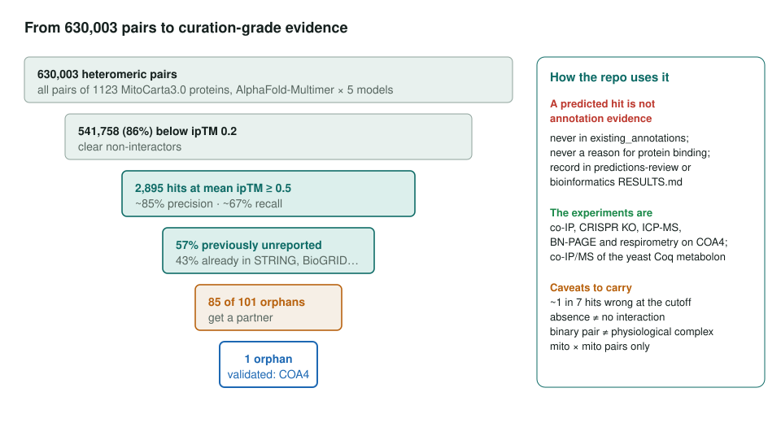
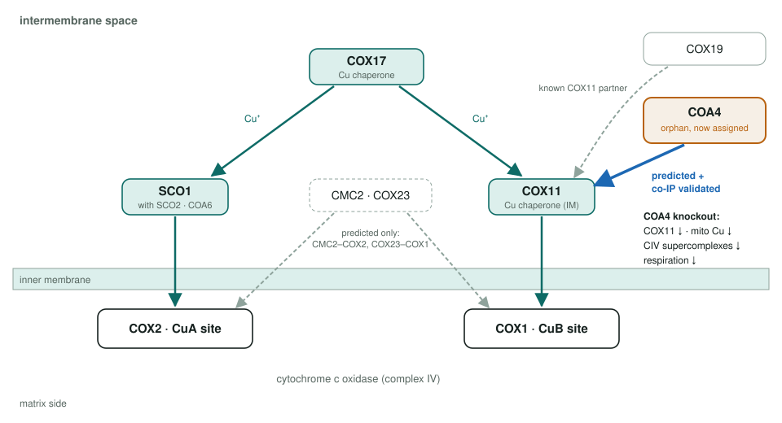
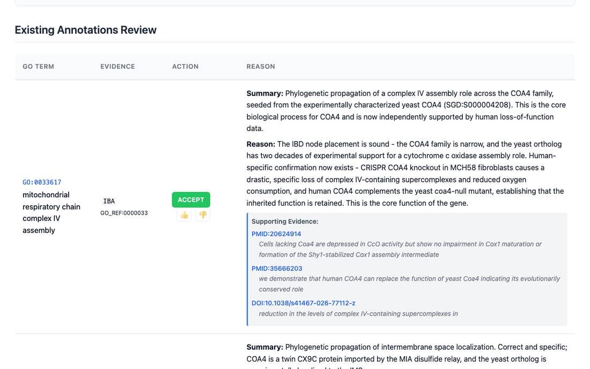

<!-- _class: lead -->

# MitoMatch

What an AlphaFold-Multimer interactome of the mitochondrial proteome can and cannot do for GO curation

AI Gene Review · projects/MITO_INTERACTOME · 2026

---

<!-- _class: bluf -->

## Bottom line

- Swaminathan et al. 2026 screened **630,003 mitochondrial protein pairs** and report **2,895 predicted interactions** (~85% precision), with partners for **85 of 101 orphans**.
- **Predictions are hypotheses**: never in `existing_annotations`, never a reason for `protein binding`.
- The paper's **experiments** place orphan **COA4** in copper delivery via COX11; we reviewed human COA4 and the yeast copper set (**97 annotations**).

---

## From pairs to evidence

---

## How the screen works

- **Score**: mean ipTM over the five AFM models; averaging suppresses false positives better than the max.
- **Cutoff**: first false positive near ipTM 0.5 on a copper-delivery benchmark (12 true pairs vs 805 non-interacting).
- **Driver**: paired-MSA depth; over 97% of mitochondrial pairs clear it, which makes the organelle tractable.
- **Recovery**: 56% of Complex Portal mitochondrial complexes fully recapitulated; TCAIM–OGDH and UQCC4–MT-CYB found blind.

---

## COA4 joins the copper pathway

---

## What the COA4 review looks like

Human COA4: complex IV assembly (IBA) accepted as core, now backed by the paper's knockout data. BioPlex preserves the COX11 partner but not a useful GO activity.

---

## Review results

| Gene | Species | Ann. | ACCEPT | Non-core | Over-ann. | REMOVE |
|---|---|---|---|---|---|---|
| COA4 | human | 8 | 4 | 3 | 1 | 0 |
| COA4 | yeast | 17 | 13 | 3 | 1 | 0 |
| COX17 | yeast | 20 | 14 | 5 | 0 | 1 |
| COX19 | yeast | 17 | 10 | 6 | 1 | 0 |
| COX23 | yeast | 13 | 6 | 7 | 0 | 0 |
| CMC2 | yeast | 12 | 6 | 5 | 1 | 0 |
| PET191 | yeast | 10 | 6 | 4 | 0 | 0 |

Total: 97 reviewed rows; 59 ACCEPT, 33 non-core, 4 over-annotated, 1 REMOVE.

The single REMOVE: COX17 `protein farnesylation` (GO:0018343), citing PMID:8078902, a paper about COX10. It seeded the miscitation audit.

---

## Findings beyond the paper

1. **Symbols do not line up**: there is no human COX23, and the paper's "PET191" is human **COA5**.
2. **GFP-library nucleus calls** on COA4 and CMC2 flagged; cytoplasm calls accepted as a pre-import pool.
3. **Four accessory factors keep `GO:0003674`** (no MF): GO has no term for supporting a metallochaperone without binding metal.
4. **COX19 is a second COX11 chaperone**, so COA4 and COX19 converge on the same target.

---

## Status and next steps

- ✅ Paper read and rules for using predicted PPIs written down.
- ✅ Human COA4 and the yeast copper set reviewed; human COA5 already reviewed under the complex IV assembly module.
- ⬜ #4229: human **COX17, COX19, CMC2**; **TCAIM**, **UQCC4**; complex Q **COQ3, COQ10A/B**.
- ⬜ Test species and conservation scores as a prior for IBA complex-membership rows.

**Read more:** `projects/MITO_INTERACTOME.md` · `genes/human/COA4/` · `genes/yeast/COX17/`
