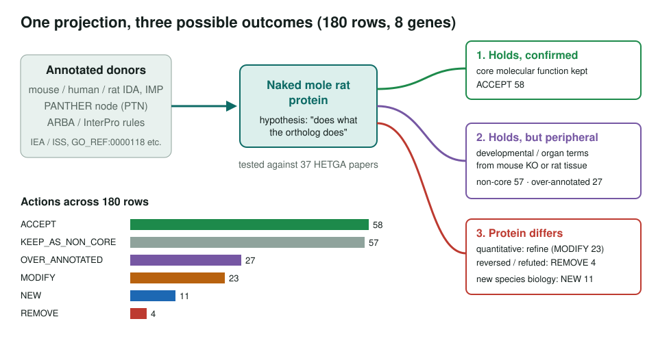
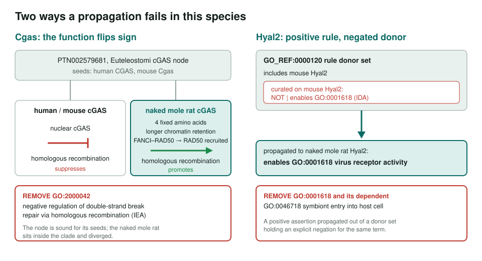
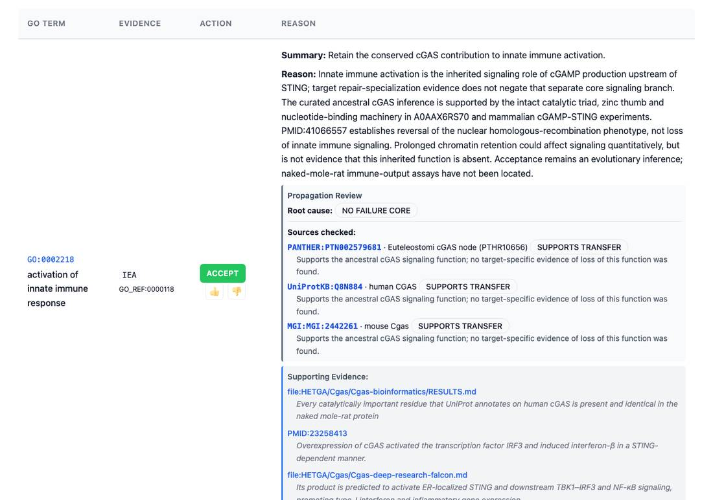

<!-- _class: lead -->

# The naked mole rat

Testing ortholog-projected GO annotations against a species that diverged

AI Gene Review · projects/NAKED_MOLE_RAT · 2026

---

<!-- _class: bluf -->

## Bottom line

- Of ~335,000 GO annotations on naked mole rat proteins, **exactly one is experimental**; the rest are projected from orthologs or sequence models.
- We reviewed **all 169 existing annotations on 8 landmark genes** (180 rows with the 11 NEW) against the species' own literature (37 papers).
- Projection is **mostly correct but unfocused**: 4 removed, 84 demoted, 11 new. The removals include a **sign reversal in Cgas** and a **Hyal2 term propagated past a curated NOT**.

---

## Why this species

- Long-lived, cancer-resistant, insensitive to some pain stimuli, hypoxia-tolerant.
- Only six HETGA entries are Swiss-Prot reviewed; everything else is TrEMBL.
- An ortholog projection is a hypothesis. Here it is **testable**, because the literature exists *because the proteins differ*.
- Two stories chosen for batch 1:
  - **Hyaluronan axis**: `Has2`, `Hyal2`, `Cd44` (very-high-molecular-mass hyaluronan)
  - **Nociception**: `Scn9a`, `Ntrk1`, `Trpv1`, `Tac1`
  - plus **`Cgas`**, all 13 original rows from one PANTHER node

---

## Three ways a projection resolves

---

## Where propagation fails

---

## What a review row looks like

Cgas review page: the ancestral innate-immune signalling row is accepted, with the PANTHER node and both seeds checked. The homologous-recombination row is removed further down.

---

## New terms GO cannot yet express

| Gene | Proposed term |
|---|---|
| `Has2` | high molecular mass hyaluronan biosynthetic process |
| `Hyal2` | regulation of hyaluronan polymer size |
| `Scn9a` | proton-inhibited voltage-gated sodium channel activity |
| `Trpv1` | vanilloid-gated monoatomic cation channel activity |
| `Cd44` | positive regulation of basal ATF6-mediated signalling |

Polymer length as the functional property; a channel closed by protons; a sensor's resting set-point.

---

## An expressivity gap

- `Has2`: the naked mole rat sequence in HEK293 cells makes high-molecular-mass hyaluronan; shRNA knockdown in naked mole rat fibroblasts reduces it.
- That is direct and mutant-phenotype evidence for terms carried only as **ISS**.
- The validator rejects `action: NEW` for any term already in GOA, so **"right term, evidence code understates what is known"** cannot be recorded.
- For an all-electronic species this is the most valuable recommendation a review could make.

---

## Status and next steps

- ✅ Batch 1 row review: 180 rows, none pending; TreeGrafter rows re-reviewed Sept 2026.
- ⬜ Pick the next HETGA batch ([#4230](https://github.com/ai4curation/ai-gene-review/issues/4230)).
- ⬜ Decide how to propose an evidence-code upgrade for an existing term.
- Tip: the decisive paper is often **titled for another gene** (e.g. TMEM2 for hyaluronan degradation).

**Read more:** `projects/NAKED_MOLE_RAT.md` · `genes/HETGA/<Gene>/`
