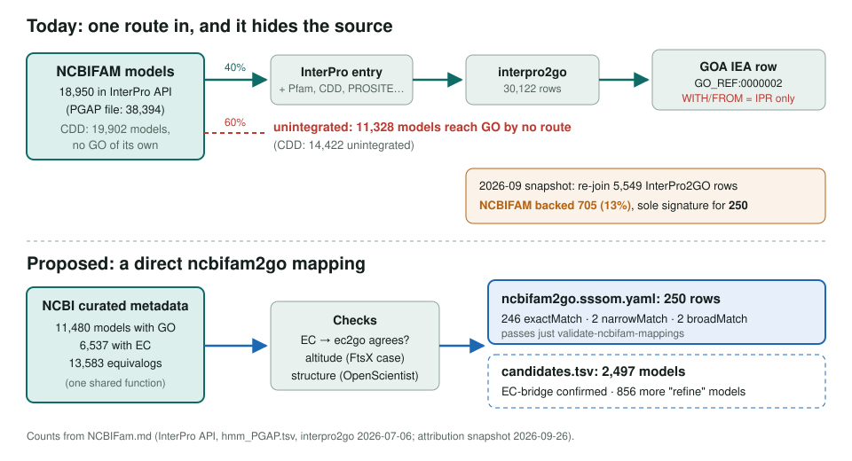
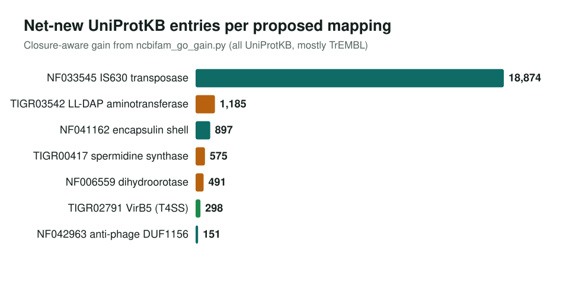

<!-- _class: lead -->

# NCBIFAM and CDD as GO sources

What the NCBI family models add, what InterPro hides, and a proposed `ncbifam2go`

AI Gene Review · projects/NCBIFam · 2026

---

<!-- _class: bluf -->

## Bottom line

- NCBIFAM/CDD reach GO **only via InterPro2GO**; 60% of NCBIFAM models are unintegrated and contribute nothing, and GOA never names the member that fired.
- NCBIFAM backs **705 (13%)** of this repo's 5,549 InterPro2GO rows (sole signature for **250**). NCBI's own metadata gives GO to **11,228** models that GO ignores.
- We built a validated **250-row `ncbifam2go` seed** and **2,455** EC-bridge candidates. The gain is large but mostly **TrEMBL**: 19 reviewed vs 26,578 entries in a 60-model sample.

---

## The route today, and the proposed one

---

## Why this resource

- NCBIFAM is **prokaryote-heavy, curated per family**: 13,253 `equivalog` models where all members share one function.
- Newer microbial biology (mobile elements, secretion, anti-phage defense, encapsulins) is where **InterPro integration lags**.
- **CDD-proper has no native GO** (FTP files and Entrez); GO seen in CDD is borrowed from bundled NCBIFAM models.

---

## Where the net-new annotations are

Orange rows: we proposed a specific term over NCBI's broad one ("refine"). Green: the one reviewed gap-fill that survived checking.

---

## Checking the reviewed "gaps"

| Row | Reviewed gain | Prokaryotes | What the entries are |
|---|---:|---:|---|
| VirB5 → GO:0043684 | 4 | 4 | genuine *Brucella* VirB5 |
| dGTPase → GO:0008832 | 13 | 13 | "-like", no EC: curators withheld it |
| IS630 → GO:0004803 | 2 | 2 | uncharacterized ORFs; weak |
| LL-DAP → GO:0010285 | 2 | 0 | plant ALD1 paralogs |
| spermidine synthase → GO:0004766 | 1 | 0 | tobacco PMT1 paralog |

Lesson: scope the gain to the model's lineage (PGAP applies to prokaryotes only), and read "-like" as a curator caution.

---

## Structural checks (OpenScientist)

- **NF042963 DUF1156**: an intact SAM-dependent DNA amino-methyltransferase, no nuclease. Adds MF GO:0009008; target base (m6A vs m4C) left undecided.
- **NF002326 dGTPase**: SAMHD1-like broad dNTPase. Family split: GO:0016793 for all, GO:0008832 and GO:0106375 as clades.
- **NF033545 IS630**: DDE transposase with intact catalytic triad; confirms GO:0004803.
- **NF041162 encapsulin**: HK97 shell, not a membrane protein; confirms GO:0140737 (weakly blinded).

---

## Status and next steps

- ✅ Member-DB attribution re-join; CDD-own-GO question resolved
- ✅ 250-row SSSOM seed validates (`just validate-ncbifam-mappings`)
- ⬜ Promote the 2,455 EC-bridge candidates; build the 843 "refine" class
- ⬜ Full-collection gain run; non-EC families need literature checks
- ⬜ Exemplar gene reviews whose only support is an NCBIFAM equivalog

**Read more:** `projects/NCBIFam.md` · `projects/NCBIFam/ncbifam2go.sssom.yaml` · `projects/NCBIFam/ncbifam2go.candidates.tsv`
