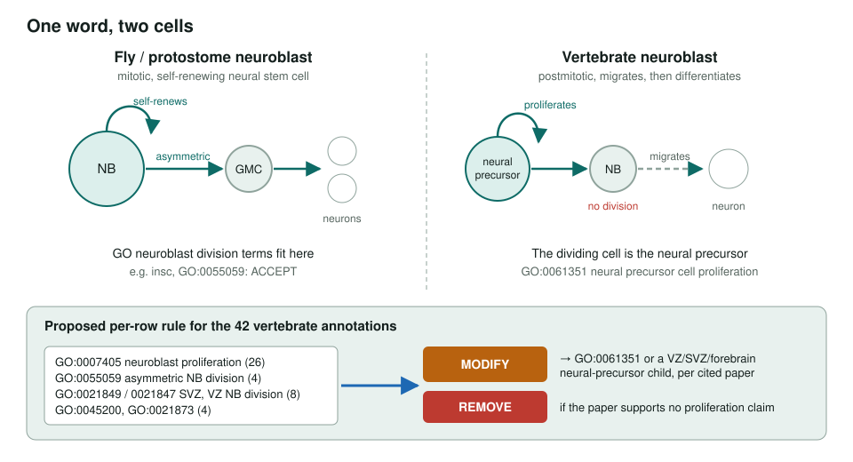
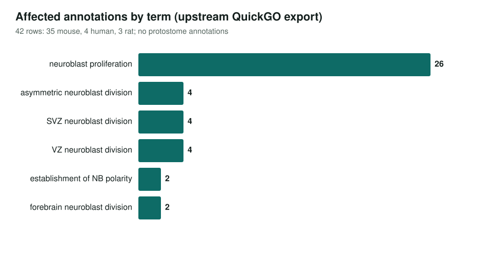

<!-- _class: lead -->

# Neuroblast proliferation

A fly stem-cell term applied to vertebrate genes

AI Gene Review · projects/NEUROBLAST_PROLIFERATION_DISAMBIGUATION · scoping · 2026

---

<!-- _class: bluf -->

## Bottom line

- GO's neuroblast proliferation and division terms describe the **fly** neuroblast, a dividing stem cell; the **vertebrate** neuroblast does not divide.
- All **42** annotations to the six terms are on **vertebrate** genes (35 mouse, 4 human, 3 rat). The planned fix is per-gene **MODIFY** to GO:0061351 *neural precursor cell proliferation*.
- **Scoped, not started.** Five existing vertebrate reviews touching these rows kept them as non-core instead.

---

## One word, two cells

---

## Where the 42 rows sit

---

## What existing reviews already say

| Gene | Term | Evidence | Action in repo |
|---|---|---|---|
| DROME/N | GO:0007405 neuroblast proliferation | IMP | KEEP_AS_NON_CORE |
| DROME/Lis-1 | GO:0007405 neuroblast proliferation | IMP | KEEP_AS_NON_CORE |
| DROME/insc | GO:0055059 asymmetric neuroblast division | IGI | ACCEPT |
| DROME/Lkb1 | GO:0055059 asymmetric neuroblast division | IMP | KEEP_AS_NON_CORE |
| human/FGFR2 | GO:0021847 VZ neuroblast division | ISS | KEEP_AS_NON_CORE |
| human/PAFAH1B1 | GO:0007405 neuroblast proliferation | ISS | KEEP_AS_NON_CORE |
| human/SHH | GO:0007405 neuroblast proliferation | ISS | KEEP_AS_NON_CORE |
| human/TP53 | GO:0007405 neuroblast proliferation | IEA | KEEP_AS_NON_CORE |
| mouse/Ctnnb1 | GO:0007405 neuroblast proliferation | IGI | KEEP_AS_NON_CORE |

These reviews were made for other projects. The fly rows fit the term; the five vertebrate rows are the ones this project would revisit.

---

## Status and next steps

- Upstream: [geneontology/go-annotation#6393](https://github.com/geneontology/go-annotation/issues/6393), still in discussion; no ontology ticket yet.
- ⬜ Revisit FGFR2 (GO:0021847) under the MODIFY rule.
- ⬜ Review the human set: SOX5, ARHGEF2, DOCK7, TEAD3.
- ⬜ Review mouse progenitor genes: Pafah1b1 (LIS1), Aspm, Nde1, Shh, Ascl1.
- ⬜ Add the pattern to `projects/OVER_ANNOTATION_PATTERNS.md` after 3–4 reviews.

**Read more:** `projects/NEUROBLAST_PROLIFERATION_DISAMBIGUATION.md`
