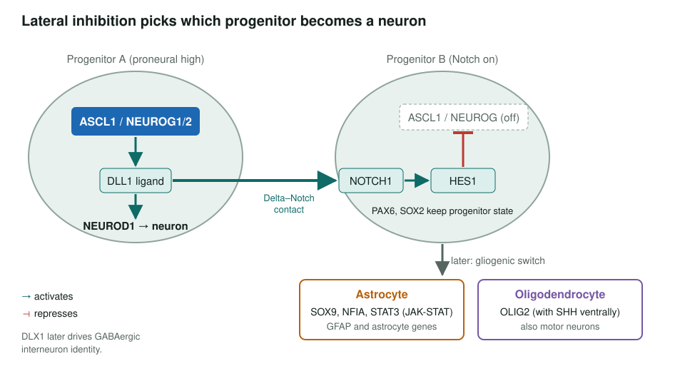
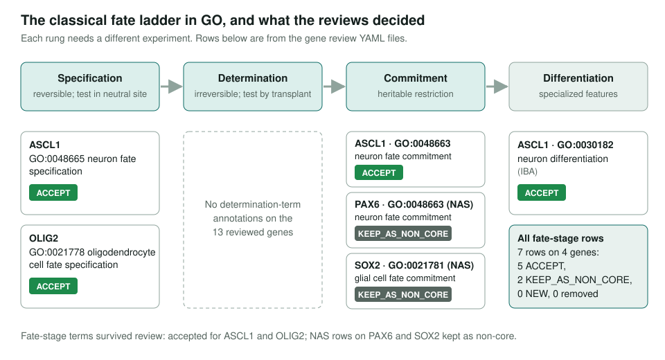
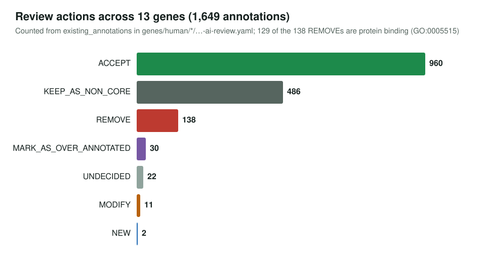
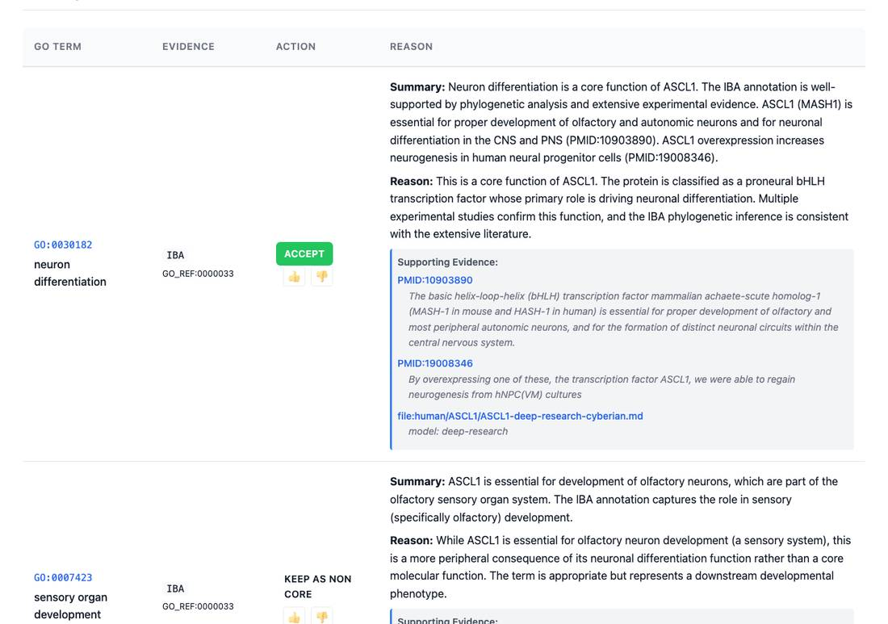

<!-- _class: lead -->

# Neuron or glia?

Reviewing GO annotations for the genes that decide neural cell fate

AI Gene Review · projects/NEURON_DEVELOPMENT · 2026

---

<!-- _class: bluf -->

## Bottom line

- GO describes fate choice with **specification → determination → commitment** terms from classical embryology; we asked whether the evidence behind each annotation supports the rung it claims.
- **13 of 38** planned human genes reviewed (all 12 master regulators + DLX1): **1,652 annotations**, 960 accepted, 138 removed.
- Fate-stage terms mostly **held up**; the removals were almost all generic `protein binding` (129 of 138). Priorities 2–4 (25 genes) are **not started**.

---

## The decision being annotated

---

## Why these terms are a curation risk

- Telling **specification** from **commitment** needs transplant or neutral-environment assays, which most papers lack.
- Single-cell studies (Velten 2017, Weinreb 2020) show **continuous trajectories**, not discrete stages.
- Some cell-type commitment terms were added on request for one gene, e.g. GO:0072154 *proximal convoluted tubule segment 1 cell fate commitment*.
- Neuron vs glia is the **clearest binary choice** (Notch lateral inhibition), so it is the right test case.

---

## What the reviews decided on the fate ladder

---

## Review actions

---

## What a review looks like

ASCL1 review page: each GOA row gets an action and a written reason with quoted evidence.

---

## Gene-level findings

- **HES1** is a repressor: projected *positive regulation of transcription* rows marked **over-annotated**.
- **ASCL1**: *negative regulation of glial cell differentiation* (GO:0045686) proposed as **NEW**.
- **OLIG2**: specification accepted; *oligodendrocyte cell fate commitment* (GO:0021779) added as **NEW**.
- **NEUROD1**: *endocrine pancreas development* accepted alongside neuronal roles; insulin-secretion and glucose rows kept as non-core.
- **STAT3** (456 rows) and **NOTCH1** (378 rows): 66 and 33 removals, all generic `protein binding`.

---

## Status and next steps

- ✅ Priority 1 (12 master regulators) and DLX1 reviewed; all validate.
- ⬜ Priority 2 subtype genes: DLX2, LHX6, TBR1, NR4A2, PITX3, ISL1, MNX1, OLIG1, SOX10.
- ⬜ Priority 3–4 signalling and oligodendrocyte genes (SHH already reviewed under the cerebellum work).
- ⬜ Decide whether granular commitment terms should give way to general terms plus Cell Ontology extensions.

**Read more:** `projects/NEURON_DEVELOPMENT.md` · `genes/human/<GENE>/`
