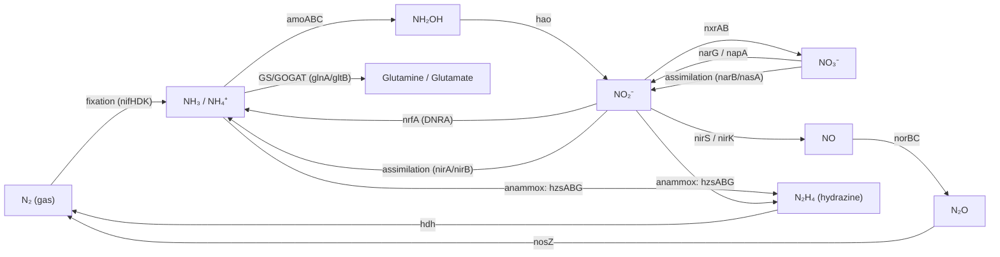

# Nitrogen Cycle Module

## Overview

The biological nitrogen cycle is the set of microbially driven redox
transformations that interconvert the major inorganic nitrogen species —
dinitrogen gas (N₂), ammonia/ammonium (NH₃/NH₄⁺), hydroxylamine (NH₂OH),
nitrite (NO₂⁻), nitrate (NO₃⁻), nitric oxide (NO), nitrous oxide (N₂O), and (in
anammox) hydrazine (N₂H₄). Unlike the carbon cycle, essentially **all** of the
key dissimilatory steps are catalysed by prokaryotes (bacteria and archaea),
which makes this an explicitly multi-organism, microbial module rather than a
single model-species project.

This module collects the canonical, well-characterised marker enzymes for each
arm of the cycle so their GO annotations can be reviewed against a coherent,
mechanistically-organised picture. It is deliberately scoped to **dissimilatory
and assimilatory inorganic-nitrogen metabolism**; downstream amino-acid and
nucleotide biosynthesis are out of scope except for the ammonia-assimilation
entry point (GS/GOGAT).

> **Companion project.** [`NITROGEN_CYCLE_OBSOLETION.md`](NITROGEN_CYCLE_OBSOLETION.md)
> tracks the proposed `do_not_annotate` flag on the ecosystem-level grouping
> term **GO:0071941 nitrogen cycle metabolic process** and the obsoletion of its
> three regulation children. That project documents *over-annotation* of
> mammalian genes onto the parent term; this module documents the *legitimate*
> microbial machinery and the specific descendant pathway terms that
> mis-annotated entries should be re-routed to. Read the two together.

## Core transformations

| Arm | Net reaction | Direction | Key marker genes |
|---|---|---|---|
| **Nitrogen fixation** | N₂ → 2 NH₃ | reductive | `nifH`, `nifD`, `nifK` (nitrogenase) |
| **Nitrification (ammonia ox.)** | NH₃ → NH₂OH → NO₂⁻ | oxidative | `amoA/B/C`, `hao` |
| **Nitrification (nitrite ox.)** | NO₂⁻ → NO₃⁻ | oxidative | `nxrAB` (NOB nitrite oxidoreductase) |
| **Denitrification** | NO₃⁻ → NO₂⁻ → NO → N₂O → N₂ | reductive (anaerobic resp.) | `narG`/`napA`, `nirS`/`nirK`, `norBC`, `nosZ` |
| **DNRA** | NO₃⁻/NO₂⁻ → NH₄⁺ | reductive (fermentative) | `nrfA` |
| **Anammox** | NH₄⁺ + NO₂⁻ → N₂ (via N₂H₄) | redox-coupled | `hzsABG`, `hdh` |
| **Assimilation** | NO₃⁻ → NO₂⁻ → NH₄⁺ → Gln/Glu | reductive (anabolic) | `narB`/`nasA`, `nirA`/`nirB`, `glnA`, `gltB` |
| **Ammonification** | organic-N (urea) → NH₃ | hydrolytic | `ureC` |

## Candidate genes for review

All accessions below are **reviewed (Swiss-Prot)** entries verified against the
UniProt REST API on 2026-06-20. Organisms are the canonical biochemical/genetic
models for each enzyme; where the cycle is studied across several models, the
best-characterised reviewed entry is listed and alternates are noted.

### 1. Nitrogen fixation — nitrogenase

| Gene | UniProt | Organism | Protein |
|---|---|---|---|
| `nifH` | P00458 | *Klebsiella pneumoniae* | Nitrogenase iron protein (Fe protein / component II) |
| `nifD` | P07328 | *Azotobacter vinelandii* | Nitrogenase MoFe protein α chain (EC 1.18.6.1) |
| `nifK` | P07329 | *Azotobacter vinelandii* | Nitrogenase MoFe protein β chain (EC 1.18.6.1) |

*Notes:* *K. pneumoniae* is the classical `nif` genetic model; *A. vinelandii*
is the structural model (MoFe-protein crystal structures). Alternative
nitrogenases (V-dependent `vnfH`, Fe-only `anfH`) are out of the initial seed.

### 2. Nitrification — ammonia & nitrite oxidation

| Gene | UniProt | Organism | Protein |
|---|---|---|---|
| `amoA` | Q04507 | *Nitrosomonas europaea* | Ammonia monooxygenase α subunit (EC 1.14.99.39) |
| `amoB` | Q04508 | *Nitrosomonas europaea* | Ammonia monooxygenase β subunit |
| `amoC` (`petC`) | Q82W83 | *Nitrosomonas europaea* | Ammonia monooxygenase γ subunit |
| `hao` | Q50925 | *Nitrosomonas europaea* | Hydroxylamine oxidoreductase (EC 1.7.2.6) |
| `cycA` (cyt c-554) | Q57142 | *Nitrosomonas europaea* | HAO-linked cytochrome c-554 |
| `nxrA` (nitrite ox.) | — | *Nitrobacter* / *Nitrospira* (NOB) | Nitrite oxidoreductase α — **no reviewed Swiss-Prot entry**; homologous to respiratory `narG`. Candidate for a TrEMBL-backed review (resolve accession first). |

### 3. Denitrification

| Gene | UniProt | Organism | Protein |
|---|---|---|---|
| `narG` | P09152 | *Escherichia coli* | Respiratory (membrane) nitrate reductase α (EC 1.7.5.1) |
| `napA` | Q56350 | *Paracoccus pantotrophus* | Periplasmic nitrate reductase (EC 1.9.6.1) |
| `nirS` | P24474 | *Pseudomonas aeruginosa* | Cytochrome *cd₁* nitrite reductase (EC 1.7.2.1) |
| `nirK` | P25006 | *Achromobacter cycloclastes* | Copper-containing nitrite reductase (EC 1.7.2.1) |
| `norB` | P98008 | *Stutzerimonas (Pseudomonas) stutzeri* | NO reductase large subunit (EC 1.7.2.5) |
| `norC` | Q51662 | *Paracoccus denitrificans* | NO reductase cytochrome *c* subunit |
| `nosZ` | Q51705 | *Paracoccus denitrificans* | Nitrous-oxide reductase (EC 1.7.2.4) |

*Notes:* `nirS` (cytochrome *cd₁*) and `nirK` (Cu-type) are mutually exclusive,
convergent solutions to the same NO₂⁻→NO step — reviewing both makes the
"either/or" distribution across denitrifiers explicit.

### 4. DNRA (dissimilatory nitrate reduction to ammonium)

| Gene | UniProt | Organism | Protein |
|---|---|---|---|
| `nrfA` | P0ABK9 | *Escherichia coli* | Cytochrome *c* nitrite reductase, ammonia-forming (EC 1.7.2.2) |

### 5. Anammox (anaerobic ammonium oxidation)

| Gene | UniProt | Organism | Protein |
|---|---|---|---|
| `hzsA` | Q1Q0T2 | *Kuenenia stuttgartiensis* | Hydrazine synthase α (EC 1.7.2.7) |
| `hzsB` | Q1Q0T4 | *Kuenenia stuttgartiensis* | Hydrazine synthase β |
| `hzsG` | Q1Q0T3 | *Kuenenia stuttgartiensis* | Hydrazine synthase γ (EC 1.7.2.7) |
| `hdh` | Q1PW30 | *Kuenenia stuttgartiensis* | Hydrazine dehydrogenase (EC 1.7.2.8) |

### 6. Assimilatory nitrate/nitrite reduction & ammonia assimilation

| Gene | UniProt | Organism | Protein |
|---|---|---|---|
| `narB` | P39458 | *Synechococcus elongatus* PCC 7942 | Ferredoxin nitrate reductase (EC 1.7.7.2) |
| `nasA` | Q06457 | *Klebsiella oxytoca* | Assimilatory nitrate reductase (EC 1.7.-.-) |
| `nirA` | P39661 | *Synechococcus elongatus* PCC 7942 | Ferredoxin–nitrite reductase (EC 1.7.7.1) |
| `nirB` | P08201 | *Escherichia coli* | NADH nitrite reductase large subunit (EC 1.7.1.15) |
| `glnA` | P0A9C5 | *Escherichia coli* | Glutamine synthetase (GS) (EC 6.3.1.2) |
| `gltB` | P09831 | *Escherichia coli* | Glutamate synthase (GOGAT) large chain (EC 1.4.1.13) |

### 7. Ammonification (organic-N mineralization)

| Gene | UniProt | Organism | Protein |
|---|---|---|---|
| `ureC` | P18314 | *Klebsiella aerogenes* | Urease α subunit (EC 3.5.1.5) |

## Relevant GO descendant terms

When re-routing annotations off the grouping term **GO:0071941**, the specific
pathway children below are the targets (see the obsoletion project for the
annotation-by-annotation plan):

- **GO:0009399** nitrogen fixation
- **GO:0019333** denitrification pathway
- **GO:0019331** anaerobic respiration, nitrate to nitrite (and related)
- nitrification / nitrite-oxidation children
- **GO:0019676** ammonia assimilation cycle (GS/GOGAT)

> GO IDs above are provided as routing guidance; verify each label/definition in
> OLS or QuickGO before using it in a review, per repo policy on not trusting
> unverified IDs.

## Scope & approach

1. **Microbial, multi-species by nature.** None of these genes live in the
   model-organism directories (`human`, `mouse`, …); each will need
   `just fetch-gene <CODE> <gene>` with the appropriate UniProt species code
   (e.g. `NITEU` for *Nitrosomonas europaea*, `PARDE` for *Paracoccus
   denitrificans*, `KUEST` for *Kuenenia stuttgartiensis*). Confirm the species
   subdirectory exists or create it before fetching.
2. **Seed with marker enzymes, not whole operons.** The lists above are the
   catalytic/diagnostic subunits. Accessory and regulatory genes (`nifEN`,
   `nirSEFCJ` maturation, `nosDFYL`, two-component `narXL`/`ntrBC`, etc.) are
   intentionally deferred to keep the first review pass focused.
3. **Use the cycle as a consistency check.** Because each step has a defined
   substrate→product redox couple, reviewing a gene against the diagram surfaces
   over-annotations (e.g. a nitrite reductase annotated to the broad parent
   GO:0071941 should move to its denitrification or DNRA child).
4. **Coordinate with the obsoletion project.** Any annotation found on
   GO:0071941 during these reviews should be logged in
   [`NITROGEN_CYCLE_OBSOLETION.md`](NITROGEN_CYCLE_OBSOLETION.md).

## Status

- 2026-06-20 — Module created. Compiled the canonical marker-gene set for the
  six core nitrogen-cycle arms plus assimilation and ammonification. All listed
  accessions are reviewed Swiss-Prot entries verified via the UniProt REST API
  on this date. The one unresolved marker is NOB nitrite oxidoreductase
  (`nxrA`), which has no reviewed entry and is flagged for accession resolution.
  No gene reviews started yet.
