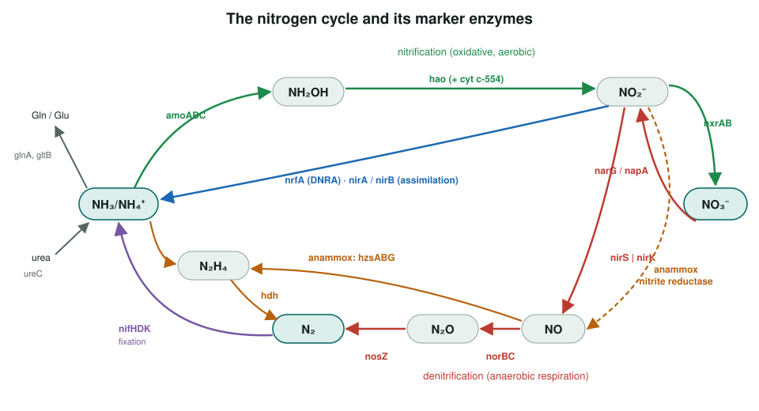
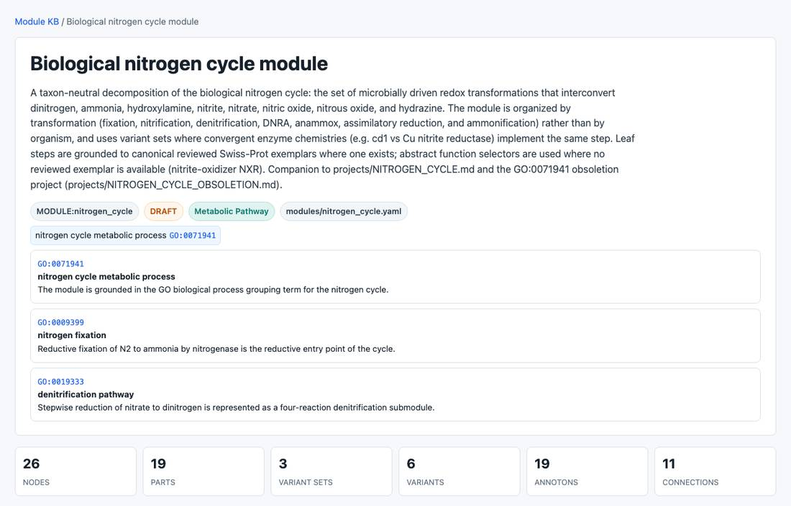

<!-- _class: lead -->

# The nitrogen cycle

Scoping a multi-organism review of the microbial nitrogen-cycle enzymes

AI Gene Review · projects/NITROGEN_CYCLE · scoping

---

<!-- _class: bluf -->

## Bottom line

- **Scoped, no gene reviews started.** The cycle's dissimilatory steps are almost all bacterial or archaeal.
- We chose **27 reviewed Swiss-Prot marker enzymes** across seven arms, plus `nxrA`, which has no reviewed entry.
- A taxon-neutral **module** (`modules/nitrogen_cycle.yaml`, DRAFT) is built; it gives the specific pathway terms that annotations on **GO:0071941** should move to.

---

## The cycle and its markers

---

## Candidate genes by arm

| Arm | Markers | Model organisms |
|---|---|---|
| Fixation | nifH, nifD, nifK | *K. pneumoniae*, *A. vinelandii* |
| Nitrification | amoA/B/C, hao, cycA; nxrA (no Swiss-Prot) | *N. europaea* |
| Denitrification | narG, napA, nirS, nirK, norB, norC, nosZ | *E. coli*, *P. aeruginosa*, *P. denitrificans* ... |
| DNRA | nrfA | *E. coli* |
| Anammox | hzsA, hzsB, hzsG, hdh | *K. stuttgartiensis* |
| Assimilation | narB, nasA, nirA, nirB, glnA, gltB | *S. elongatus*, *E. coli*, *K. oxytoca* |
| Ammonification | ureC | *K. aerogenes* |

nirS and nirK are convergent solutions to the same NO₂⁻ → NO step; reviewing both makes the either/or distribution explicit.

---

## The draft module

pages/modules/nitrogen_cycle.html: one part per arm, variant sets for convergent enzymes, Swiss-Prot exemplars as grounding.

---

## Status and next steps

- ✅ Marker set chosen and accessions verified (2026-06-20); module drafted.
- ⬜ Resolve an accession for NOB nitrite oxidoreductase (`nxrA`).
- ⬜ `just fetch-gene` each marker under its species code (e.g. NITEU, PARDE, KUEST) and review.
- ⬜ Log any GO:0071941 rows found to the companion obsoletion project.

**Read more:** `projects/NITROGEN_CYCLE.md` · `modules/nitrogen_cycle.yaml` · `projects/NITROGEN_CYCLE_OBSOLETION.md`
