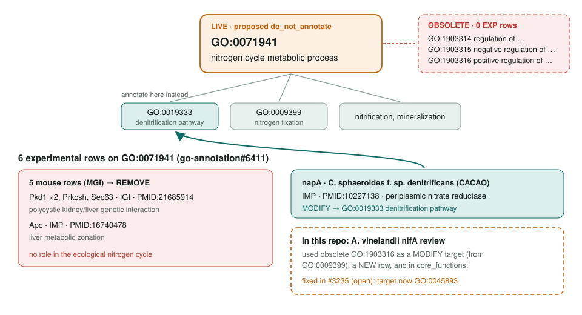
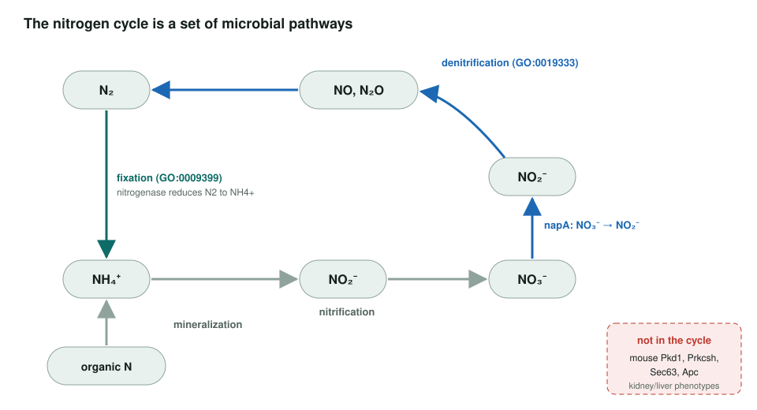

<!-- _class: lead -->

# Nitrogen cycle metabolic process: do_not_annotate and regulation obsoletion

GO:0071941 → annotate its child pathways · GO:1903314/5/6 obsolete

AI Gene Review · projects/NITROGEN_CYCLE_OBSOLETION · 2026

---

<!-- _class: bluf -->

## Bottom line

- GO:0071941 is an **ecosystem grouping term**; its three **regulation children are obsolete**, while the parent remains the live grouping term.
- The original **6 experimental rows** are down to one current direct hit; **napA** should move to **GO:0019333** denitrification pathway.
- **Local cleanup done.** The one in-repo obsolete-term hit, **A. vinelandii nifA**, was fixed in #3235.

---

## Old terms → where annotations should go

---

## What the term is for

---

## Why five of six rows are wrong

- **Pkd1, Prkcsh, Sec63** (IGI, PMID:21685914): the polycystic kidney and liver disease network; glucosidase II, translocon, polycystin.
- **Apc** (IMP, PMID:16740478): liver metabolic zonation; urea-cycle enzymes sit downstream, but APC has no nitrogen-cycle role.
- All five use `acts_upstream_of_or_within`, assigned by MGI.
- The term is about microbial nitrogen transformations; **mammalian nitrogen excretion is a different process**.
- **napA** (IMP, PMID:10227138) is a real denitrification gene, just on the parent term.

---

## In this repo

| Review | Relation | State |
|---|---|---|
| `genes/AZOVI/nifA` | used **GO:1903316** (obsolete) | fixed in #3235; GO:0045893 is the live interim term |
| `genes/human/SEC63` | ortholog of affected mouse Sec63 | reviewed; no GO:0071941 row in its GOA file |
| mouse Pkd1, Prkcsh, Apc, Sec63 | affected upstream | removed from exact GO:0071941 |
| `napA` | still on GO:0071941 | not reviewed |

GO has no "regulation of nitrogen fixation" term, so a replacement must be chosen per row.

---

## Status and next steps

- **2026-05-13:** project created; 6 rows matched the upstream count.
- **2026-09-26:** OLS lists GO:1903314/5/6 obsolete; GO:0071941 still live.
- **2026-09-27:** #3235 merged, removing GO:1903316 from nifA.
- **2026-10-04:** GO:1903314/5/6 obsolete in QuickGO; GO:0071941 has only the napA row.
- Next: move **napA** to denitrification; add the historical mouse-row pattern to `projects/OVER_ANNOTATION_PATTERNS.md`.

**Upstream:** go-annotation#6411 closed · go-ontology#27220 closed
**Read more:** `projects/NITROGEN_CYCLE_OBSOLETION.md`
