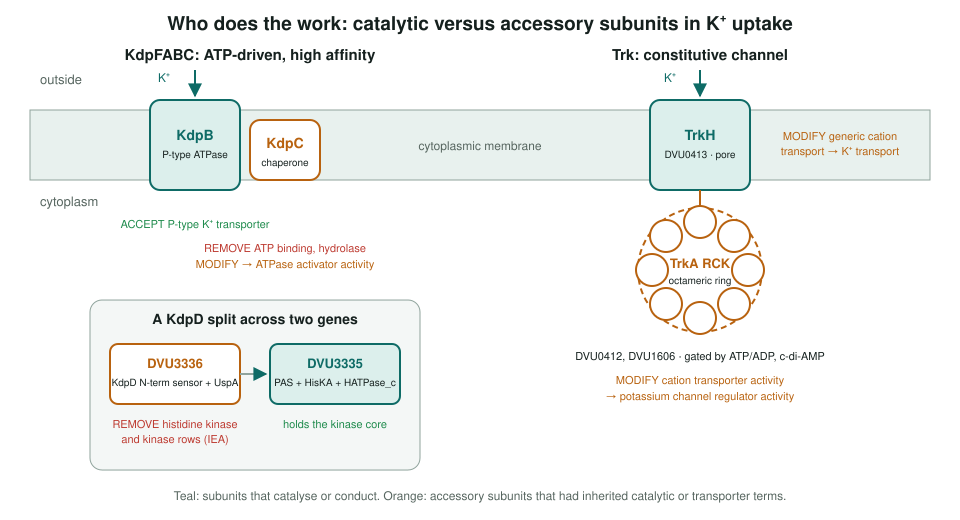
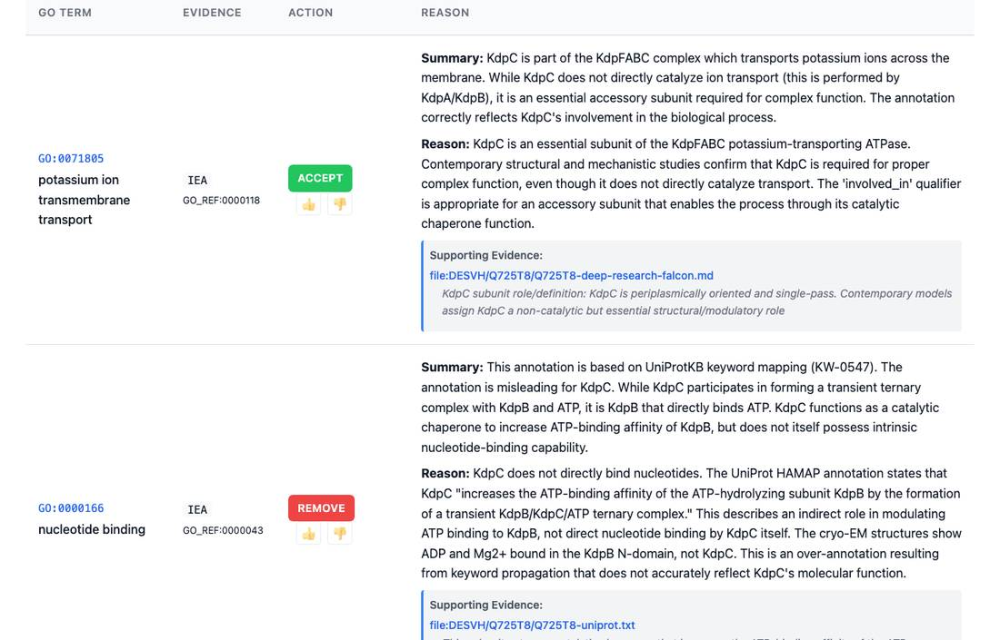
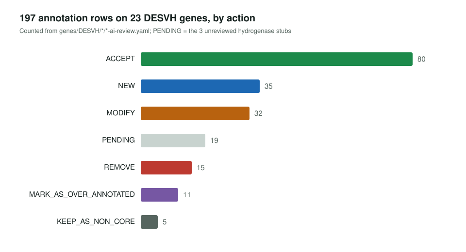

<!-- _class: lead -->

# *Nitratidesulfovibrio vulgaris* Hildenborough

GO review of four pathways in the model sulfate-reducing bacterium

AI Gene Review · projects/NITV2_PATHWAYS · 2026

---

<!-- _class: bluf -->

## Bottom line

- We reviewed **23 genes** in sulfate reduction, potassium transport, sigma factors and hydrogen metabolism; **20 have manual actions** (178 rows), 3 hydrogenase stubs are still `PENDING`.
- The main fix is **separating catalytic from accessory subunits**: AprB, KdpC and the TrkA-type RCK proteins lose inherited catalytic or transporter terms.
- A wrong reassignment of DVU0848–0849 to Flx–Hdr was reverted to **QmoA/QmoB** in PR #3226: they sit in the *aprBA–qmoABC* cluster; Flx–Hdr is DVU2399–2405.

---

## Why this organism

- **Model sulfate reducer**: sulfate is the terminal electron acceptor of anaerobic respiration.
- Annotation is almost entirely electronic, so each pathway is a test of how well pipelines assign subunit roles.
- Four pathways: sulfate reduction (AprAB, QmoABC, a SulP permease), K⁺ transport (Kdp, Trk), sigma factors, and periplasmic and cytoplasmic hydrogenases.

---

## Who does the work in K⁺ uptake

---

## KdpC is a chaperone, not an ATPase

kdpC (Q725T8): process row accepted; `nucleotide binding`, `ATP binding` and `hydrolase activity` removed; transporter MF replaced by ATPase activator activity (GO:0001671).

---

## Other corrections

- **AprB** (Q72DT3): adenylyl-sulfate reductase activity → **electron transfer activity**; AprA keeps the catalytic term and gains dissimilatory sulfate reduction.
- **AprA**: `succinate dehydrogenase activity` (IEA) **removed**.
- **Sigma factors**: DNA-binding TF activity → **sigma factor activity** (GO:0016987) on rpoD, rpoH, fliA; RNA polymerase activity removed from fliA.
- **rpoC** is the RNA polymerase β′ core subunit, not a sigma factor.
- **DVU0279**: a SulP-family transporter whose sulfate substrate is unproven.

---

## Results

---

## Status and next steps

- ✅ Sulfate reduction (6), potassium transport (7), sigma factors (5) reviewed.
- ◐ Hydrogenases: hydA and hynA1 reviewed; hysA, echA, cooH still `PENDING`.
- ✅ DVU0848–0849 restored to QmoA/QmoB; QmoB dropped two unsupported `NEW` rows.
- ⬜ Finish hysA, echA and cooH (#3981).

**Read more:** `projects/NITV2_PATHWAYS.md` · `genes/DESVH/<accession>/`
