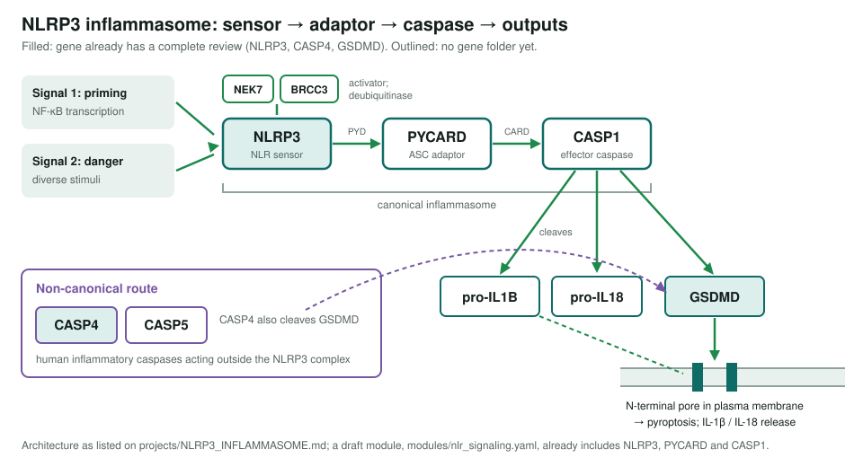
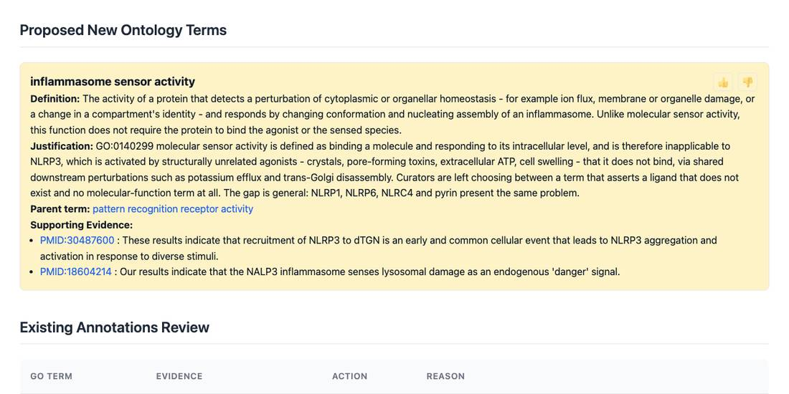

<!-- _class: lead -->

# NLRP3 inflammasome assembly

A scoped project: ten candidate genes, three already reviewed

AI Gene Review · projects/NLRP3_INFLAMMASOME · 2026

---

<!-- _class: bluf -->

## Bottom line

- **NLRP3** recruits **PYCARD (ASC)** to activate **caspase-1**, which matures IL-1β and IL-18 and cleaves **gasdermin D** to open pyroptotic pores.
- **Scoped, not yet started**: no project-specific review work has been done.
- **3 of 10** candidates already reviewed (NLRP3, CASP4, GSDMD; 364 annotations). PYCARD, CASP1 and five others have no gene folder; a draft **NLR signaling module** already includes NLRP3, PYCARD and CASP1.

---

## The mechanism and what is covered

---

## Why this complex

- A **major therapeutic target**; gain-of-function NLRP3 causes **CAPS**, and inflammasome activity contributes to gout, atherosclerosis and Alzheimer disease.
- Post-2020 work on the **trans-Golgi activation site**, post-translational control, assembly structures and the **GSDMD pore** is likely under-represented in GO.
- A bounded complex with a clear order: sensor → adaptor → caspase → substrates.

---

## A gap in GO the NLRP3 review found

NLRP3 is activated by unrelated stimuli it does not bind, so GO:0140299 <em>molecular sensor activity</em> does not fit. The review proposes <em>inflammasome sensor activity</em>.

---

## Status and next steps

| Gene | State |
|---|---|
| NLRP3 (188 ann.), CASP4 (99), GSDMD (77) | Reviewed (COMPLETE) |
| PYCARD, CASP1, CASP5, IL1B, IL18, NEK7, BRCC3 | No gene folder |

- ⬜ `just fetch-gene human <GENE>` for the seven missing genes, starting with **PYCARD** and **CASP1**.
- ⬜ Extend `modules/nlr_signaling.yaml` (DRAFT) with the reviewed inflammasome genes.

**Read more:** `projects/NLRP3_INFLAMMASOME.md` · `modules/nlr_signaling.yaml`
