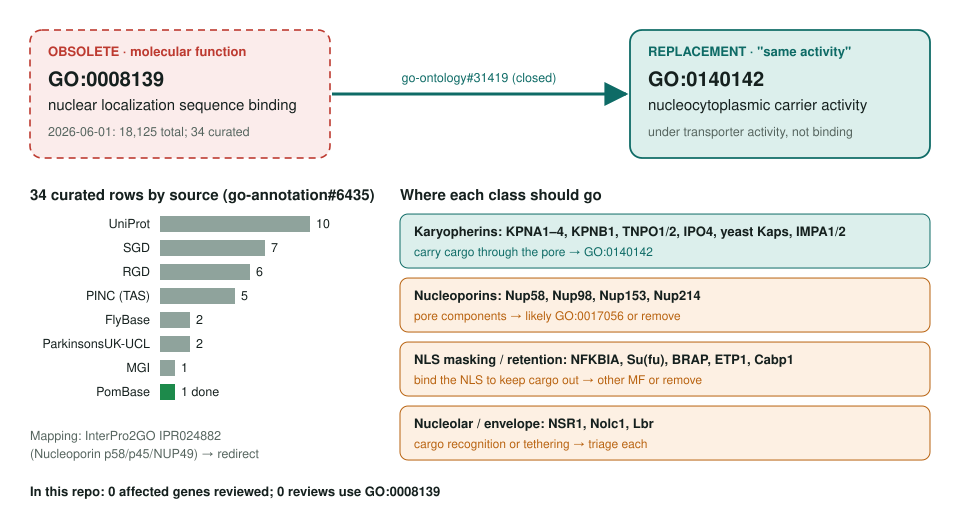
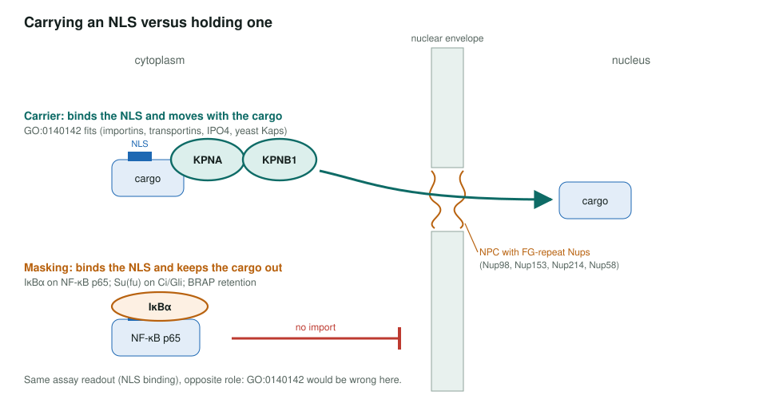

<!-- _class: lead -->

# Nuclear localization sequence binding: obsoletion

GO:0008139 → GO:0140142 nucleocytoplasmic carrier activity, triaged per annotation

AI Gene Review · projects/NLS_BINDING_OBSOLETION · 2026

---

<!-- _class: bluf -->

## Bottom line

- GO **obsoleted GO:0008139** as "the same activity as" **GO:0140142** nucleocytoplasmic carrier activity (OLS, 2026-09-26).
- Of **34 curated rows**, the karyopherins move cleanly; **nucleoporins, NLS-masking and nucleolar proteins** bind an NLS without carrying it and need case-by-case calls.
- **Scoped, not yet started:** none of the 31 affected accessions is reviewed here. The page was marked MATURE; it is now SCOPING.

---

## Old term → replacement, by class

---

## Carrying versus holding an NLS

---

## Why a straight swap would be wrong

- GO:0140142 is "binding to **and carrying** a cargo between the nucleus and the cytoplasm".
- **IκBα** (IPI, PMID:1493333) masks the p65 NLS; **Su(fu)** holds Ci/Gli in the cytoplasm.
- **Nup58/98/153/214** (PMID:7878057, PMID:8707840) are pore components; likely GO:0017056 or removal.
- **NSR1, Nolc1** recognise nucleolar cargo; **Lbr** tethers at the nuclear envelope.
- **Cabp1** and **BRAP** need their pull-down and retention evidence re-read.
- InterPro2GO **IPR024882** (Nucleoporin p58/p45/NUP49) should not become carrier activity.

---

## Review queue

| Tier | Genes | Expected outcome |
|---|---|---|
| 1 | human KPNA2, KPNA4, KPNB1, IPO4 | move to GO:0140142 |
| 2 | yeast PSE1, KAP104, KAP123, MTR10, KAP120 | move to GO:0140142 |
| 3 | NFKBIA, Su(fu), Nup58/98/153/214, NSR1, ETP1, Lbr, Nolc1 | triage: other MF or remove |
| 4 | BRAP, Cabp1, Arabidopsis IMPA1/IMPA2 | triage / plant coverage |

PINC's 5 TAS rows (KPNA1, KPNA3, KPNB1, TNPO1, TNPO2) are candidates for evidence-code modernisation.

---

## Status and next steps

- **2026-06-01/02:** project created; 34 rows tallied by source; genes tiered.
- **2026-09-26:** GO:0008139 **obsolete** in OLS. No affected gene under `genes/`; no review uses GO:0008139.
- Only repo review using GO:0140142: human **NPM1** (core function), not in the affected set.
- Next: review **KPNA2 + KPNA4**, then **KPNB1**, then one diagnostic case (**NFKBIA** or **Su(fu)**).

**Upstream:** go-annotation#6435 · go-ontology#31419
**Read more:** `projects/NLS_BINDING_OBSOLETION.md`
