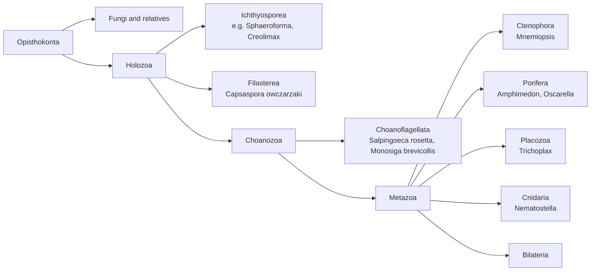

# Project ORIGINS_OF_MULTICELLULARITY: Gene Function at the Origin of Animals

**Bottom line:** animals evolved from a single-celled ancestor they share
with choanoflagellates, and many genes that build animal bodies (cadherins,
integrins and their adhesome, tyrosine kinases, Hippo signalling, the T-box
factor Brachyury) predate animals and are present in their unicellular
relatives. GO barely covers these relatives, so their functions are
annotated almost entirely by transfer from animals. A census of GOA on
2026-09-30 found 0 experimental GO annotations for ichthyosporeans,
ctenophores and placozoans. Choanoflagellates have 2, both `protein binding`;
*Capsaspora* has 4, all on one histone; sponges have 16. Metazoa as a whole
has about 952,000. We are reviewing the few unicellular-relative genes with direct genetic
evidence, starting with the three *Salpingoeca rosetta* genes required for
rosette colonies, and will add a matched set of animal "multicellularity
toolkit" genes. We also ask whether IBA and IEA propagation places
animal-specific process terms on unicellular proteins, and whether GO has the
terms to describe clonal colony development in a non-animal. Three draft
reviews are done: rosetteless (secreted C-type lectin-like protein of the
rosette extracellular matrix), jumble (Golgi-localised predicted
glycosyltransferase) and couscous (predicted alpha-1,2-mannosyltransferase).
They add two experimental annotations where GOA had none for these proteins,
remove one electronic term (`GO:0046354` mannan biosynthetic process, whose GO
definition is softwood hemicellulose), and show that GO has no term for
rosette development; a new term is proposed in the rosetteless review.

## Motivation

Multicellularity arose independently many times (animals, land plants, several
algal lineages, fungi, and aggregative forms such as *Dictyostelium*). Animal
multicellularity is the best studied of these, and comparative genomics of its
closest unicellular relatives has changed the question. The
choanoflagellate genome showed that cadherins, tyrosine kinases and other
"animal" signalling and adhesion families were already present before animals
[PMID:18273011 "The genome of the choanoflagellate Monosiga brevicollis and the origin of metazoans"].
*Capsaspora* carries an integrin adhesome and many animal-type transcription
factors [PMID:23942320 "The Capsaspora genome reveals a complex unicellular prehistory of animals"; PMID:20479219 "Ancient origin of the integrin-mediated adhesion and signaling machinery"].
Gene-family reconstructions of the animal stem lineage separate what was
co-opted from what was new
[PMID:29848444 "Gene family innovation, conservation and loss on the animal stem lineage"].
The origin of animal multicellularity is therefore largely a story of
**co-option**: ancestral proteins with unicellular functions (prey capture,
substrate adhesion, environmental sensing) taking on roles in a multicellular
body.

This makes the lineage a hard test of GO annotation practice:

1. **Annotation desert.** The organisms that best test these hypotheses have
   almost no experimental GO annotations (see the census below). What they
   have is IEA and IBA, transferred mainly from animals.
2. **Propagation direction.** An IBA placed at a node below the Holozoa split
   hands animal-derived functions to choanoflagellate and *Capsaspora*
   proteins. Where that function is biochemical (kinase activity,
   calcium-dependent adhesion), the transfer may be sound. Where it is a
   multicellular process (e.g. tissue development, cell-cell junction
   assembly in an epithelium), the transfer asserts something the organism
   may not do. Where the propagation actually lands is an open, testable
   question (see [IBA_REVIEW](IBA_REVIEW.md) and
   [HOMOLOGY_PROPAGATION](HOMOLOGY_PROPAGATION.md)).
3. **Ontology coverage.** GO has rich terms for animal development and for
   aggregative development in *Dictyostelium* (e.g. `GO:0031152` aggregation
   involved in sorocarp development), but it is not clear that it has terms
   for clonal colony formation in a unicellular holozoan, such as rosette
   development in *S. rosetta*.
4. **Toolkit genes in animals.** The human orthologs of the ancestral toolkit
   are heavily annotated. Reviewing them with the premetazoan evidence in
   mind helps separate the ancestral core activity from the animal-specific
   processes they were later recruited into.

## Phylogenetic frame

Branching among the early animal lineages is drawn as a polytomy. Chromosome-scale
synteny supports ctenophores as sister to all other animals
[PMID:37198475 "Ancient gene linkages support ctenophores as sister to other animals"],
but this project does not depend on resolving that question. Reviews
summarising the unicellular-to-multicellular transition:
[PMID:29065305 "The Origin of Animal Multicellularity and Cell Differentiation"],
[PMID:28479598 "The origin of Metazoa: a unicellular perspective"],
[PMID:33622103 "The origin of animals: an ancestral reconstruction of the unicellular-to-multicellular transition"].

Multicellularity modes in the unicellular relatives:

| Lineage | Organism | Multicellular stage | Mode |
|---|---|---|---|
| Choanoflagellata | *Salpingoeca rosetta* | Rosette colonies, induced by a bacterial sulfonolipid [PMID:23066504 "A bacterial sulfonolipid triggers multicellular development in the closest living relatives of animals"] | Clonal (incomplete cytokinesis) |
| Choanoflagellata | *Choanoeca flexa* | Cup-shaped colonies that invert their curvature in response to light, via a rhodopsin-cGMP pathway and actomyosin contractility [PMID:31624206 "Light-regulated collective contractility in a multicellular choanoflagellate"] | Colonial (mode to check in full text) |
| Filasterea | *Capsaspora owczarzaki* | Adherent, cystic and aggregative life stages [PMID:32857975 "the life cycle of C. owczarzaki (hereafter, Capsaspora) includes three distinct life stages: adherent; cystic; and aggregative"]; life-stage transitions track changes in chromatin and cis-regulation [PMID:27114036 "The Dynamic Regulatory Genome of Capsaspora and the Origin of Animal Multicellularity"] | Aggregative |
| (outgroup, Amoebozoa) | *Dictyostelium discoideum* | Fruiting body | Aggregative, independent origin; see [DICTYOSTELIUM_DEVELOPMENT](DICTYOSTELIUM_DEVELOPMENT.md) |

## Annotation census

Experimental GO annotations (ECO:0000269 and descendants) in GOA, queried from
QuickGO on 2026-09-30 by
[`annotation_census.py`](ORIGINS_OF_MULTICELLULARITY/annotation_census.py);
raw output in
[`annotation_census.tsv`](ORIGINS_OF_MULTICELLULARITY/annotation_census.tsv).

| Lineage | NCBI taxon | Experimental annotations | What they are |
|---|---|---:|---|
| Ichthyosporea | 127916 | 0 | none |
| Filasterea | 2687318 | 4 | all on one *Capsaspora* macroH2A histone (A0A0D2UG83), PMID:34887560 |
| Choanoflagellata | 28009 | 2 | `GO:0005515` protein binding (IPI) for two *M. brevicollis* proteins (A9V7T9, A9VAD3) from a cross-species bZIP interaction screen [PMID:23661758 "Networks of bZIP protein-protein interactions diversified over a billion years of evolution"] |
| Ctenophora | 10197 | 0 | none |
| Porifera | 6040 | 16 | *Oscarella pearsei* vinculin VIN1 and talin TLN [PMID:29880641 "Analysis of a vinculin homolog in a sponge (phylum Porifera) reveals that vertebrate-like cell adhesions emerged early in animal evolution"]; a *Chondrilla* galactose-binding lectin; an *Amphimedon* PI5P 4-kinase; a *Suberites* silicatein |
| Placozoa | 10226 | 0 | none |
| Cnidaria | 6073 | 319 | mostly *Nematostella* and corals (toxins, cGAS/STING) |
| Metazoa (all) | 33208 | 951,791 | |

Two notes from the census:

- The only sponge row for `GO:0098630` aggregation of unicellular organisms is
  on the *Chondrilla* lectin (C0HLX7). Its source reports agglutination of
  *Staphylococcus* and *E. coli* [PMID:29175164 "Antibacterial activity of a new lectin isolated from the marine sponge Chondrilla caribensis"],
  so the aggregating organisms are bacteria, not sponge cells. This row says
  nothing about sponge multicellularity.
- The sponge vinculin paper is the one experimental entry point for the
  adhesome in an early-branching animal, and it pairs naturally with the
  *Capsaspora* integrin work
  [PMID:32857975 "Integrin-Mediated Adhesion in the Unicellular Holozoan Capsaspora owczarzaki"].

## Work plan

### Track A: unicellular-relative genes with direct genetic evidence

Forward and reverse genetics in *S. rosetta* now exist
[PMID:25299189 "The Rosetteless gene controls development in the choanoflagellate S. rosetta."; PMID:32496191 "Genome editing enables reverse genetics of multicellular development in the choanoflagellate Salpingoeca rosetta."].
The genes below have phenotypes but, as of the census, no experimental GO
annotations. Accessions were resolved from the locus tags and GenBank
accessions given in the papers.

| Priority | Gene | Organism | UniProt | Evidence | Current UniProt name / GOA | Notes |
|---|---|---|---|---|---|---|
| 1 | rosetteless (*rtls*) | SALRS | F2U5Y1 (PTSG_03555) | Forward genetic screen; essential for rosette development; the protein forms an extracellular layer that coats and connects the basal poles of rosette cells [PMID:25299189] | "Lung surfactant protein A"; no GOA rows | C-type lectin domain (PF00059), signal peptide. The UniProt name is a similarity-derived label and looks like a naming error to report |
| 2 | jumble (*jmbl*) | SALRS | F2TWH0 (PTSG_00436; EGD72416) | Forward genetics; mutant cells aggregate into amorphous clumps instead of rosettes, with aberrant glycosylation of the basal ECM [PMID:30556809 "Predicted glycosyltransferases promote development and prevent spurious cell clumping in the choanoflagellate S. rosetta"] | "Uncharacterized protein"; no GOA rows | Predicted glycosyltransferase, one N-terminal TM helix |
| 3 | couscous (*cous*) | SALRS | F2UJ78 (PTSG_07368; EGD77026) | Forward genetics, same study [PMID:30556809] | "Apple domain-containing protein"; 7 IEA rows incl. `GO:0000026` alpha-1,2-mannosyltransferase activity | PF11051 mannosyltransferase plus PAN/apple domain; IEA MF is plausible, check the Golgi and "mannan biosynthesis"-type process IEAs |
| 4 | *hippo*, *warts* and *yorkie* (Hippo pathway) | SALRS | F2UQC7 (PTSG_10780), F2U943 (PTSG_04961), F2UDK1 (PTSG_06057), from the bioRxiv preprint DOI:10.1101/2024.07.13.603360 | CRISPR knockouts; warts-KO rosettes are larger than wild type, and Warts and Yorkie regulate ECM genes including couscous [PMID:41037400 "A selection-based knockout approach for a choanoflagellate reveals regulation of multicellular development by Hippo signaling."] | | Pairs with the premetazoan Hippo pathway in *Capsaspora* [PMID:22832104 "Premetazoan origin of the hippo signaling pathway"] |
| 5 | septins | SALRS | *to resolve* | Tagged septins localise to the basal poles of single cells and rosettes [PMID:30281390 "Transfection of choanoflagellates illuminates their cell biology and the ancestry of animal septins."] | | Localisation only; a role in rosette development is a hypothesis, so CC terms at most |
| 6 | integrin β2 and vinculin | CAPO3 | *to resolve*; UniProt has several "Integrin beta" entries (e.g. A0A0D2WRB3, A0A0D2VIQ2, A0A0D2X2W6) | Adherent cells attach through actin-dependent filopodia, where integrin β2 and vinculin localise as patches [PMID:32857975] | | Map the paper's "integrin β2" to a UniProt accession from its methods before fetching |
| 7 | Brachyury | CAPO3 | *to resolve* | Functional conservation shown in *Xenopus*; DNA-binding motif similar to metazoan Brachyury [PMID:24043797 "Early evolution of the T-box transcription factor family"] | | Premetazoan T-box factor; the paper argues metazoan-specific specificity arose later |
| 8 | VIN1 / TLN | OSCPE | A0A3B6UES5 / A0A3G2LGI8 | [PMID:29880641] | 5 experimental rows | Reviewed (DRAFT) |
| 9 | coHpo, coWts, coYki (Hippo pathway) | CAPO3 | A0A0D2WLF3 (CAOG_01932), A0A0D2VGR4 (CAOG_00619), A0A0D2WY30 (CAOG_07866) | Knockouts: coHpo and coWts mutants have nuclear coYki, elongated contractile cells and denser aggregates; coYki mutants bleb and make flatter aggregates; no proliferation effect [PMID:35659869 "Genome editing in the unicellular holozoan Capsaspora owczarzaki suggests a premetazoan role for the Hippo pathway in multicellular morphogenesis."; PMID:38517944 "The Hippo kinase cascade regulates a contractile cell behavior and cell density in a close unicellular relative of animals."] | IEA only | Reviewed (DRAFT); locus IDs from the key resources table of PMID:38517944 |

### Track B: the animal toolkit, reviewed with premetazoan evidence in mind

Human genes whose families predate animals and which the literature above
treats as part of the multicellularity toolkit. Reviews already in the repo
are marked; they need a pass focused on whether the core function is ancestral.

- **Cadherin/catenin adhesion:** CDH1 (review exists), CTNNB1, CTNNA1
- **Integrin adhesome:** ITGB1, TLN1, VCL, PTK2
- **Tyrosine kinase signalling:** SRC, CSK, ABL1 (review exists)
- **Hippo pathway:** STK3, LATS1, YAP1, TEAD1
- **Transcription factors with premetazoan origin:** MYC (review exists), TBXT, TP53 (review exists)
- **Animal-specific comparators:** NOTCH1 (review exists), COL4A1. Neither is
  present in choanoflagellates in the form it has in animals, so they are
  controls for "animal innovation".

### Track C: propagation audit

For each Track A/B family, pull the IBA and IEA annotations on
choanoflagellate and *Capsaspora* orthologs and classify each by where the
PAINT node sits (pre-Holozoa, Holozoa, Choanozoa, Metazoa) and whether the
term is a biochemical activity or a multicellular process. Candidate error
types from the prediction-review taxonomy: `TAXON_CONSTRAINT_VIOLATION` and
`PATHWAY_CONTEXT_IGNORED`. Per CLAUDE.md, an IBA carries a phylogenetic
judgement: the question is whether the target sits inside the clade that
inherited the function, not how many donors there are.

### Track D: ontology gaps

- Is there a GO process term for clonal colony (rosette) development in a
  unicellular organism? Candidates to check include `GO:0007275` multicellular
  organism development and its parent `GO:0032501` multicellular organismal
  process. Check whether their definitions or taxon constraints exclude
  non-animals before using them, and draft an NTR only if nothing fits.
- Is bacterial induction of development (RIF-1 sulfonolipid
  [PMID:23066504]; the chondroitinase that induces mating
  [PMID:28867285 "Mating in the Closest Living Relatives of Animals Is Induced by a Bacterial Chondroitinase."])
  representable on the choanoflagellate side, or only as a process of the
  bacterium?

## Open questions

- Is rosetteless's C-type lectin domain needed for its function, and does
  "Lung surfactant protein A" get propagated to other choanoflagellate
  proteins by name rules?
- Which UniProt entry is the "integrin β2" of PMID:32857975?
- Do choanoflagellate cadherins (e.g. the *M. brevicollis* MBCDH set,
  PMID:18273011) carry IEA `cell-cell adhesion` or `adherens junction` terms,
  and is there evidence for either?

## Related projects

[DICTYOSTELIUM_DEVELOPMENT](DICTYOSTELIUM_DEVELOPMENT.md) (independent,
aggregative origin), [ECM](ECM.md), [MECHANOBIOLOGY](MECHANOBIOLOGY.md),
[IBA_REVIEW](IBA_REVIEW.md), [HOMOLOGY_PROPAGATION](HOMOLOGY_PROPAGATION.md),
[CEPHALOPOD](CEPHALOPOD.md) (another annotation desert).

---

# STATUS

2026-09-30: Track A priorities 1–3 reviewed (DRAFT).

- [x] GOA experimental-annotation census across Holozoa
- [x] Resolve UniProt accessions for rosetteless, jumble, couscous
- [x] Resolve accessions for *S. rosetta* hippo, warts, yorkie and *Capsaspora* coHpo, coWts, coYki
- [ ] Resolve accessions for *S. rosetta* septins and *Capsaspora* integrin β2, vinculin and Brachyury (PMID:32857975 is abstract-only; PMID:24043797 gives no locus ID for CoBra)
- [x] `just fetch-gene SALRS <accession> --alias <name>` for Track A priorities 1–3 (works for unreviewed TrEMBL entries)
- [x] Review: rosetteless (F2U5Y1) — DRAFT
- [x] Review: jumble (F2TWH0) — DRAFT
- [x] Review: couscous (F2UJ78) — DRAFT
- [x] Review OSCPE VIN1 and TLN — DRAFT
- [x] Review CAPO3 coHpo, coWts, coYki — DRAFT
- [x] Review SALRS hippo, warts, yorkie — DRAFT
- [ ] Track B human toolkit reviews (none started)
- [ ] Track C propagation audit (started: three cases so far, coWts, warts, yorkie; see 2026-10-01 notes)
- [ ] Track D ontology check (started: NTR "rosette colony development" drafted in the rosetteless review)
- [ ] Deep research (falcon) for the three SALRS genes, once a provider key is available

# NOTES

## 2026-09-30

Created project. Census numbers come from `annotation_census.py` and will
drift as GOA updates; rerun before quoting them elsewhere. All PMIDs on this
page were checked against PubMed esummary, and all UniProt accessions against
the UniProt REST API. The *S. rosetta* locus-to-gene mapping comes from the
full text of PMID:25299189 (PTSG_03555 = Rosetteless) and PMID:30556809
(GenBank EGD72416 = jumble, EGD77026 = couscous).

Later the same day: reviewed rosetteless, jumble and couscous (SALRS, all
DRAFT). No deep-research provider key was available, so each gene has a
manual `-notes.md` built from the cached full text instead of a
`-deep-research-*.md` file; falcon deep research is still to do. Cached the
choanoflagellate papers under `publications/` (PMID:41037400 is abstract-only,
so the 2025 knockout phenotypes are not yet captured). Findings:

- **rosetteless**: NEW `GO:0031012` extracellular matrix (IDA). Core function
  `GO:0005201` extracellular matrix structural constituent is inferred from
  location plus phenotype, not measured, and is kept out of the annotation
  rows. UniProt's name "Lung surfactant protein A" comes from the genome
  project's EMBL record and should be changed.
- **jumble**: NEW `GO:0005794` Golgi apparatus (IDA, tagged protein at the
  Golgi position; the non-functional L305P protein is retained in the ER).
  InterPro finds no domain; the glycosyltransferase call rests on fold
  recognition only, so the MF appears only in core_functions.
- **couscous**: 7 IEA rows. Accepted alpha-1,2-mannosyltransferase activity,
  glycosyltransferase activity, glycoprotein biosynthetic process and
  membrane. Golgi apparatus and Golgi membrane left UNDECIDED, because the
  tagged protein was "clearly not localized to the Golgi" (PMID:30556809).
  Removed mannan biosynthetic process.
- None of the three was given a rosette-development process term: jumble and
  couscous fail the participation test (necessity only, targets unknown), and
  GO has no suitable term. The NTR "rosette colony development" is in the
  rosetteless review, where the protein is a structural part of the colony
  matrix.

## 2026-10-01

Reviewed the *Capsaspora* Hippo kinase cascade and the sponge adhesome pair
(all DRAFT, manual notes because no deep-research key is available).

- **coWts: first Track C case.** TreeGrafter places coWts (A0A0D2VGR4) in
  PTHR22988:SF71 "CITRON RHO-INTERACTING KINASE", the ROCK/MRCK/citron family,
  while human LATS1/2 are in PTHR24356. Drosophila wts is also in PTHR22988, so
  the Warts/LATS clade is split across two PANTHER families. coWts therefore
  inherits cytoskeletal terms from a ROCK/citron node and misses the LATS-node
  hippo signaling IBA. Actomyosin structure organization was removed,
  cytoskeleton terms marked over-annotated, and hippo signaling added (IMP,
  coYki is nuclear in coWts-/- cells; PMID:38517944). The *S. rosetta* Warts
  (F2U943) is in PTHR24356, the LATS family.
- **coHpo:** signal transduction modified to hippo signaling; protein
  tetramerization removed (a p53-like tetramerisation fold match on the SARAH
  domain, which forms dimers).
- **coYki:** all five propagated rows hold, including hippo signaling and
  transcription coactivator activity; NEW DNA-binding transcription factor
  binding (IPI, co-IP with coSd). Its knockout shows no proliferation effect,
  so no proliferation term. A negative result for Track C.
- **Sponge VIN1/TLN:** both protein binding rows replaced by talin binding and
  vinculin binding. VIN1 binds F-actin only with talin peptide present; NEW
  cell-cell junction (IDA, endogenous protein at epithelial contacts). TLN
  cell-cell adhesion modified to cell-matrix adhesion.
- Resolved *S. rosetta* hippo, warts, yorkie from the bioRxiv preprint of
  PMID:41037400. The preprint full text could not be cached (bioRxiv rate
  limits; the Europe PMC copy returns 403) at first; a later retry cached the
  version 1 PDF. The PTSG locus IDs appear only in version 2 (read from
  bioRxiv XML, not cached); this is recorded in each gene's notes.
- **S. rosetta warts: second Track C case.** Its IBA rows come from the
  Metazoa-Choanoflagellida speciation node PTN002390470 of the LATS family.
  That node carries animal tissue-level terms: regulation of organ growth was
  removed (choanoflagellates have no organs; GO's taxon constraints do not
  exclude them), and positive regulation of apoptotic process and G1/S
  transition were marked over-annotated. hippo signaling was accepted. *M.
  brevicollis* Warts receives the same rows. This is a node-placement issue
  for the PAINT curators, not a family error.
- **S. rosetta yorkie: third Track C case.** TreeGrafter grafts F2UDK1 onto an
  Ecdysozoa node of the MAGI-related family PTHR10316, a family-placement
  error like coWts. Our motif scan (yorkie-bioinformatics/) finds four Warts
  phosphorylation motifs but no TEAD-interface motif, and PANTHER classes a
  different WW protein, F2U5K0, in the YAP1 family; the preprint nonetheless
  names PTSG_06057 (F2UDK1) as yorkie. Orthology needs a proper phylogeny.
- **S. rosetta hippo:** generic kinase and signal-transduction rows kept;
  hippo signaling not added, since hippo knockouts do not phenocopy warts
  (normal rosette size) and nothing places Hippo upstream of Warts in S.
  rosetta.
