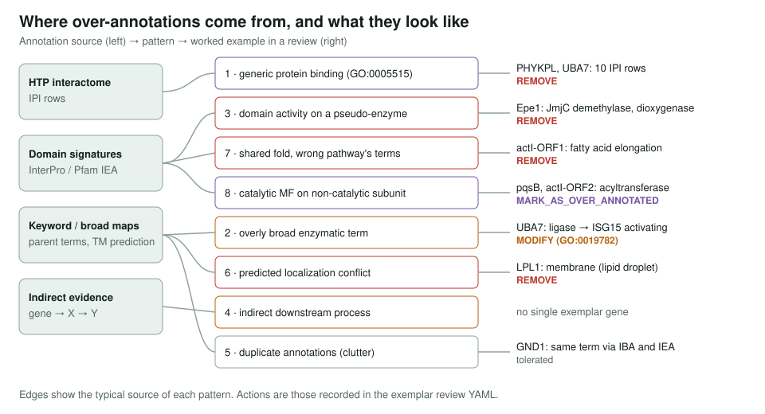
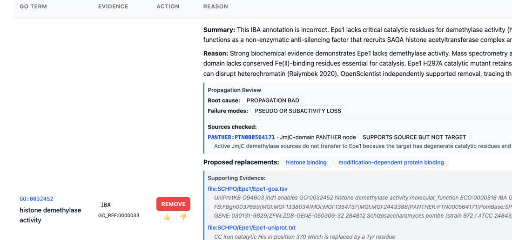
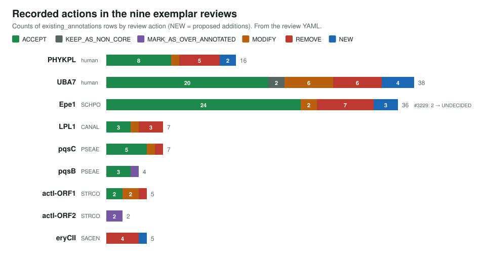

<!-- _class: lead -->

# Over-annotation patterns

Recurring ways a GO annotation can be defensible and still say nothing, or say something false

AI Gene Review · projects/OVER_ANNOTATION_PATTERNS · 2026

---

<!-- _class: bluf -->

## Bottom line

- Many GO rows come from **HTP screens, domain signatures, broad mappings or family propagation** and tell a reader little, or assert an activity the protein lacks.
- We catalogued **eight recurring patterns**, each tied to worked examples in real reviews; first presented at the **GO Consortium meeting, October 2025**.
- **Nine exemplar reviews** are complete and their recorded actions match the patterns. The catalogue is qualitative: **frequency across the repo is not yet measured**.

---

## Why a catalogue

- The same over-annotation shapes recur gene after gene.
- Naming a pattern lets a curator or pipeline author **recognise it once** instead of rediscovering it.
- Over-annotations **dilute** informative rows, create a **false impression** of understanding, **skew enrichment**, and **propagate by IBA** to other species.

---

## Eight patterns and their sources

---

## A pseudo-enzyme in practice: Epe1

Fission yeast Epe1 has a JmjC domain but lacks the Fe(II)-binding catalytic residues; the IBA demethylase row is REMOVE with histone-binding replacements proposed.

---

## Shared folds, shared subunits

- **Pattern 7:** the KAS-III fold is common to fatty-acid and polyketide synthases, so IEA puts **fatty-acid** terms on polyketide enzymes.
  - actI-ORF1: `GO:0030497` fatty acid elongation → **REMOVE**; `GO:0006633` → **MODIFY** to `GO:1901112` actinorhodin biosynthesis.
  - pqsC: `GO:0006633` → **REMOVE**; the product is a quinolone signal.
- **Pattern 8:** a catalytic MF lands on the partner without an active site.
  - pqsB, actI-ORF2: acyltransferase → **MARK_AS_OVER_ANNOTATED**; eryCII (heme-less P450): monooxygenase, heme, iron → **REMOVE**.

---

## Actions in the exemplar reviews

---

## Curation principles

1. **Specificity over breadth:** prefer the most specific accurate term.
2. **Remove uninformative rows:** generic `protein binding` from HTP screens.
3. **Validate domain predictions**, especially enzymatic activity.
4. **Direct vs indirect:** annotate the proximal function, not downstream consequences.
5. **Consider pseudo-enzymes:** a domain does not guarantee activity.

---

## Status and next steps

- ✅ Eight patterns documented; nine exemplar reviews complete.
- ⬜ Measure how often each pattern occurs across the repo (e.g. share of `GO:0005515` rows demoted).
- ⬜ Turn the most mechanical patterns (HTP `protein binding`, fold-based pathway terms) into flags a curator can filter on.
- Related: `projects/PSEUDOENZYMES.md`, `projects/PROTEIN_COMPLEX_FUNCTIONS.md`, `projects/REVIEW_QUALITY_AUDIT.md`

**Read more:** `projects/OVER_ANNOTATION_PATTERNS.md`
