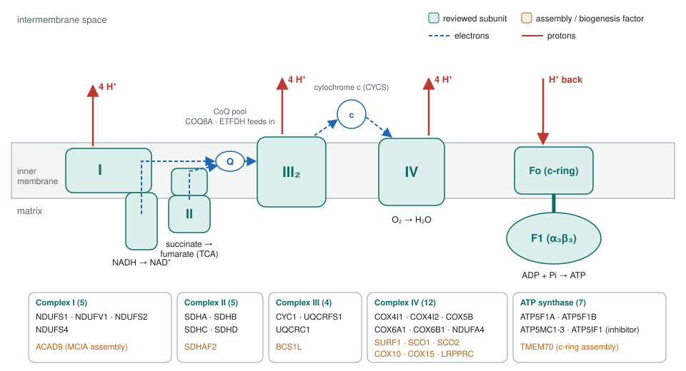
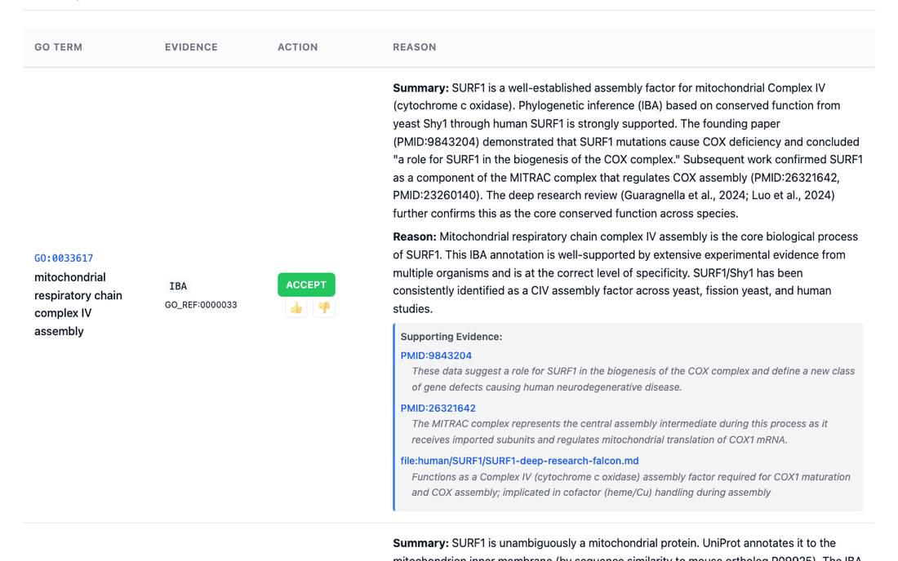
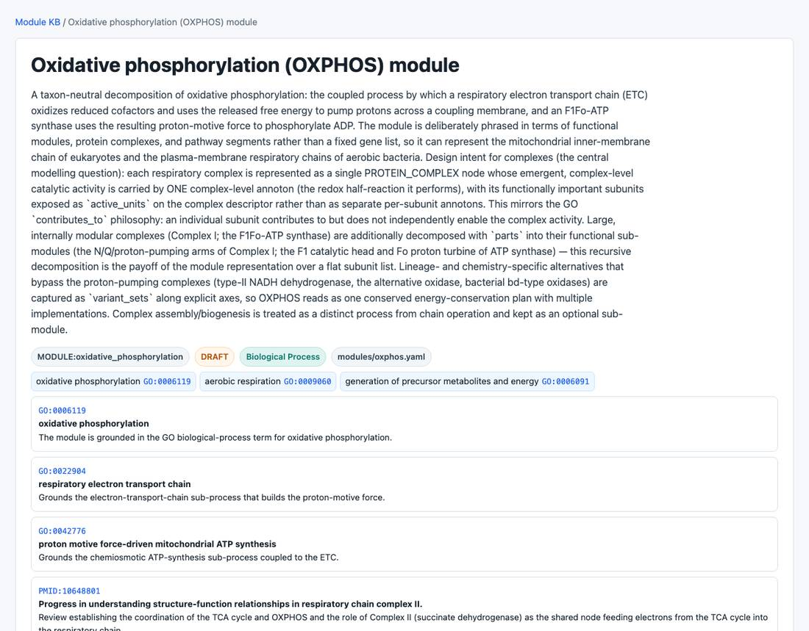

<!-- _class: lead -->

# Oxidative phosphorylation

Reviewing GO annotations across the five respiratory complexes, their carriers and assembly factors

AI Gene Review · projects/OXPHOS · 2026

---

<!-- _class: bluf -->

## Bottom line

- OXPHOS makes most cellular ATP: **four electron-transport complexes, two carriers, one ATP synthase**, about 90 subunits plus assembly factors.
- **36 of 38** prioritized human genes are reviewed: **1,330 annotations**, 861 accepted, 152 over-annotated, 52 removed, 18 NEW.
- One pattern throughout: subunits **`contributes_to`** the complex activity; **assembly factors are not the enzyme**.

---

## What was reviewed, complex by complex

---

## Why this pathway

- Every complex is a **multi-subunit machine**, so the central question is **who carries the activity**: the complex, a catalytic subunit, or neither.
- **Assembly factors** (SURF1, SCO1/2, COX10, COX15, BCS1L, TMEM70) often inherit the activity of the complex they build.
- **Dual roles** need both kept apart: SDHA in TCA and ETC; CYCS in the ETC and apoptosis; ATP5F1B at the cell surface.
- Disease genes (Leigh, paraganglioma, GRACILE, CoQ10 deficiency) make wrong annotations costly.

---

## The subunit pattern

| Role | GO pattern | Examples |
|---|---|---|
| Catalytic subunit | enables own activity + `contributes_to` complex activity | NDUFV1 electron transfer (NEW) + contributes to CI activity; SDHA; UQCRFS1 |
| Non-catalytic subunit | `contributes_to` only; direct oxidase row over-annotated | COX6B1, COX4I2, COX6A1 |
| Assembly factor | assembly process or its own chemistry | SURF1 → CIV assembly; COX10 heme O synthase; SCO1 copper chaperone |
| Inhibitor | own MF | ATP5IF1 → ATPase inhibitor activity |

---

## What a review looks like

SURF1: complex IV assembly is accepted as its core process. Its cytochrome-c oxidase activity and proton transport rows were removed.

---

## Results by complex

| Complex | Genes | Ann. | ACCEPT | Non-core | Over-ann. | MODIFY | REMOVE | NEW |
|---|---|---|---|---|---|---|---|---|
| I | 5 | 252 | 187 | 38 | 15 | 4 | 4 | 2 |
| II | 5 | 196 | 135 | 29 | 12 | 9 | 6 | 5 |
| III | 4 | 112 | 66 | 9 | 27 | 3 | 5 | 2 |
| IV | 12 | 334 | 202 | 47 | 44 | 12 | 24 | 5 |
| V | 7 | 322 | 202 | 55 | 39 | 6 | 13 | 1 |
| Carriers / CoQ / ETF | 3 | 114 | 69 | 23 | 15 | 4 | 0 | 3 |

Counts from the 36 review YAMLs; 8 UNDECIDED (ATP5F1B 3, ATP5IF1 3, ACAD9 2) not shown. Complex IV includes its assembly factors and LRPPRC.

---

## The OXPHOS module

modules/oxphos.yaml: each complex is one PROTEIN_COMPLEX node with a single complex-level activity; subunits are active units; NDH-2, AOX and bd-oxidase are variants.

---

## Status and next steps

- ✅ 36/38 prioritized genes reviewed; taxon-neutral OXPHOS module built.
- ✅ Per-complex modules exist too (`mitochondrial_complex_i_core` … `mitochondrial_complex_iv`, ETF, CoQ10).
- ⬜ **COX7A2L** (supercomplex factor, contested) and **HCCS** (cytochrome c heme lyase) not yet reviewed.
- ✅ STATUS checklist updated for the 11 reviews done under other projects.

**Read more:** `projects/OXPHOS.md` · `modules/oxphos.yaml` · `genes/human/<GENE>/`
