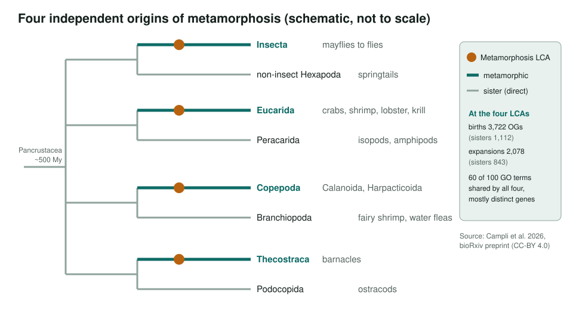
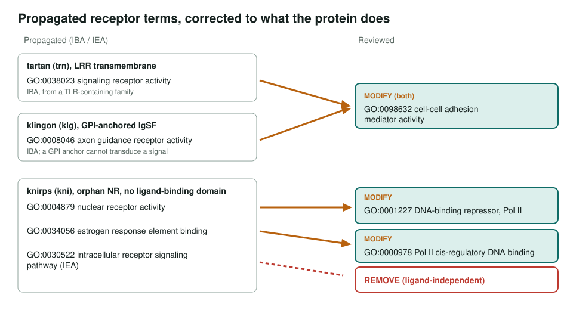
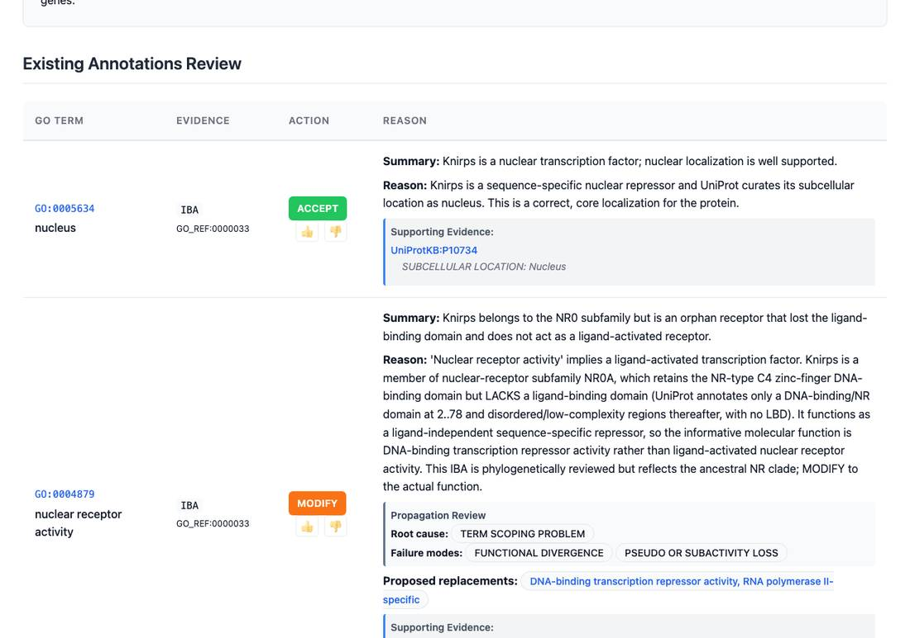

<!-- _class: lead -->

# Metamorphosis gene families in Pancrustacea

Reviewing the fly reference genes behind a convergent-evolution result

AI Gene Review · projects/PANCRUSTACEA_METAMORPHOSIS · 2026

---

<!-- _class: bluf -->

## Bottom line

- Metamorphosis arose **four times** in Pancrustacea; a 2026 preprint finds each origin recruited **different gene families converging on the same functions**.
- We reviewed every GO annotation on the **8 *Drosophila* reference genes** the paper names: 183 imported GOA rows plus 4 NEW rows.
- **108 accepted**, 24 modified, 1 removed. Propagated **receptor** terms were corrected; bare `protein binding` was made specific where GO had a faithful term.

---

## Four independent origins

---

## Why review the fly genes

- Almost all functional knowledge for these families comes from ***Drosophila***.
- Any GO transfer to crustacean orthologues will start from these annotations.
- Copy number, pleiotropy, rewiring and co-option mean fly function **should not be assumed** to transfer. So the fly annotations need to be right and focused first.
- Named genes: `kni`, `hairy` (TFs) · `klg`, `trn`, `caps`, `kek1` (adhesion/receptor) · `krz`, `insc` (signalling, asymmetric division)

---

## Results across 8 genes

| Gene | Rows | ACCEPT | Non-core | MODIFY | REMOVE | Other |
|---|---|---|---|---|---|---|
| kni | 29 | 17 | 3 | 8 | 1 | |
| hairy | 45 | 28 | 6 | 9 | 0 | 1 over, 1 undecided |
| klg | 20 | 12 | 5 | 2 | 0 | 1 NEW |
| trn | 7 | 2 | 3 | 1 | 0 | 1 NEW |
| caps | 13 | 5 | 6 | 0 | 0 | 2 NEW |
| kek1 | 22 | 19 | 1 | 0 | 0 | 2 undecided |
| krz | 21 | 8 | 12 | 1 | 0 | |
| insc | 30 | 17 | 10 | 3 | 0 | |

---

## Receptor terms that did not fit

---

## What a review row looks like

knirps: nucleus accepted; the IBA "nuclear receptor activity" modified to a DNA-binding repressor term, with the propagation failure recorded.

---

## Other corrections

- **hairy**: every `protein binding` IPI resolved via WITH/FROM to STUbL ligase, Groucho/CtBP corepressor, or TF binding (Ultrabithorax); `membrane organization` flagged as over-annotation.
- **knirps**: `protein binding` IPIs → `GO:0001222` transcription corepressor binding.
- **insc**: `establishment of mitotic spindle localization` → **orientation**; two miscited references flagged.
- **krz**: GPCR-binding adaptor core accepted; ERK binding made specific; MAPK/Toll/Hedgehog/Notch attenuation kept non-core.

---

## Status and next steps

- ✅ 8/8 reference genes reviewed and validated.
- ⬜ An ecdysteroid-biosynthesis-regulation module ([#3990](https://github.com/ai4curation/ai-gene-review/issues/3990)).
- ⬜ Optional: *deadpan* (`dpn`), mentioned but not an expanding family ([#3990](https://github.com/ai4curation/ai-gene-review/issues/3990)).
- Open question: do fly imaginal-disc terms over-attribute insect-specific roles to crustacean orthologues?

**Read more:** `projects/PANCRUSTACEA_METAMORPHOSIS.md` · `genes/DROME/<gene>/`
