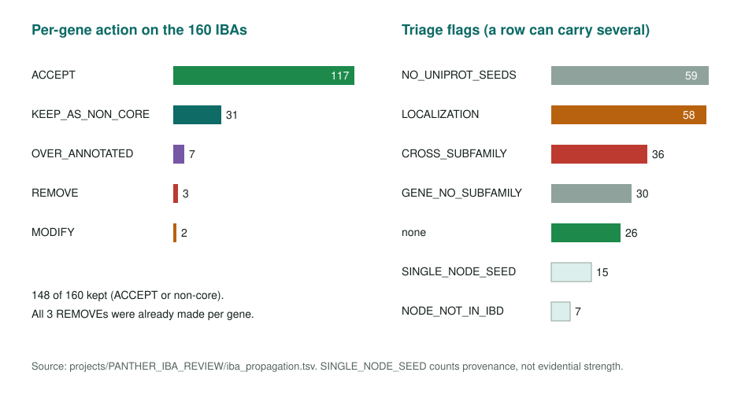
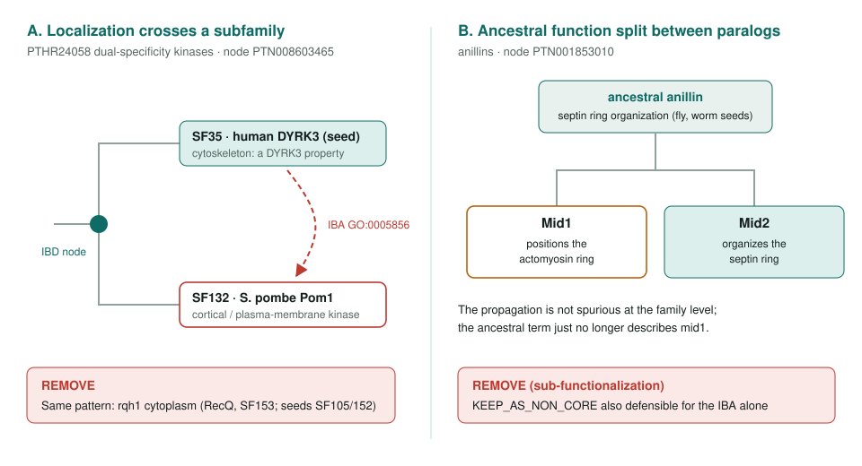

<!-- _class: lead -->

# PANTHER IBA family review

Testing 160 fission yeast IBAs at the tree node they came from

AI Gene Review · projects/PANTHER_IBA_REVIEW · 2026

---

<!-- _class: bluf -->

## Bottom line

- Each IBA follows from a **PAINT curator's IBD** at an ancestral PANTHER node; we rebuilt that propagation for **all 160 IBAs** on 41 reviewed *S. pombe* genes.
- The per-gene calls **held up**: 148 kept, the 36 cross-subfamily flags were mostly conserved functions, **no new errors** among accepted rows.
- Real over-propagations were **localization terms** and **paralog-specific functions** crossing subfamily lines (pom1, rqh1, mid1).

---

## What an IBA asserts

- A PAINT curator reads the tree, the MSA and the experimental annotations, and places the function at a node (**IBD**). Descendants inherit it as **IBA**.
- So an IBA is a phylogenetic judgment. To challenge one, ask: is the target **inside the clade** that inherited the function, and is there target-specific evidence of **loss or divergence**?
- A short seed list is **not** weak support; one well-characterized descendant can ground a node.

---

## Method: rebuild each propagation from repo data

- `with/from` → source node (`PTN…`) and seed genes.
- Gene and seed **subfamilies** from `*-uniprot.txt` and `interpro/panther/<FAM>/<FAM>-entries.csv`.
- Node-level PAINT annotations and **IRD/IKR losses** from `IBD.gaf`.
- Join our per-gene action; flag `CROSS_SUBFAMILY`, `LOCALIZATION`, `NODE_LOSS`, ...
- `just refresh-panther-iba-project` regenerates all three tables.

---

## Outcomes and flags

---

## The two failure patterns

---

## The flag is triage, not a verdict

| Gene | IBA term | Why the cross-subfamily flag is a false positive |
|---|---|---|
| cdc2 | CDK holoenzyme | Cdc2 is the founding CDK |
| plo1 | protein Ser/Thr kinase activity | Polo kinase; conserved family-wide |
| rad3 | DNA damage checkpoint | Rad3/ATR; conserved PIKK function |
| ste11 | dbTF activity | HMG transcription factor |
| cdc18 | replication origin binding | Cdc18/Cdc6 |

Fine-grained PANTHER subfamilies split true orthologs across species. From REVIEW.md.

---

## One term, two correct answers

- `GO:0000165` **MAPK cascade**, IBA on two kinases:
  - **wis1 → ACCEPT**: the MAP2K of the Sty1 stress cascade.
  - **cdc7 → MARK_AS_OVER_ANNOTATED**: SIN initiating kinase; the SIN is a GTPase-regulated relay, not a MAPK cascade.
- **ral2**: PAINT's own IRD losses (peroxidase, cytosol, redox) on node `PTN005166285` keep peroxiredoxin functions off this Kelch subfamily; the one surviving IBA is **ACCEPT**.

---

## Status and next steps

- Done: 160 IBAs analysed; written review in `REVIEW.md`.
- PAINT loss table: **2,129** findings across 549 cached families; **63 IKR** losses fall on a reviewed member, ready for residue reconstruction with `prepare_loss_analysis.py`.

**Read more:** `projects/PANTHER_IBA_REVIEW.md` · `REVIEW.md` · `iba_propagation.tsv` · `projects/IBA_REVIEW.md`
