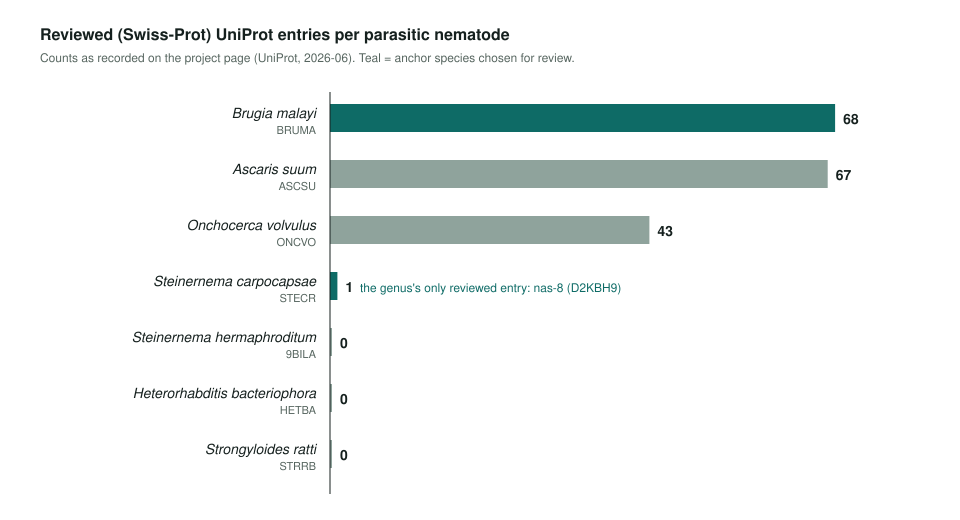
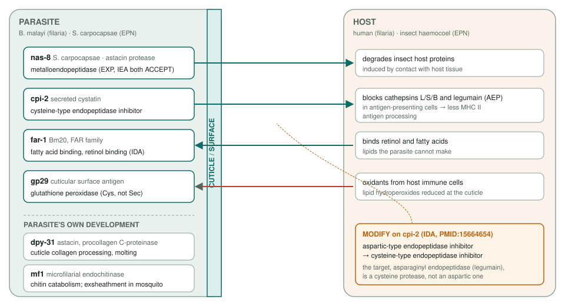
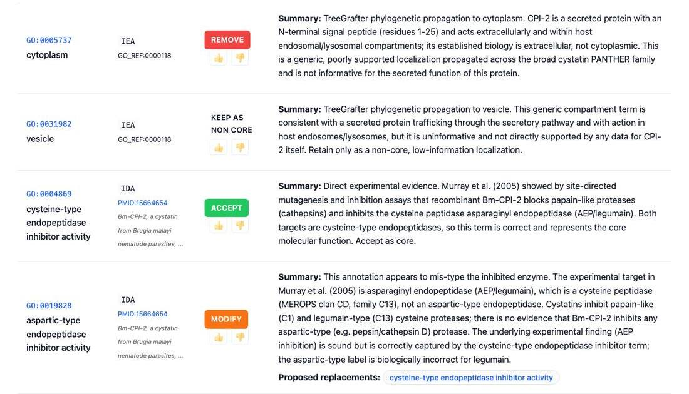

<!-- _class: lead -->

# Parasites

GO review of nematode genes that work at the host interface

AI Gene Review · projects/PARASITES · 2026

---

<!-- _class: bluf -->

## Bottom line

- Parasites invade hosts, evade immunity and scavenge host nutrients; these functions are **thinly covered by GO**, and parasite species have **few reviewed UniProt entries**.
- We anchored on *S. carpocapsae* **nas-8** (the genus's only Swiss-Prot entry) and **five reviewed *Brugia malayi*** secreted, cuticle or surface proteins.
- **All 35 GOA rows actioned across 6 seed reviews**, with 21 ACCEPT. Key fix: a CPI-2 **aspartic-type** inhibitor row → **cysteine-type**, since legumain is a cysteine protease.

---

## Why these species

---

## What the seed proteins do

---

## Review outcomes

| Gene | Species | Rows | ACCEPT | Non-core | Over-ann. | MODIFY | REMOVE |
|---|---|---|---|---|---|---|---|
| nas-8 | *S. carpocapsae* | 6 | 4 | 1 | 1 | 0 | 0 |
| cpi-2 | *B. malayi* | 6 | 3 | 1 | 0 | 1 | 1 |
| far-1 | *B. malayi* | 5 | 4 | 0 | 1 | 0 | 0 |
| dpy-31 | *B. malayi* | 6 | 4 | 1 | 1 | 0 | 0 |
| gp29 | *B. malayi* | 5 | 3 | 1 | 1 | 0 | 0 |
| mf1 | *B. malayi* | 7 | 3 | 2 | 0 | 2 | 0 |

From <code>genes/{STECR,BRUMA}/&lt;gene&gt;/&lt;gene&gt;-ai-review.yaml</code>. Over-annotations are generic parents (metallopeptidase, peroxidase, lipid binding); mf1 MODIFYs move to chitinase and chitin catabolism.

---

## A mis-typed protease inhibitor

cpi-2: the IDA row from PMID:15664654 said <em>aspartic-type</em>; the target (AEP/legumain) is a cysteine peptidase, so it becomes GO:0004869. Above it, the TreeGrafter <em>cytoplasm</em> row is removed for a secreted protein.

---

## Status and next steps

- ✅ 35/35 imported GOA rows now have curation actions.
- ⬜ Six seed YAMLs remain `INITIALIZED`; add notes/deep research before final re-review.
- ⬜ [#3992](https://github.com/ai4curation/ai-gene-review/issues/3992): pick *S. hermaphroditum* (`9BILA`) seeds; no reviewed entries, so this needs literature + bioinformatics.
- ⬜ [#3992](https://github.com/ai4curation/ai-gene-review/issues/3992): fold in the host-modulator candidates from `PARASITE_IMMUNE_MODULATORS`.

**Read more:** `projects/PARASITES.md` · `genes/BRUMA/` · `genes/STECR/nas-8/`
