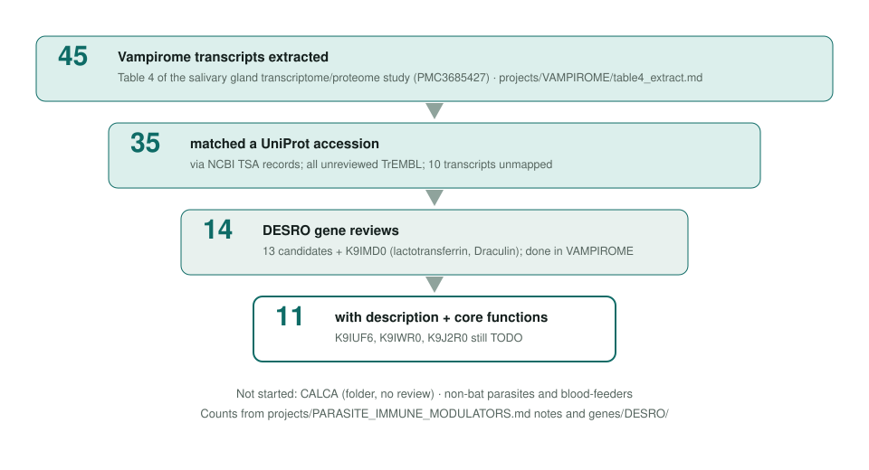
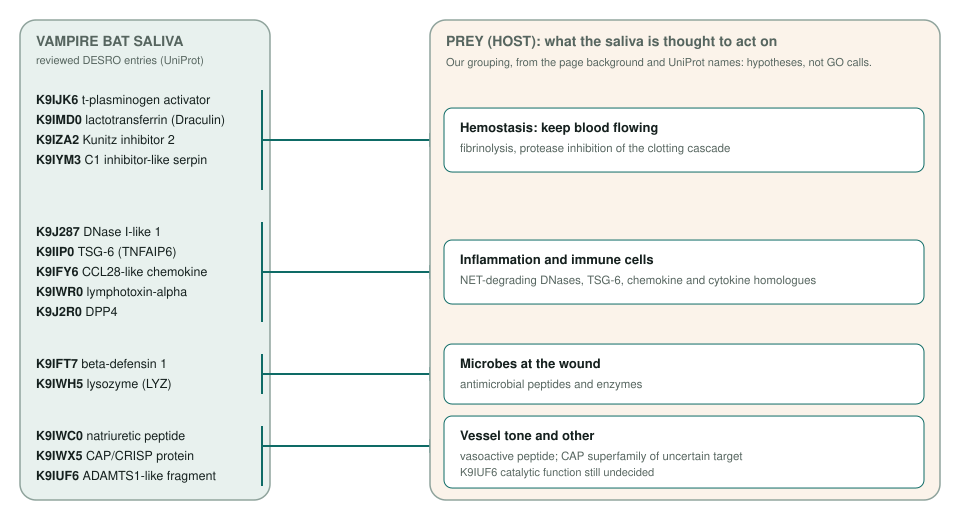

<!-- _class: lead -->

# Parasite immune modulators

Scoping GO curation of secreted host-modulating proteins, starting with vampire bat saliva

AI Gene Review · projects/PARASITE_IMMUNE_MODULATORS · 2026

---

<!-- _class: bluf -->

## Bottom line

- Blood-feeders and parasites secrete proteins that **blunt host clotting, inflammation and immunity**.
- We scoped the **vampire bat (DESRO) Vampirome**: 45 salivary transcripts → **35 UniProt accessions, all unreviewed TrEMBL**.
- The reviews moved to **VAMPIROME**: **14 DESRO reviews**, 136 reviewed rows, and 12 core-function summaries. Non-bat parasites now route through **PARASITES**.

---

## From transcripts to reviews

---

## What the reviewed saliva proteins are thought to do

---

## Where the review work stands (VAMPIROME)

| Action | Rows |
|---|---|
| ACCEPT | 66 |
| MODIFY | 27 |
| MARK_AS_OVER_ANNOTATED | 21 |
| KEEP_AS_NON_CORE | 8 |
| UNDECIDED | 7 |
| REMOVE | 3 |
| NEW (proposed) | 4 |

136 reviewed rows across 14 reviews in <code>genes/DESRO/</code>: 132 imported GOA rows plus 4 NEW proposals. UNDECIDED rows are mainly the K9IUF6 ADAMTS1 fragment; K9IUF6 and K9J2R0 still need core_functions.

---

## Status and next steps

- ✅ Background, Table 4 extract and UniProt mapping (`projects/VAMPIROME/`).
- ✅ 14 DESRO reviews under `VAMPIROME`; ⬜ synthesize K9IUF6 and K9J2R0; ⬜ resolve `CALCA/vCGRP`.
- ⬜ Remaining ~20 mapped candidates (lipocalins, serpins, cystatin, TIMPs).
- ⬜ [#3994](https://github.com/ai4curation/ai-gene-review/issues/3994): finish the DESRO backlog.
- ⬜ Non-bat parasites: fold into the `PARASITES` umbrella as its host-modulation sub-topic ([#3992](https://github.com/ai4curation/ai-gene-review/issues/3992)).

**Read more:** `projects/PARASITE_IMMUNE_MODULATORS.md` · `projects/VAMPIROME.md` · `genes/DESRO/`
