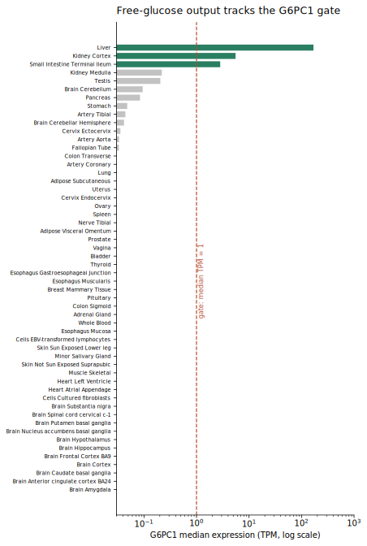
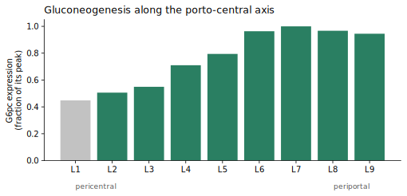
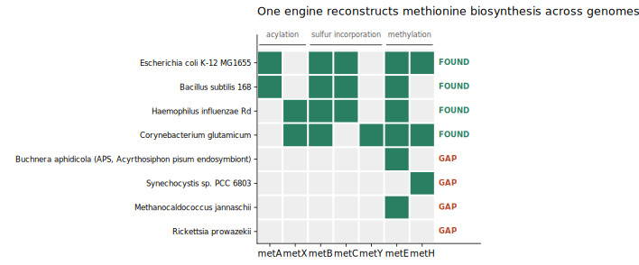
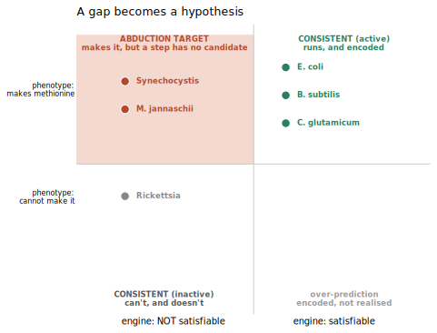

# Pathway satisfiability

**We ask not "does this genome have the pathway?" but "is the pathway wired up *here* — in
this tissue, this cell zone, this genome?" A curation module is read as a boolean formula
over steps; a context (expression, genome content) supplies the truth values. When a pathway
is independently known to run but the logic says it can't, the gap becomes a reviewable,
gene-localised hypothesis.**

## Bottom line

- **It recovers textbook biology from data alone.** Across GTEx's 54 tissues the human
  gluconeogenesis module lights up in exactly **liver, kidney cortex, small intestine** — no
  false positives, no misses — and every other tissue fails at the *same* gate step
  (gluconeogenic glucose-6-phosphatase), resisting the ubiquitous non-gluconeogenic paralog.
- **It resolves *within* an organ, not just between organs.** With a liver-zonation oracle the
  route is satisfiable at the **periportal** pole and blocked at the **pericentral** pole — the
  metazoan question ("which isozyme, in which context") that genome-level tools can't ask.
- **One engine, many contexts.** The same logic reconstructs L-methionine biosynthesis across
  microbial genomes from KEGG orthologs (picking the encoded route per organism), i.e. it
  reproduces GapMind-style step-finding as a special case.
- **A gap is a hypothesis, not just a hole.** Crossing satisfiability with an *independent*
  activity claim turns unexplained gaps into structured leads: **intestinal gluconeogenesis →
  G6PC1**, **liver ketolysis → OXCT1/SCOT**, plus microbial "metabolic dark matter" targets
  (*Synechocystis*, *M. jannaschii*) that make methionine with no canonical enzyme for a step.

Why this matters: pathway-completeness tools (KEGG/Reactome coverage) ask a genome-level
question — right for a microbe, wrong for a metazoan, where every cell carries the whole
genome and the discriminating variable is **which isozyme is expressed in which context**.
Gluconeogenesis is "present" in every human cell, yet glucose output is restricted to a few
tissues and, within the liver, to a few cell layers. This project resolves the pathway *into*
that context.

> **How it works** (model, engine, `src` paths, and commands to reproduce every result) lives
> in the companion notebook: **[Methods & reproduction](PATHWAY_SATISFIABILITY/methods.md)**.
> It is the eukaryotic analogue of GapMind's prokaryotic step-finding.
>
> **See it** — a [rendered demo snapshot](PATHWAY_SATISFIABILITY/demo.html) shows the engine's
> output: the compiled routes/gate, the 54-tissue GTEx resolution, and the microbial methionine
> reconstruction. It is a static page (the expression-gate slider is frozen at its default). For
> the **live slider**, run the self-contained notebook locally —
> `uvx marimo run projects/PATHWAY_SATISFIABILITY/demo_standalone.py` — which executes **offline**
> against committed GTEx/KEGG caches. `demo_standalone.py` (generated by
> [`build_standalone_demo.py`](PATHWAY_SATISFIABILITY/build_standalone_demo.py)) is import-free,
> so it also exports to an interactive WebAssembly page via `marimo export html-wasm`.

## Background: pathway hole filling

"Pathway hole filling" — a pathway looks like it should run but a step has no gene assigned, so
what fills it? — is a mature field for **microbial genomes** and essentially silent on the
**metazoan** version of the question. The prior art splits into three problems: (1) **step-finding**,
does a genome encode the pathway (GapMind — of which this project is the eukaryotic analogue;
KEGG module completeness; MinPath; SEED subsystems); (2) **hole-filling proper**, nominate the
gene for a known-but-unassigned step — the origin of the term, in Pathway Tools' Bayesian
**Pathway Hole Filler** (Green & Karp 2004) and IMG's "Find Candidate Genes for Missing
Function," both leaning on genome context (operons, occurrence profiles); and (3) **network
gap-filling**, add reactions so a flux model balances (GapFind/GapFill, ModelSEED, gapseq).

Every one of these answers a **genome-level** presence/absence question — right for a microbe,
where a genome roughly *is* an organism. It is the wrong question for a metazoan, where every
cell carries the whole genome and the discriminating variable is not presence but **which
isozyme is expressed where**. This project keeps GapMind's logic and swaps the oracle from
genome gene-content to **context expression**, so a "hole" becomes "this pathway cannot be wired
up *in this context*, and here is the gene and place where it fails."

> Full landscape, citations, and a comparison table:
> **[Background: pathway hole filling](PATHWAY_SATISFIABILITY/background.md)**.

## Results

### Between organs (GTEx bulk tissue)
Evaluating the human gluconeogenesis module across 54 tissues recovers exactly the textbook
gluconeogenic set — **liver, kidney cortex, small intestine** — with no false positives and
no misses (Figure 1). Every non-gluconeogenic tissue fails at the *same* gate atom, the
gluconeogenic glucose-6-phosphatase catalytic subunit `G6PC1`, and the engine resists the
ubiquitous paralog `G6PC3` (expressed everywhere but not gluconeogenic). The gate is graded:
raising the expression threshold drops tissues in the order liver → kidney → intestine, matching
their known quantitative contribution.

*Figure 1. Across all 54 GTEx tissues: median expression of `G6PC1`, the terminal gate gene, on a
log axis. **Green** = tissues where the whole gluconeogenesis module is satisfiable — exactly the
three that clear the gate threshold (dashed line). Every grey tissue fails at that same step, and
the near-ubiquitous look-alike `G6PC3` is correctly not accepted for it. Colouring is derived from
the satisfiability engine, not annotated by hand.*

### Within an organ (Halpern 2017 liver zonation)
Reusing the same engine with a liver-lobule zonation oracle, the gluconeogenesis route is
satisfiable only toward the **periportal** pole and is blocked at the **pericentral** pole —
at the same gate atom (Figure 2). The porto-central orientation is inferred from landmark genes
(not assumed), so the periportal restriction is a derivation, not a restatement.

*Figure 2. The same engine, one scale down: the liver lobule (Halpern 2017, nine reconstructed
layers, pericentral → periportal). Bars are `G6pc` expression as a fraction of its own peak;
**green** layers are where gluconeogenesis is satisfiable. The pericentral pole is blocked at the
very same gate atom, `G6PC1`. Because the porto-central axis is oriented from independent landmark
genes, the periportal restriction is a result, not an assumption — the identical gate operates
between organs (Figure 1) and within one.*

### Which precursor? (substrate-entry routes)
A precursor-resolved module makes lactate / alanine (via pyruvate) and glycerol (bypassing
the carboxylation backbone) explicit. Because glycerol skips that backbone, the **only**
universally required step is the terminal glucose-6-phosphatase system. Per tissue the engine
then reports which precursors are usable, with physiologically faithful skews (kidney
lactate-dominant; liver highest alanine capacity).

### Across genomes (KEGG genome presence) — the GapMind reproduction
The *same* engine reconstructs L-methionine biosynthesis from KEGG orthologs across genomes
(Figure 3). It selects the encoded route per organism (succinyl vs acetyl acylation;
trans-sulfuration vs direct sulfhydrylation; cobalamin-dependent vs -independent methylation),
completes *C. glutamicum* through the alternative branch despite a missing trans-sulfuration
enzyme, and flags genome-reduced organisms as gaps.

*Figure 3. Methionine biosynthesis reconstructed across eight genomes. Green = the ortholog is
encoded (KEGG); columns are grouped by pathway stage (acylation `metA`/`metX`; sulfur
incorporation `metB`+`metC` trans-sulfuration or `metY` direct; methylation `metE`/`metH`). Each
genome uses a different encoded route — `E. coli` succinyl (`metA`), `H. influenzae` acetyl
(`metX`), `C. glutamicum` direct sulfhydrylation (`metY`, no `metC`) — and the engine reports
**FOUND** or a **GAP** accordingly. Only the oracle changed from the tissue results; the logic is
identical.*

### Abduction — a gap is a hypothesis
Crossing satisfiability with an **independent** activity phenotype (Figure 4):

| outcome | meaning | example |
|---|---|---|
| CONSISTENT_ACTIVE | reconstructable & known prototroph | E. coli, B. subtilis, C. glutamicum |
| **ABDUCTION_TARGET** | **makes methionine but a step has no candidate** | **Synechocystis, M. jannaschii** |
| CONSISTENT_INACTIVE | gap correctly predicts a known auxotrophy | Rickettsia prowazekii |

The two abduction targets are real metabolic dark matter: both are autotrophs that synthesise
methionine yet encode none of the canonical acylation/sulfur enzymes, so the engine emits a
structured lead ("an unannotated / non-orthologous enzyme must fill this step"). The same
machinery does *not* over-call *Rickettsia*, whose gap is correctly read as its auxotrophy.

*Figure 4. A gap becomes a hypothesis. Each genome placed by the **engine's** verdict (can the
pathway be reconstructed? — horizontal) against an **independent** phenotype (does the organism
actually make methionine? — vertical). The dangerous, interesting quadrant is top-left: organisms
that demonstrably make methionine yet have no candidate for a step — `Synechocystis`,
`M. jannaschii` — flagged as leads. `Rickettsia` (a genuine auxotroph) is correctly *not* flagged,
and the "encoded but not realised" quadrant is empty. The phenotype axis is independent of the
gene content, so a flagged gap is a real prediction, not a restatement.*

The same `abduce()` runs on the **eukaryotic** side against GTEx, with the independent claim
now a documented tissue function (and an extra "not cell-autonomous" explanation, since a
metazoan pathway can be split across organs):

| outcome | meaning | example |
|---|---|---|
| CONSISTENT_ACTIVE | tissue oxidises ketones, enzymes expressed | heart, brain, muscle, kidney |
| CONSISTENT_INACTIVE | gap correctly predicts the function's absence | **liver ketolysis → gap at OXCT1/SCOT** |
| ABDUCTION_TARGET | function reported but a step's gene barely expressed | **intestinal gluconeogenesis → G6PC1** |

Ketone-body oxidation pinpoints why the liver cannot consume the ketones it makes — it is the
one tissue lacking OXCT1/SCOT (GTEx liver = 0 TPM) — reproducing a textbook fact from
expression alone. Intestinal gluconeogenesis, genuinely debated because intestinal
glucose-6-phosphatase is low, surfaces as a lead localised to one gene, which is exactly the
form a reviewer can act on.

## Epistemics

- **Presence ≠ flux.** Expression/genome presence is used asymmetrically: absence excludes a
  route (strong), presence only permits it. A satisfiable set is an upper bound on capacity.
- **Derived, not assumed.** Zonation orientation comes from landmark genes; tissue/zone
  identity from data — never from the answer being sought.
- **Abduction is independent.** The activity column (growth phenotype) is independent of the
  ortholog oracle, so a scored gap is a genuine prediction, and "the assertion is wrong" is
  always retained as an explicit hypothesis.

## Methods & reproduction

The model, engine internals (`module_logic.py`), architecture diagram, source paths, and the
exact commands to reproduce every result above are in the companion notebook:
**[Methods & reproduction](PATHWAY_SATISFIABILITY/methods.md)**.

## Next steps

- A human liver zonation oracle to remove the mouse-ortholog step in the zonation result.
- Apply the engine to additional curated modules (it is module-agnostic).
- Promote the resolvers from `modules/experimental/` into a small CLI once the oracle
  interfaces stabilise.
