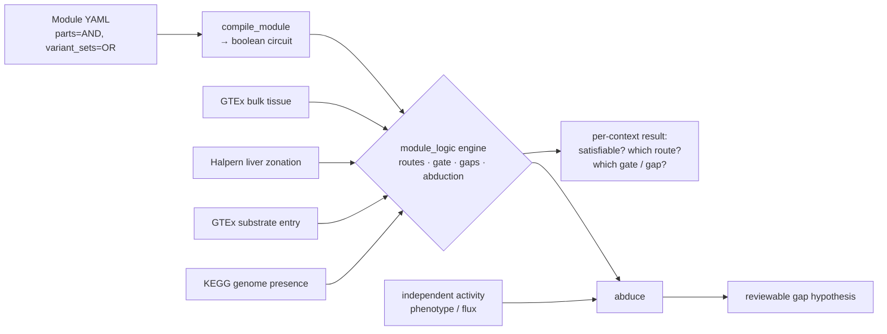

# Pathway satisfiability

**A pathway module is a boolean formula over steps; a *context* (tissue, cell zone,
genome) supplies the truth values. The same engine then answers "is this pathway wired
up *here*?" — and, when a pathway is independently known to run but the logic says no,
turns the gap into a reviewable hypothesis.**

## Motivation

Pathway-completeness tools (KEGG/Reactome module coverage) ask a genome-level question:
does the organism *have* the pathway? That is the right question for a microbe but the
wrong one for a metazoan, where every cell carries the whole genome and the discriminating
variable is **which isozyme is expressed in which context**. Gluconeogenesis is "present"
in every human cell, yet free-glucose output is restricted to a few tissues — and, within
the liver, to a few cell layers.

This project treats a curation **module** (`modules/*.yaml`, the `ModuleReview` schema) as
a monotone boolean circuit and evaluates it against a *context oracle*:

- a module's **parts / annotons are AND**; its **variant_sets are OR**;
- a leaf **annoton (a step) is an atom** whose truth value comes from the oracle;
- the engine enumerates **routes** (one branch per variant set), tests **satisfiability**
  in a context, finds the **gate** atoms required by every route, and reports the
  **unsatisfied steps** (gaps).

The logic core carries no biological data; only the oracle changes between contexts. This
is deliberately the eukaryotic analogue of GapMind's prokaryotic step-finding.

## Architecture



The engine lives at `src/ai_gene_review/module_logic.py` (frozen `Atom`; `compile_module`,
`enumerate_routes`, `is_satisfied`, `core_atoms`, `unsatisfied_steps`, `abduce`; doctested,
mypy-clean) with `tests/test_module_logic.py`. The oracles and per-context resolvers are in
`modules/experimental/gluconeogenesis-context/` (see its `RESULTS.md` for full output).

## Results

### Between organs (GTEx bulk tissue)
Evaluating the human gluconeogenesis module across 54 tissues recovers exactly the textbook
gluconeogenic set — **liver, kidney cortex, small intestine** — with no false positives and
no misses. Every non-gluconeogenic tissue fails at the *same* gate atom, the gluconeogenic
glucose-6-phosphatase catalytic subunit, and the engine resists the ubiquitous paralog
(expressed everywhere but not gluconeogenic). The gate is graded: raising the expression
threshold drops tissues in the order liver → kidney → intestine, matching their known
quantitative contribution.

### Within an organ (Halpern 2017 liver zonation)
Reusing the same engine with a liver-lobule zonation oracle, the gluconeogenesis route is
satisfiable only toward the **periportal** pole and is blocked at the **pericentral** pole —
at the same gate atom. The porto-central orientation is inferred from landmark genes (not
assumed), so the periportal restriction is a derivation, not a restatement.

### Which precursor? (substrate-entry routes)
A precursor-resolved module makes lactate / alanine (via pyruvate) and glycerol (bypassing
the carboxylation backbone) explicit. Because glycerol skips that backbone, the **only**
universally required step is the terminal glucose-6-phosphatase system. Per tissue the engine
then reports which precursors are usable, with physiologically faithful skews (kidney
lactate-dominant; liver highest alanine capacity).

### Across genomes (KEGG genome presence) — the GapMind reproduction
The *same* engine reconstructs L-methionine biosynthesis from KEGG orthologs across genomes.
It selects the encoded route per organism (succinyl vs acetyl acylation; trans-sulfuration vs
direct sulfhydrylation; cobalamin-dependent vs -independent methylation), completes
*C. glutamicum* through the alternative branch despite a missing trans-sulfuration enzyme, and
flags genome-reduced organisms as gaps.

### Abduction — a gap is a hypothesis
Crossing satisfiability with an **independent** activity phenotype:

| outcome | meaning | example |
|---|---|---|
| CONSISTENT_ACTIVE | reconstructable & known prototroph | E. coli, B. subtilis, C. glutamicum |
| **ABDUCTION_TARGET** | **makes methionine but a step has no candidate** | **Synechocystis, M. jannaschii** |
| CONSISTENT_INACTIVE | gap correctly predicts a known auxotrophy | Rickettsia prowazekii |

The two abduction targets are real metabolic dark matter: both are autotrophs that synthesise
methionine yet encode none of the canonical acylation/sulfur enzymes, so the engine emits a
structured lead ("an unannotated / non-orthologous enzyme must fill this step"). The same
machinery does *not* over-call *Rickettsia*, whose gap is correctly read as its auxotrophy.

The same `abduce()` runs on the **eukaryotic** side against GTEx, with the independent claim
now a documented tissue function (and an extra "not cell-autonomous" explanation, since a
metazoan pathway can be split across organs):

| outcome | meaning | example |
|---|---|---|
| CONSISTENT_ACTIVE | tissue oxidises ketones, enzymes expressed | heart, brain, muscle, kidney |
| CONSISTENT_INACTIVE | gap correctly predicts the function's absence | **liver ketolysis → gap at OXCT1/SCOT** |
| ABDUCTION_TARGET | function reported but a step's gene barely expressed | **intestinal gluconeogenesis → G6PC1** |

Ketone-body oxidation pinpoints why the liver cannot consume the ketones it makes — it is the
one tissue lacking OXCT1/SCOT (GTEx liver = 0 TPM) — reproducing a textbook fact from
expression alone. Intestinal gluconeogenesis, genuinely debated because intestinal
glucose-6-phosphatase is low, surfaces as a lead localised to one gene, which is exactly the
form a reviewer can act on.

## Epistemics

- **Presence ≠ flux.** Expression/genome presence is used asymmetrically: absence excludes a
  route (strong), presence only permits it. A satisfiable set is an upper bound on capacity.
- **Derived, not assumed.** Zonation orientation comes from landmark genes; tissue/zone
  identity from data — never from the answer being sought.
- **Abduction is independent.** The activity column (growth phenotype) is independent of the
  ortholog oracle, so a scored gap is a genuine prediction, and "the assertion is wrong" is
  always retained as an explicit hypothesis.

## Reproduce

```bash
# engine + tests
uv run pytest tests/test_module_logic.py -q
uv run pytest --doctest-modules src/ai_gene_review/module_logic.py

# per-context resolvers (from modules/experimental/gluconeogenesis-context/)
uv run python resolve_context.py       # between organs (GTEx)
uv run python resolve_zonation.py      # within liver (Halpern zonation)
uv run python resolve_substrates.py    # which precursor per tissue
uv run python resolve_genomes.py       # methionine across genomes (KEGG)
uv run python resolve_abduction.py     # microbial gaps vs phenotype → leads / auxotrophy
uv run python resolve_eukaryotic_abduction.py   # tissue gaps vs function (ketolysis, gluconeogenesis)
```

## Artifacts

- Engine: `src/ai_gene_review/module_logic.py`; tests: `tests/test_module_logic.py`
- Modules: `modules/gluconeogenesis_human.yaml`, `modules/gluconeogenesis_human_substrates.yaml`,
  `modules/methionine_biosynthesis.yaml`, `modules/ketone_body_oxidation.yaml`
- Oracles & resolvers + full results: `modules/experimental/gluconeogenesis-context/`
  (`RESULTS.md`)

## Next steps

- A human liver zonation oracle to remove the mouse-ortholog step in the zonation result.
- Apply the engine to additional curated modules (it is module-agnostic).
- Promote the resolvers from `modules/experimental/` into a small CLI once the oracle
  interfaces stabilise.
