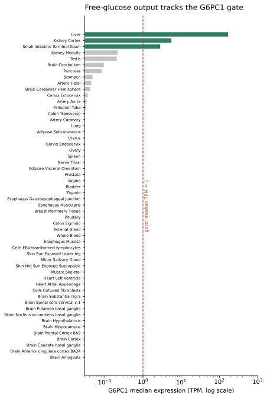
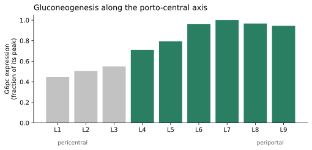
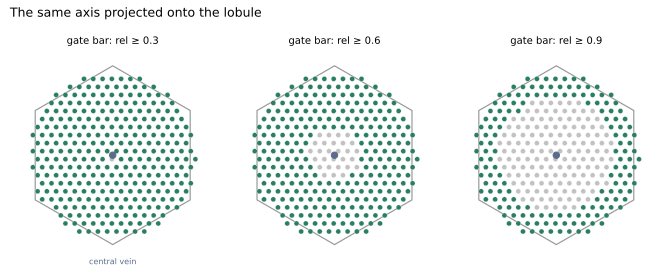
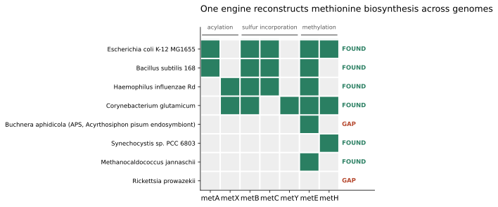
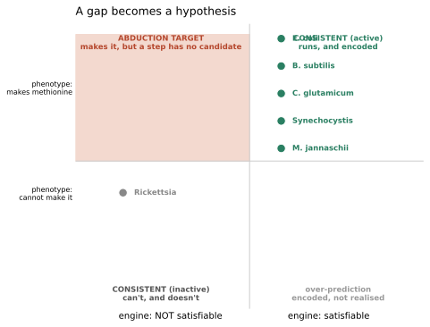

# Pathway satisfiability

**We ask not "does this genome have the pathway?" but "is the pathway wired up *here* — in
this tissue, this cell zone, this genome?" A curation module is read as a boolean formula
over steps; a context (expression, genome content) supplies the truth values. When a pathway
is independently known to run but the logic says it can't, the gap becomes a reviewable,
gene-localised hypothesis.**

## Bottom line

- **It recovers textbook biology from expression alone.** Across GTEx's 54 tissues the human
  gluconeogenesis module is satisfiable in exactly **liver, kidney cortex, small intestine** —
  no false positives, no misses — and every other tissue fails at the *same* gate step,
  gluconeogenic glucose-6-phosphatase. Read this honestly: the discriminating work is done by
  **curation, not by circuit evaluation**. The satisfiable set is identical to
  `G6PC1 ≥ threshold`, because every other atom in the module is near-ubiquitous. What the
  result vindicates is *grounding the terminal step to G6PC1 specifically* rather than to "any
  glucose-6-phosphatase" — the module refuses the ubiquitous paralog `G6PC3` because a curator
  excluded it, and that exclusion is what a naive GOA-driven build would get wrong.
- **It resolves *within* an organ, not just between organs.** With a liver-zonation oracle the
  route is satisfiable across the **periportal and mid** lobule and blocked in the
  **pericentral** third — the metazoan question ("which isozyme, in which context") that
  genome-level tools can't ask.
- **One engine, many contexts.** The same logic reconstructs L-methionine biosynthesis across
  microbial genomes from KEGG orthologs (picking the encoded route per organism), i.e. it
  reproduces GapMind-style step-finding as a special case.
- **A gap is a hypothesis, not just a hole — and the hypothesis list must include "my model is
  wrong".** Crossing satisfiability with an *independent* activity claim turns unexplained gaps
  into structured leads: **intestinal gluconeogenesis → G6PC1** and **liver ketolysis →
  OXCT1/SCOT**. An earlier version of this page also advertised two microbial "metabolic dark
  matter" targets (*Synechocystis*, *M. jannaschii*); **both were artifacts of an incomplete
  model and have been retracted** — see [Retracted](#retracted-the-microbial-dark-matter-claim).
  That retraction is now the most instructive result here.

Why this matters: pathway-completeness tools (KEGG/Reactome coverage) ask a genome-level
question — right for a microbe, wrong for a metazoan, where every cell carries the whole
genome and the discriminating variable is **which isozyme is expressed in which context**.
Gluconeogenesis is "present" in every human cell, yet glucose output is restricted to a few
tissues and, within the liver, to a few cell layers. This project resolves the pathway *into*
that context.

> **Independent review** (annotation quality, logic, and validity of the conclusions below,
> with reproduction commands): **[Independent review](PATHWAY_SATISFIABILITY/REVIEW.md)**.
> Several claims on this page are flagged there as overstated — read it alongside the results.
>
> **How it works** (model, engine, `src` paths, and commands to reproduce every result) lives
> in the companion notebook: **[Methods & reproduction](PATHWAY_SATISFIABILITY/methods.md)**.
> It is the eukaryotic analogue of GapMind's prokaryotic step-finding.
>
> **See it** — a [rendered demo snapshot](PATHWAY_SATISFIABILITY/demo.html) shows the engine's
> output: the compiled routes/gate, the 54-tissue GTEx resolution, and the microbial methionine
> reconstruction. It is a static page (the expression-gate slider is frozen at its default). For
> the **live slider**, run the self-contained notebook locally —
> `uvx marimo run projects/PATHWAY_SATISFIABILITY/demo_standalone.py` — which executes **offline**
> against committed GTEx/KEGG caches. `demo_standalone.py` (generated by
> [`build_standalone_demo.py`](PATHWAY_SATISFIABILITY/build_standalone_demo.py)) is import-free,
> so it also exports to an interactive WebAssembly page via `marimo export html-wasm`.

## Background: pathway hole filling

"Pathway hole filling" — a pathway looks like it should run but a step has no gene assigned, so
what fills it? — is a mature field for **microbial genomes** and essentially silent on the
**metazoan** version of the question. The prior art splits into three problems: (1) **step-finding**,
does a genome encode the pathway (GapMind — of which this project is the eukaryotic analogue;
KEGG module completeness; MinPath; SEED subsystems); (2) **hole-filling proper**, nominate the
gene for a known-but-unassigned step — the origin of the term, in Pathway Tools' Bayesian
**Pathway Hole Filler** (Green & Karp 2004) and IMG's "Find Candidate Genes for Missing
Function," both leaning on genome context (operons, occurrence profiles); and (3) **network
gap-filling**, add reactions so a flux model balances (GapFind/GapFill, ModelSEED, gapseq).

Every one of these answers a **genome-level** presence/absence question — right for a microbe,
where a genome roughly *is* an organism. It is the wrong question for a metazoan, where every
cell carries the whole genome and the discriminating variable is not presence but **which
isozyme is expressed where**. This project keeps GapMind's logic and swaps the oracle from
genome gene-content to **context expression**, so a "hole" becomes "this pathway cannot be wired
up *in this context*, and here is the gene and place where it fails."

> Full landscape, citations, and a comparison table:
> **[Background: pathway hole filling](PATHWAY_SATISFIABILITY/background.md)**.

## Results

### Between organs (GTEx bulk tissue)
Evaluating the human gluconeogenesis module across 54 tissues recovers exactly the textbook
gluconeogenic set — **liver, kidney cortex, small intestine** — with no false positives and
no misses (Figure 1). Every non-gluconeogenic tissue fails at the *same* gate atom, the
gluconeogenic glucose-6-phosphatase catalytic subunit `G6PC1`. The gate is graded: raising the
expression threshold drops tissues in the order liver → kidney → intestine, matching their known
quantitative contribution.

> **What is and isn't doing the work here.** The satisfiable set is *exactly* `G6PC1 ≥ threshold`
> at all three thresholds, so the boolean circuit contributes no discriminating power in this
> module: at the 1 TPM bar `SLC37A4`, `PCK2` and `G6PC3` pass in all 54 tissues, `PC` in 53 and
> `FBP1` in 42, while `G6PC1` passes in 3. A one-line single-gene filter reproduces Figure 1.
> The claim worth making is therefore about **curation, not computation**: the module grounds
> the terminal step to `G6PC1` alone, recording `G6PC2`/`G6PC3` as a *paralog trap*, so the
> near-ubiquitous `G6PC3` cannot satisfy the gate. That exclusion is a curator's judgement
> written into the module — it is not derivable from GOA, which still carries `GO:0006094`
> gluconeogenesis on `G6PC3`. Circuit evaluation earns its keep where the ORs actually
> discriminate, as in the substrate-resolved module below.

*Figure 1. Across all 54 GTEx tissues: median expression of `G6PC1`, the terminal gate gene, on a
log axis. **Green** = tissues where the whole gluconeogenesis module is satisfiable — exactly the
three that clear the gate threshold (dashed line). Every grey tissue fails at that same step, and
the near-ubiquitous look-alike `G6PC3` is not accepted for it, because the module grounds the step
to `G6PC1`. Colouring is derived from the satisfiability engine, not annotated by hand — though as
noted above, in this module that verdict tracks `G6PC1` alone.*

### Within an organ (Halpern 2017 liver zonation)
Reusing the same engine with a liver-lobule zonation oracle, the gluconeogenesis route is
satisfiable across the **periportal and mid** lobule (layers 4–9) and blocked in the
**pericentral** third (layers 1–3) (Figures 2–3). The porto-central orientation is inferred from
landmark genes (not assumed), so the periportal restriction is a derivation, not a restatement.

Two details matter for reading this honestly. First, the block is **multi-step, not single-gate**:
the pericentral pole (L1) fails at `pepck_step`, `fbpase_step` *and* `glucose_release_step`
simultaneously, and L2–L3 fail at `fbpase_step` alone — so `G6PC1` is not the sole gate at this
scale, and the resolver now reports every failing step rather than only the gate atoms. Second,
the zonation oracle applies an **absolute expression floor** alongside the relative-to-own-peak
threshold. Without it, per-gene peak normalisation let `Fbp2` — the muscle isozyme, ~1000× below
`Fbp1` in absolute abundance and not expressed by liver — satisfy the FBPase step wherever it sat
near its own tiny maximum. That is the same paralog trap the terminal step is grounded against,
one level down, and it had gone unnoticed.

*Figure 2. The measured axis. `G6pc` expression across Halpern 2017's nine porto-central zonation
layers (L1 pericentral → L9 periportal), each bar coloured by whether gluconeogenesis is
satisfiable there. The pericentral third is blocked; `G6PC1` is one of the three steps that fail
at the pericentral pole, alongside the PEPCK and FBPase steps. This is a one-dimensional
measurement — expression along a single axis, not a tissue image.*

*Figure 3. The same axis projected onto the lobule. Figure 2's nine layers are wrapped onto the
**canonical lobule diagram** (central vein at the centre, portal rim outside) and tiled as
spots; as the expression gate tightens (left → right) the satisfiable zone (**green**) retreats to
the periportal rim. The **geometry is a schematic** — a standard anatomical diagram, not measured
2-D coordinates — while each spot's **colour is the real per-layer result** from Figure 2.*

### Which precursor? (substrate-entry routes)
A precursor-resolved module makes lactate / alanine (via pyruvate) and glycerol (bypassing
the carboxylation backbone) explicit. Because glycerol skips that backbone, the **only**
universally required step is the terminal glucose-6-phosphatase system. Per tissue the engine
then reports which precursors are usable, with physiologically faithful skews (kidney
lactate-dominant; liver highest alanine capacity).

This is the module where the circuit does real work rather than tracking one gene: adding the
glycerol branch *changes the answer to a structural question*, dropping `PC` out of the AND-core
(18 routes, universal gate `G6PC1·SLC37A4`) because one precursor route bypasses it. That
recomputation is not something a per-gene threshold can do.

### Across genomes (KEGG genome presence) — the GapMind reproduction
The *same* engine reconstructs L-methionine biosynthesis from KEGG orthologs across genomes
(Figure 4). It selects the encoded route per organism (succinyl vs acetyl acylation;
trans-sulfuration vs direct sulfhydrylation; the homoserine-independent aspartate-semialdehyde
route; cobalamin-dependent vs -independent methylation), completes *C. glutamicum* through the
alternative branch despite a missing trans-sulfuration enzyme, and flags genome-reduced organisms
as gaps.

The module is two required steps — reach L-homocysteine, then methylate it — over 14 routes.
Homocysteine is reachable either via O-acyl-L-homoserine (acylation `metA`/`metX`, then sulfur
incorporation by trans-sulfuration `metB`+`metC` or direct sulfhydrylation `metY`/`metZ`) or
directly from L-aspartate semialdehyde via the two-subunit sulfurtransferase `MJ0100`+`MJ0099`,
which bypasses homoserine altogether. Modelling only the first entry is what produced the
retracted "dark matter" result below.

*Figure 4. Methionine biosynthesis reconstructed across eight genomes. Green = the ortholog is
encoded (KEGG); columns are grouped by pathway stage (acylation `metA`/`metX`; sulfur
incorporation `metB`+`metC` trans-sulfuration or `metY`/`metZ` direct; the homoserine-independent
`MJ0100`+`MJ0099` route; methylation `metE`/`metH`). Each genome uses a different encoded route —
`E. coli` succinyl (`metA`), `H. influenzae` acetyl (`metX`), `C. glutamicum` direct
sulfhydrylation (`metY`, no `metC`), `Synechocystis` and `M. jannaschii` the aspartate-semialdehyde
route with no acyltransferase at all — and the engine reports **FOUND** or a **GAP** accordingly.
Only the oracle changed from the tissue results; the logic is identical.*

### Abduction — a gap is a hypothesis
Crossing satisfiability with an **independent** activity phenotype (Figure 5):

| outcome | meaning | example |
|---|---|---|
| CONSISTENT_ACTIVE | reconstructable & known prototroph | E. coli, B. subtilis, C. glutamicum, Synechocystis, M. jannaschii |
| ABDUCTION_TARGET | makes methionine but a step has no candidate | *(none in this panel)* |
| CONSISTENT_INACTIVE | gap correctly predicts a known auxotrophy | Rickettsia prowazekii |

Every prototroph in the panel is now reconstructable, and the only gap — *Rickettsia prowazekii* —
is a genuine auxotroph whose gap the engine correctly reads as the auxotrophy rather than as a
lead. The microbial panel yields **no** abduction targets, and that is the correct answer.

#### Retracted: the microbial "dark matter" claim

An earlier version of this page reported *Synechocystis* sp. PCC 6803 and *Methanocaldococcus
jannaschii* as "real metabolic dark matter" — autotrophs that make methionine while encoding no
canonical enzyme for the acylation and sulfur-incorporation steps. **This was wrong, and the
error was ours, not the annotation's.**

Both organisms encode **K23975**, L-aspartate semialdehyde sulfurtransferase (EC 2.8.1.16), with
its iron–sulfur partner **K23976** — `mja:MJ_0100`/`MJ_0099` and `syn:slr0689`/`slr2059` — in
KEGG, the very database the oracle queries. That enzyme forms homocysteine directly from aspartate
semialdehyde and sulfide, bypassing homoserine and its acylation entirely
([PMID:25938369](https://pubmed.ncbi.nlm.nih.gov/25938369/)). Two compounding causes:

1. the module was scoped "from homoserine" and modelled only the O-acyl-homoserine entry, so an
   organism using the direct route could not be represented at all; and
2. the oracle's step→KO table listed seven KOs and omitted these two — and its predicate returned
   `False` for any atom it could not map, making "not in my lookup table" indistinguishable from
   "not in this genome".

Both are fixed: the module now carries the aspartate-semialdehyde route as an alternative to the
whole acylation + sulfur-incorporation arm, the oracle knows the KOs (and `metZ`, which was
likewise unmapped), and it now **raises rather than guessing** when an atom has no KO. With that,
both organisms resolve to CONSISTENT_ACTIVE via the correct route, while *Rickettsia*'s auxotrophy
prediction and all four prototroph reconstructions are unchanged.

The lesson generalises past this one bug, and is why the retraction is left on the page: **a
satisfiability gap is evidence about the model at least as much as about the organism.** The
engine's own hypothesis set already contained the right answer — *"an alternative route not
represented in the module is used"* — and the write-up promoted the most exciting hypothesis
("an unannotated enzyme must fill this step") over the most likely one. Any gap should be pushed
through model-scope and oracle-coverage checks before it is called a discovery.

*Figure 5. A gap becomes a hypothesis. Each genome placed by the **engine's** verdict (can the
pathway be reconstructed? — horizontal) against an **independent** phenotype (does the organism
actually make methionine? — vertical). The dangerous quadrant is top-left: organisms that
demonstrably make methionine yet have no candidate for a step. **It is now empty.**
`Synechocystis` and `M. jannaschii` sat there until the module was given the
aspartate-semialdehyde route they actually use, and they now sit correctly in
CONSISTENT (active); `Rickettsia`, a genuine auxotroph, is correctly not flagged. The phenotype
axis is independent of the gene content, so a flagged gap would be a real prediction — but as the
retraction above shows, only once the model and oracle can represent the organism's real biology.*

The same `abduce()` runs on the **eukaryotic** side against GTEx, with the independent claim
now a documented tissue function (and an extra "not cell-autonomous" explanation, since a
metazoan pathway can be split across organs):

| outcome | meaning | example |
|---|---|---|
| CONSISTENT_ACTIVE | tissue oxidises ketones, enzymes expressed | heart, brain, muscle, kidney |
| CONSISTENT_INACTIVE | gap correctly predicts the function's absence | **liver ketolysis → gap at OXCT1/SCOT** |
| ABDUCTION_TARGET | function reported but a step's gene barely expressed | **intestinal gluconeogenesis → G6PC1** |

Ketone-body oxidation pinpoints why the liver cannot consume the ketones it makes — it is the
one tissue effectively lacking OXCT1/SCOT (GTEx liver median 0.46 TPM, against heart 60 and brain
45) — reproducing a textbook fact from expression alone. Intestinal gluconeogenesis, genuinely
debated because intestinal glucose-6-phosphatase is low, surfaces as a lead localised to one gene,
which is exactly the form a reviewer can act on. This is the strongest result on the page: the
separation is ~100-fold, it does not rest on a threshold sitting in a narrow margin, and the
conclusion is independently correct.

## Epistemics

- **Presence ≠ flux.** Expression/genome presence is used asymmetrically: absence excludes a
  route (strong), presence only permits it. A satisfiable set is an upper bound on capacity.
- **Derived, not assumed.** Zonation orientation comes from landmark genes; tissue/zone
  identity from data — never from the answer being sought.
- **Abduction is independent.** The activity column (growth phenotype) is independent of the
  ortholog oracle, so a scored gap is a genuine prediction, and "the assertion is wrong" is
  always retained as an explicit hypothesis.
- **A gap indicts the model before it indicts the organism.** The retracted dark-matter result
  is the standing example. Before a gap is read as biology, it has to survive two checks that
  have nothing to do with the organism: can the module *represent* the route this organism might
  use, and does the oracle *cover* every atom in the module? Only the residue is a lead.
- **An oracle must not answer questions it cannot answer.** The genome oracle used to return
  "absent" for any atom missing from its step→KO table, so incomplete coverage was
  indistinguishable from a real genome gap — which is precisely how the retracted result was
  manufactured. It now raises instead.
- **Normalisation can smuggle in the error you are guarding against.** Grounding the terminal
  step to `G6PC1` deliberately defeats the `G6PC3` paralog trap; per-gene peak normalisation in
  the zonation oracle then silently re-admitted the same class of error at the FBPase step, by
  letting an unexpressed muscle isozyme count as present. Relative measures need an absolute
  floor.
- **Where the discriminating power actually lies.** In the bulk-tissue gluconeogenesis result it
  is one gene, not the circuit; the circuit earns its keep in the substrate-resolved module,
  where adding a branch changes the AND-core. Worth stating plainly rather than letting a
  54-tissue figure imply more.

## Methods & reproduction

The model, engine internals (`module_logic.py`), architecture diagram, source paths, and the
exact commands to reproduce every result above are in the companion notebook:
**[Methods & reproduction](PATHWAY_SATISFIABILITY/methods.md)**.

## Next steps

- A human liver zonation oracle to remove the mouse-ortholog step in the zonation result.
- Apply the engine to additional curated modules (it is module-agnostic).
- Promote the resolvers from `modules/experimental/` into a small CLI once the oracle
  interfaces stabilise.
