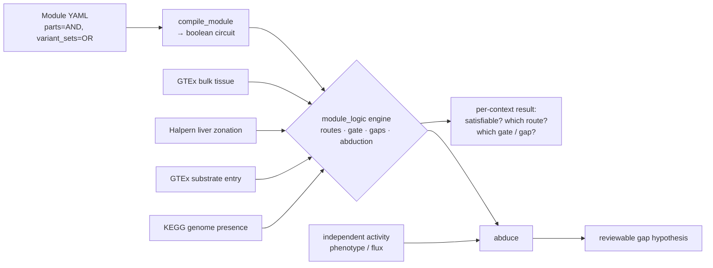

# Methods & reproduction

Companion to [Pathway satisfiability](../PATHWAY_SATISFIABILITY.md). This page holds the
model, the engine internals, and the commands to reproduce every result. Nothing here is
needed to read the main page — start there for the bottom line.

## The model

A curation **module** (`modules/*.yaml`, the `ModuleReview` schema) is treated as a monotone
boolean circuit and evaluated against a *context oracle*:

- a module's **parts / annotons are AND**; its **variant_sets are OR**;
- a leaf **annoton (a step) is an atom** whose truth value comes from the oracle;
- the engine enumerates **routes** (one branch per variant set), tests **satisfiability**
  in a context, finds the **gate** atoms required by every route, and reports the
  **unsatisfied steps** (gaps).

The logic core carries no biological data; only the oracle changes between contexts. This is
deliberately the eukaryotic analogue of GapMind's prokaryotic step-finding.

## Architecture



The engine lives at `src/ai_gene_review/module_logic.py` (frozen `Atom`; `compile_module`,
`enumerate_routes`, `is_satisfied`, `core_atoms`, `unsatisfied_steps`, `abduce`; doctested,
mypy-clean) with `tests/test_module_logic.py`. The oracles and per-context resolvers are in
`modules/experimental/gluconeogenesis-context/` (see its `RESULTS.md` for full output).

## Reproduce

```bash
# engine + tests
uv run pytest tests/test_module_logic.py -q
uv run pytest --doctest-modules src/ai_gene_review/module_logic.py

# per-context resolvers (from modules/experimental/gluconeogenesis-context/)
uv run python resolve_context.py       # between organs (GTEx)
uv run python resolve_zonation.py      # within liver (Halpern zonation)
uv run python resolve_substrates.py    # which precursor per tissue
uv run python resolve_genomes.py       # methionine across genomes (KEGG)
uv run python resolve_abduction.py     # microbial gaps vs phenotype → leads / auxotrophy
uv run python resolve_eukaryotic_abduction.py   # tissue gaps vs function (ketolysis, gluconeogenesis)
```

## Artifacts

- Engine: `src/ai_gene_review/module_logic.py`; tests: `tests/test_module_logic.py`
- Modules: `modules/gluconeogenesis_human.yaml`, `modules/gluconeogenesis_human_substrates.yaml`,
  `modules/methionine_biosynthesis.yaml`, `modules/ketone_body_oxidation.yaml`
- Oracles & resolvers + full results: `modules/experimental/gluconeogenesis-context/`
  (`RESULTS.md`)
