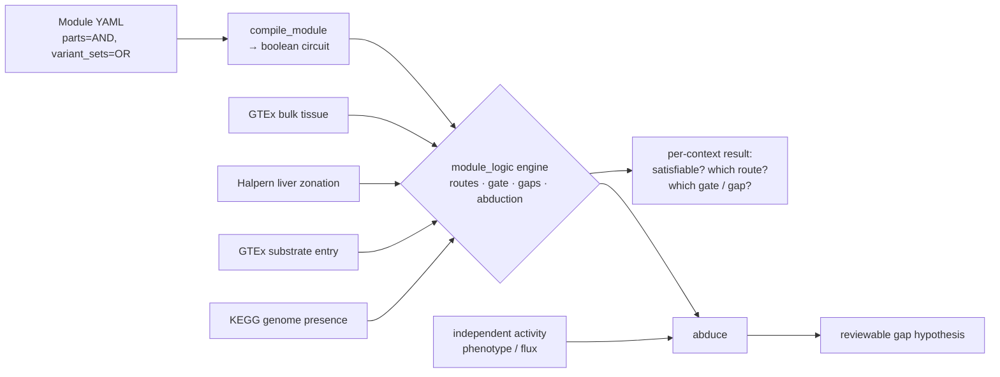

# Methods & reproduction

Companion to [Pathway satisfiability](../PATHWAY_SATISFIABILITY.md) and
[Background: pathway hole filling](background.md). This page holds the actual model, the engine
API, the module-YAML shape, the oracle interface, and the commands to reproduce every result.
Nothing here is needed to read the main page — start there for the bottom line.

The whole thing is ~330 lines of pure-logic Python (`module_logic.py`, doctested and mypy-clean)
plus a handful of per-context oracle/resolver scripts. The logic core carries **no biological
data**; only the oracle changes between contexts. That separation is the whole design.

## The model

A curation **module** (`modules/*.yaml`, the `ModuleReview` schema) is compiled into a monotone
boolean circuit and evaluated against a *context oracle*:

- a node's **`parts` and `annotons` are conjunctive** → `And`;
- a **`variant_sets` entry is disjunctive** (at-least-one for satisfiability) → `Or`;
- an **`optional` part** compiles to `Or(sub, empty)`, i.e. always satisfiable;
- a leaf **annoton (a step) is an `Atom`** whose truth value is supplied externally by a
  per-context **predicate** (e.g. "is this participant gene expressed in this tissue / cell-zone?"
  or "is this step's ortholog encoded in this genome?").

### Data model (`src/ai_gene_review/module_logic.py`)

```python
@dataclass(frozen=True)
class Atom:                 # a leaf step: a participant gene, truth value from an oracle
    node_id: str; label: str; gene_symbol: Optional[str]; uniprot: Optional[str]

@dataclass
class And:                  # satisfied iff every child is satisfied
    node_id: str; children: list["Circuit"]

@dataclass
class Or:                   # disjunction over variant branches (>=1 for satisfiability)
    set_id: str; selection: str; children: list["Circuit"]

Circuit   = Union[Atom, And, Or]
Predicate = Callable[[Atom], bool]     # the oracle: does this atom hold?
```

### Engine API

Everything below is a top-level function in `module_logic.py`; each is doctested.

| function | signature | what it returns |
|---|---|---|
| `compile_module` | `(doc: dict) -> And` | compile a loaded `ModuleReview` doc's `module` into a circuit |
| `compile_module_file` | `(path) -> And` | load a `ModuleReview` YAML and compile it |
| `enumerate_routes` | `(circuit) -> list[list[Atom]]` | every route (one branch per `Or`); Cartesian over OR-nodes |
| `is_satisfied` | `(circuit, holds: Predicate) -> bool` | evaluate the circuit under a per-atom predicate |
| `active_routes` | `(circuit, holds) -> list[list[Atom]]` | the routes whose every atom holds |
| `core_atoms` | `(circuit) -> list[Atom]` | the **AND-core**: atoms required by *every* route (gate candidates) |
| `unsatisfied_steps` | `(circuit, holds) -> list[Circuit]` | the **gaps**: top-level steps with no satisfiable variant |
| `abduce` | `(circuit, holds, asserted_active: bool) -> Abduction` | reconcile satisfiability with an independent activity claim |

`enumerate_routes` grows multiplicatively (route count = product of branch counts across OR
nodes); curated modules are small (≤ tens of routes), and satisfiability/gap queries never
materialise all routes, so they are the primitives to reach for at scale.

### Worked example (the module docstring doctest, verbatim)

A tiny pathway: one required entry step, then a two-way isozyme choice.

```python
>>> doc = {"module": {"id": "m", "parts": [
...   {"order": 1, "node": {"id": "entry", "annotons": [
...      {"id": "a_act", "participant": {"gene": {"preferred_term": "A",
...         "term": {"id": "UniProtKB:P1"}}}}]}},
...   {"order": 2, "node": {"id": "iso", "variant_sets": [
...      {"id": "vs", "selection": "ONE_OR_MORE", "variants": [
...         {"id": "b", "annotons": [{"id": "b_act", "participant": {"gene":
...            {"preferred_term": "B", "term": {"id": "UniProtKB:P2"}}}}]},
...         {"id": "c", "annotons": [{"id": "c_act", "participant": {"gene":
...            {"preferred_term": "C", "term": {"id": "UniProtKB:P3"}}}}]}]}]}},
... ]}}
>>> circuit = compile_module(doc)
>>> [[a.gene_symbol for a in r] for r in enumerate_routes(circuit)]
[['A', 'B'], ['A', 'C']]
>>> [a.gene_symbol for a in core_atoms(circuit)]          # A is on every route -> the gate
['A']
>>> is_satisfied(circuit, lambda atom: atom.gene_symbol in {"A", "C"})
True
>>> is_satisfied(circuit, lambda atom: atom.gene_symbol in {"B", "C"})   # missing A -> gated
False
```

`core_atoms` returning `['A']` is the whole idea in miniature: the entry step is on every route,
so its absence gates the module regardless of which isozyme branch is chosen — the same way
`G6PC1·SLC37A4` gates real gluconeogenesis in every non-gluconeogenic tissue.

## The module YAML shape

A step is a `ModuleNode` with `annotons` (its genes) and/or `variant_sets` (isozyme choices).
Trimmed from `modules/gluconeogenesis_human.yaml`:

```yaml
module:
  id: gluconeogenesis_human
  parts:
    - order: 1                      # a required step -> AND conjunct
      node:
        id: pyruvate_carboxylase_step
        annotons:
          - id: PC_activity          # -> Atom(gene_symbol="PC", uniprot="P11498")
            participant:
              gene: {preferred_term: PC (pyruvate carboxylase),
                     term: {id: UniProtKB:P11498}}
    - order: 4                      # the terminal, tissue-restricting step
      node:
        id: glucose_release_step
        variant_sets:               # -> Or(...) but grounded to the gluconeogenic isozyme
          - id: g6pc_catalytic
            selection: ONE_OR_MORE
            variants:
              - {id: G6PC1, annotons: [ ... G6PC1 ... ]}   # G6PC2/G6PC3 = paralog trap, excluded
```

`gene_symbol` is the leading token of `preferred_term` (`"PC (pyruvate carboxylase)"` → `PC`);
`uniprot` is the bare accession from `term.id`. The point of grounding the terminal step to
`G6PC1` specifically (not "any glucose-6-phosphatase") is exactly the paralog-overannotation
caution: the near-ubiquitous `G6PC3` must not satisfy the gate.

## The oracle interface

An oracle is just a `Predicate = Callable[[Atom], bool]`. Each resolver builds one from a
cached data matrix and hands it to `is_satisfied` / `unsatisfied_steps` / `abduce`:

```python
# resolve_context.py, in essence: a GTEx tissue column becomes a predicate
matrix = load_gtex_matrix()                          # gene x tissue median TPM (cached TSV)
def holds(atom, tissue=tissue, thr=threshold):
    return matrix.get(atom.gene_symbol, {}).get(tissue, 0.0) >= thr
satisfiable = is_satisfied(circuit, holds)
gaps        = unsatisfied_steps(circuit, holds)      # which step failed, in this tissue
```

Four oracles, one engine — only the predicate's data source changes:

| oracle | file | atom truth = |
|---|---|---|
| GTEx bulk tissue | `gtex_oracle.py` | median TPM ≥ threshold in the tissue |
| liver zonation | `zonation_oracle.py` | Halpern 2017 layer profile ≥ relative threshold |
| substrate entry | (GTEx, substrate module) | precursor-route genes expressed |
| genome presence | `kegg_oracle.py` | step's KO encoded in the genome (GapMind-style) |

`gtex_oracle.py` is a real GTEx v8 API client (resolves symbol → versioned GENCODE id,
alias-aware e.g. `G6PC1`→`G6PC`; caches a gene×tissue TSV) — it does not fabricate values.

## Abduction: a gap is a hypothesis

`abduce(circuit, holds, asserted_active)` crosses satisfiability with an **independent** activity
claim (a growth phenotype, a documented tissue function) and returns an `Abduction` with one of
four `Classification` values:

| classification | satisfiable? | asserted active? | meaning |
|---|---|---|---|
| `CONSISTENT_ACTIVE` | yes | yes | pathway reconstructable & known to run |
| `CONSISTENT_INACTIVE` | no | no | gap correctly predicts a known absence (e.g. auxotrophy) |
| `ABDUCTION_TARGET` | no | **yes** | **runs but a step has no candidate → a reviewable lead** |
| `OVERPREDICTION` | yes | no | encoded yet not realised (regulation off, or the claim is wrong) |

For an `ABDUCTION_TARGET` the engine attaches `gap_candidates` (the absent genes per gap step)
and a fixed `GAP_HYPOTHESES` set: non-orthologous/unannotated enzyme · unmodelled alternative
route · **not cell-autonomous** (intermediate supplied by another cell/organ — the metazoan-only
explanation) · the activity assertion itself is wrong. The activity column is independent of the
oracle, so a scored gap is a genuine prediction, not a circular restatement.

## Architecture



## Reproduce

```bash
# engine + tests
uv run pytest --doctest-modules src/ai_gene_review/module_logic.py   # logic doctests
uv run pytest tests/test_module_logic.py -q                          # engine unit tests

# routes + gate for a module, ad hoc
uv run python -c "from ai_gene_review.module_logic import compile_module_file, enumerate_routes, core_atoms; \
c=compile_module_file('modules/gluconeogenesis_human.yaml'); \
print(len(enumerate_routes(c)), 'routes; gate', [a.gene_symbol for a in core_atoms(c)])"

# per-context resolvers (from modules/experimental/gluconeogenesis-context/)
uv run python gtex_oracle.py                     # refresh GTEx v8 cache
uv run python resolve_context.py                 # between organs (GTEx) + validation
uv run python resolve_context.py --threshold 5   # graded gate
uv run --with openpyxl python zonation_oracle.py # fetch/cache Halpern zonation
uv run python resolve_zonation.py                # within liver (periportal restriction)
uv run python resolve_substrates.py              # which precursor per tissue
uv run python resolve_genomes.py                 # methionine across genomes (KEGG)
uv run python resolve_abduction.py               # microbial gaps vs phenotype → leads / auxotrophy
uv run python resolve_eukaryotic_abduction.py    # tissue gaps vs function (ketolysis, gluconeogenesis)
```

## Artifacts

- **Engine:** `src/ai_gene_review/module_logic.py` · **tests:** `tests/test_module_logic.py`
- **Modules:** `modules/gluconeogenesis_human.yaml`,
  `modules/gluconeogenesis_human_substrates.yaml`, `modules/methionine_biosynthesis.yaml`,
  `modules/ketone_body_oxidation.yaml`
- **Demos:** `demo.py` (interactive, needs the project env), `demo_standalone.py` (import-free,
  generated by `build_standalone_demo.py`). The committed static snapshot `demo.html` is
  regenerated with
  `uv run --with marimo marimo export html projects/PATHWAY_SATISFIABILITY/demo_standalone.py -o projects/PATHWAY_SATISFIABILITY/demo.html -f`.
- **Oracles & resolvers + the full, exhaustive results walk-through:**
  `modules/experimental/gluconeogenesis-context/` — see its `RESULTS.md` for the complete
  per-context output (threshold sweeps, zonation layers, per-genome routes, abduction tables)
  that the main page summarises.
