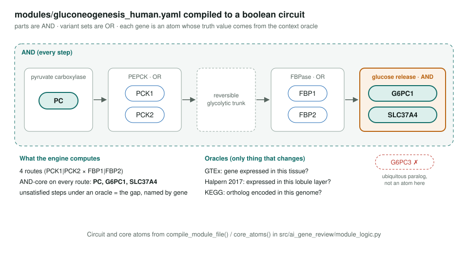
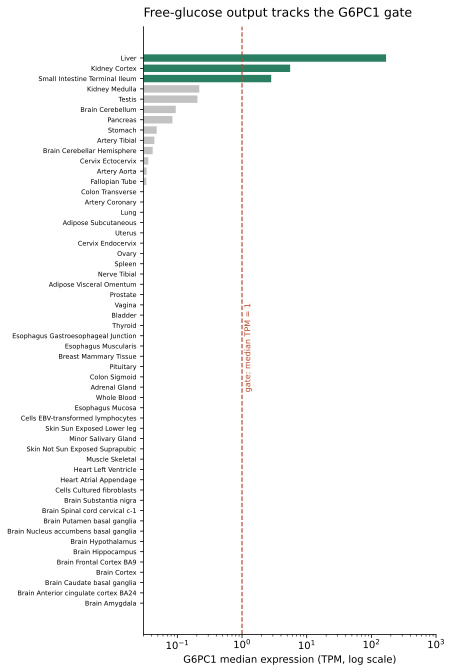
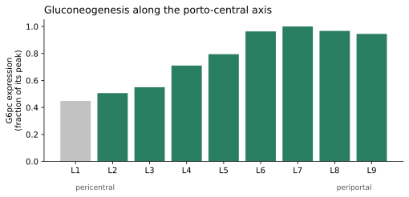
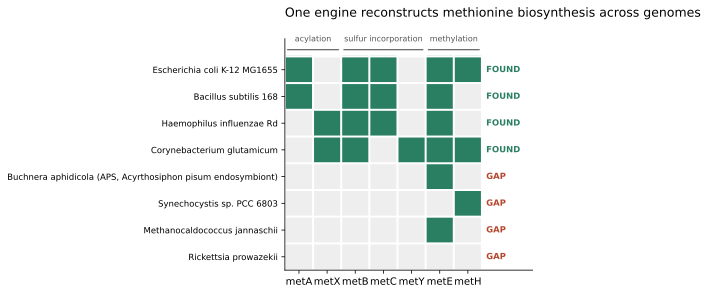
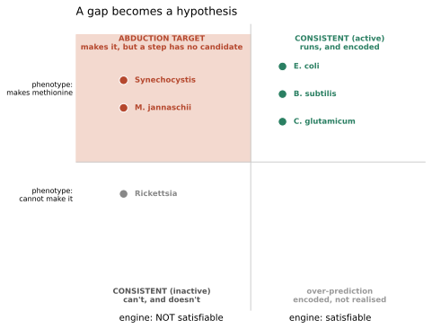

<!-- _class: lead -->

# Pathway satisfiability

Reading a curation module as a boolean formula, evaluated in a context

AI Gene Review · projects/PATHWAY_SATISFIABILITY · 2026

---

<!-- _class: bluf -->

## Bottom line

- Across **54 GTEx tissues**, the human gluconeogenesis module is satisfiable in exactly **liver, kidney cortex, small intestine**; every other tissue fails at **G6PC1**.
- The same engine resolves **within the liver** (periportal yes, pericentral no) and reproduces **GapMind-style** methionine reconstruction across genomes.
- Gaps crossed with independent activity data become **gene-localised leads**: intestinal gluconeogenesis → G6PC1; liver ketolysis → OXCT1.

---

## Why ask it this way

- Pathway tools (KEGG/Reactome coverage, GapMind, Pathway Tools hole filler) ask a **genome-level** question: does this organism encode the pathway?
- Right for a microbe. Wrong for a metazoan: **every cell has the whole genome**.
- The discriminating variable is **which isozyme is expressed in which context**.
- So keep GapMind's logic and swap the oracle: **genome content → context expression**.

---

## The module as a circuit

---

## Between organs: 54 GTEx tissues

- Green: the whole module is satisfiable. **Liver, kidney cortex, small intestine** only.
- Every grey tissue fails at the **same gate atom**, G6PC1.
- The ubiquitous paralog **G6PC3** is not accepted for the step.
- Raising the threshold drops tissues in the order **liver → kidney → intestine**.

---

## Within an organ: liver zonation

- Halpern 2017 nine-layer porto-central axis (mouse). The route is **blocked at the pericentral pole** at the same G6PC1 gate.
- Orientation is inferred from **landmark genes**, not assumed.

---

## Across genomes: methionine

Only the oracle changed (KEGG ortholog presence). The engine picks the encoded route per organism: succinyl vs acetyl acylation, trans-sulfuration vs direct sulfhydrylation.

---

## A gap is a hypothesis

- **Abduction targets**: *Synechocystis*, *M. jannaschii* make methionine with **no candidate** for a step.
- *Rickettsia* gap correctly read as **auxotrophy**.
- Eukaryotic side: **liver ketolysis** gap at OXCT1 (GTEx liver 0 TPM); **intestinal gluconeogenesis** flagged at G6PC1.

---

## Status and next steps

- ✅ Engine: `src/ai_gene_review/module_logic.py` (doctested) + `tests/test_module_logic.py`.
- ✅ Resolvers and figures: `modules/experimental/gluconeogenesis-context/`; demo `projects/PATHWAY_SATISFIABILITY/demo.html`.
- ✅ Spin-off: `taxon_absent_component/` flags JAK-STAT IBA rows in *Dictyostelium* (no JAK encoded).
- ⬜ Human liver zonation oracle (remove the mouse-ortholog step).
- ⬜ Run on more curated modules; promote resolvers into a CLI.

**Read more:** `projects/PATHWAY_SATISFIABILITY.md` · `methods.md` · `background.md`
