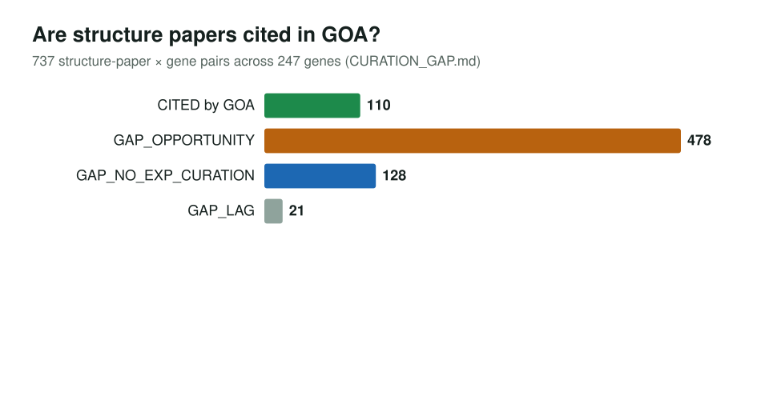
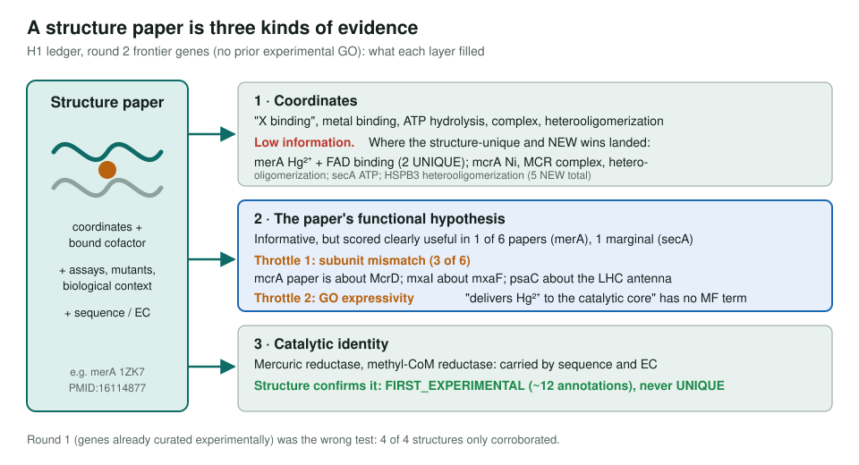

<!-- _class: lead -->

# PDB structures as GO evidence

Where deposited structures change a gene's annotation, and where they only confirm it

AI Gene Review · projects/PDB · 2026

---

<!-- _class: bluf -->

## Bottom line

- **1,991** pipeline genes have a deposited structure (27,157 PDB entries), yet only **19%** of 1,668 structure-paper and gene pairs are cited in GOA.
- Structures reliably give under-curated proteins their **first experimental-grade evidence** (>12 annotations, **5 NEW** rows across the reviews).
- **New informative function is rare**: 2 structure-unique annotations (both merA); the papers' own hypotheses paid off clearly in 1 of 6.

---

## Why look at structures

- A bound **cofactor, metal, ligand or partner** is direct evidence for MF, binding and complex membership.
- Rank candidates by **richness × sparsity**: a cofactor-bound, full-length structure of an IEA-only enzyme scores high.
- Three cuts (620 genes): **dark_mf** 206 · **euk** 210 · **contested** 340 (a review disputed a catalytic MF).

---

## Structure papers are missing from the evidence trail

353 of 573 genes cite none of their structure papers. GAP_OPPORTUNITY: the paper predates the gene's latest experimental annotation.

---

## Does structure fill gaps? (H1)

---

## Structure adjudicates contested activities

| Gene | Disputed MF | Action | In the structure |
|---|---|---|---|
| HEN1 (ARATH) | peptidyl-prolyl isomerase | REMOVE | SAH → methyltransferase |
| XYL1 (PICST) | oxidoreductase (generic) | REMOVE | NADP |
| DOT1 (yeast) | methyltransferase (generic) | over-annotated | SAM/SAH |
| SIRT2 (human) | transferase (generic) | over-annotated | NAD, Zn |
| mcrA (METAC) | transferase (generic) | REMOVE | F430, SAM, Fe-S |

Two cases: an over-general parent (cofactor confirms catalysis, points to the specific child) versus a wrong specific activity (structure argues against it).

---

## Caveats we hit

- RCSB **per-entry citations drift**: SPR's are inhibitor screens, cbh1's glycosylation NMR. Verify each PMID before citing.
- A bound ligand is a **clue, not proof**; additives are filtered but adventitious binders remain.
- Round 1 tested genes that were **already curated experimentally**, so structures could only corroborate (4 of 4).

---

## Status and next steps

- ✅ Inventory, RCSB enrichment, citation-gap and H1 ledger
- ✅ Structure-informed reviews: XYL1, IDH3B, COX6B1, psaC, COI1, ATAD1; HSPB3; merA, mcrA, secA; mxaI null
- ⬜ Work down `GAP_WORKLIST.md` (FANCB, PNO1, RCO1, RPS3, AEBP2 …)
- ⬜ Map complex partners to UniProt; consider a PDB-evidence field in the schema

**Read more:** `projects/PDB.md` · `projects/PDB/H1_LEDGER.md` · `projects/PDB/CURATION_GAP.md`
