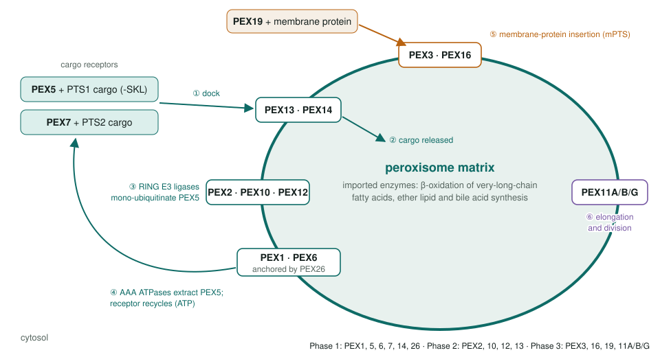
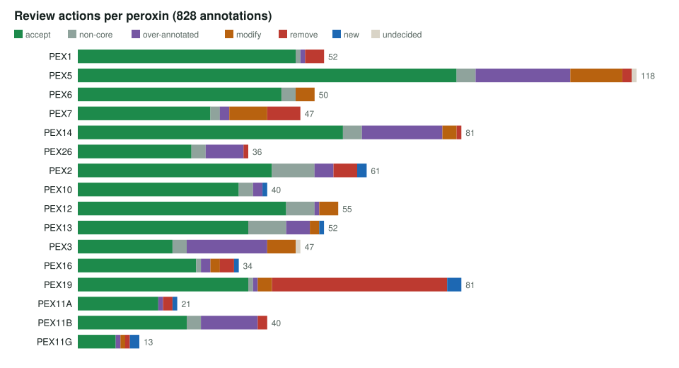
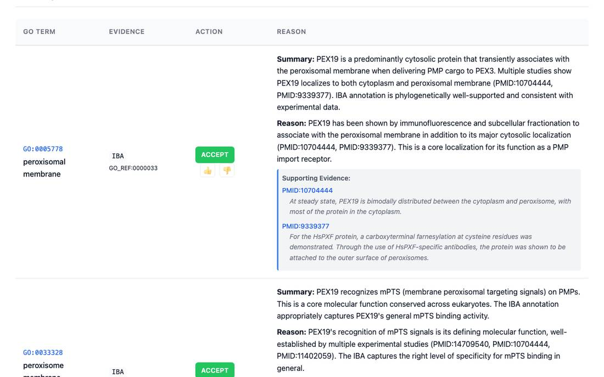
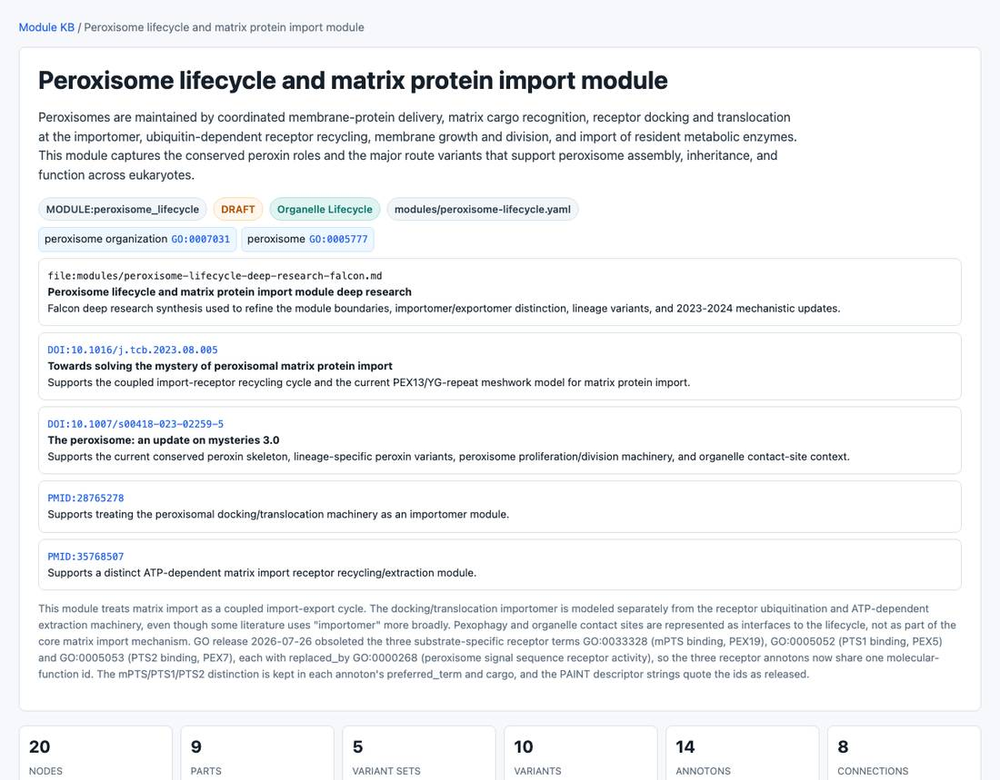

<!-- _class: lead -->

# Peroxisome biogenesis

Reviewing GO annotations for the 16 human PEX genes

AI Gene Review · projects/PEROXISOME · 2026

---

<!-- _class: bluf -->

## Bottom line

- Peroxins **insert membrane proteins, import matrix enzymes and divide the organelle**; their loss causes **Zellweger spectrum disorders**.
- We reviewed **all 828 GO annotations** on the **16 human PEX genes**: 579 accepted, 93 over-annotated, 64 removed, 11 NEW.
- The main problem was **generic `protein binding`**: 35 of PEX19's 37 removals and 17 of PEX5's 19 over-annotations.

---

## The machinery we reviewed

---

## Why peroxins

- A **closed, well-characterized set**: 16 genes, one organelle, a clinical readout (PEX1 alone accounts for about 65% of Zellweger cases).
- Each peroxin has **one job** in a cycle, which makes over-annotation easy to spot:
  - **guilt by cargo**: a receptor annotated to the metabolism of the enzymes it imports (PEX7 → ether lipid biosynthesis)
  - **guilt by phenotype**: knockout effects such as neuron migration or suckling behaviour (PEX13)
  - **interactome rows**: `protein binding` IPI from high-throughput screens

---

## Actions per gene

---

## What a review looks like

PEX19 review page: peroxisomal membrane and mPTS binding are accepted as core. Most of PEX19's 81 rows are `protein binding` IPI, and 35 of those were removed.

---

## Findings

1. **`protein binding` (GO:0005515)** is the largest single category of change across the set.
2. **PEX7** homodimerization (GO:0042803) marked over-annotated: the cited paper shows the WD40 repeats bind PTS2, not a dimer interface.
3. **PEX2** Cdc73/Paf1 complex and cell-proliferation phenotype rows **removed**.
4. **PEX14** β-tubulin binding kept as core; phase separation noted as an emerging model for the import pore.
5. **Cargo and phenotype processes** mostly kept as **non-core**, not removed.

---

## The peroxisome lifecycle module

modules/peroxisome-lifecycle.yaml: membrane insertion, docking, ubiquitination, ATP-driven receptor export and division as separate parts.

---

## Status and next steps

- ✅ 16/16 peroxins reviewed in three phases.
- ✅ Lifecycle module models the conserved peroxin roles and route variants.
- ⬜ GO obsoleted the PTS1, PTS2 and mPTS binding terms in favour of *peroxisome signal sequence receptor activity*; PEX5, PEX7 and PEX19 reviews are tracked in `projects/PEROXISOME_TARGETING_SIGNAL_OBSOLETION.md`.
- Candidates beyond scope: PEX5L, PEX39, the metabolic enzymes of the matrix.

**Read more:** `projects/PEROXISOME.md` · `modules/peroxisome-lifecycle.yaml`
