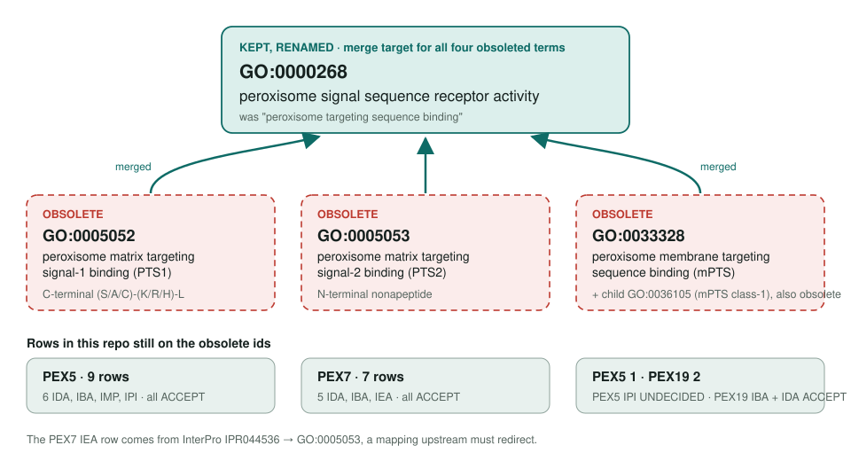
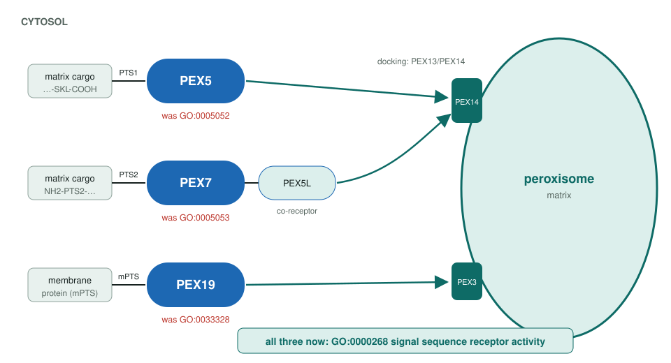

<!-- _class: lead -->

# Peroxisome targeting signal binding obsoletion

GO:0005052 · GO:0005053 · GO:0033328 · GO:0036105 → GO:0000268 peroxisome signal sequence receptor activity

AI Gene Review · projects/PEROXISOME_TARGETING_SIGNAL_OBSOLETION · 2026

---

<!-- _class: bluf -->

## Bottom line

- GO **obsoleted four signal-specific binding terms** (PTS1, PTS2, mPTS and its class-1 child) and merged them into the renamed parent **GO:0000268**.
- The change **landed** in GO release 2026-07-26 (OLS shows all four obsolete, `replaced_by` GO:0000268).
- **Refresh merged in #3233:** 18 ACCEPT rows in PEX5, PEX7 and PEX19 → MODIFY to GO:0000268; PEX5's mPTS row stays UNDECIDED; two peroxin–peroxin protein-binding rows drop their replacement (PEX5 → MARK_AS_OVER_ANNOTATED, PEX7 → REMOVE), since a peroxin contact is not signal recognition.

---

## Four obsolete terms, one parent

---

## Why the terms went

- Upstream reason: each child "represents a **specific substrate**", the signal sequence.
- One receptor class does the same job for each signal, so the **sequence type is beyond GO's scope**.
- The parent was renamed from *peroxisome targeting sequence binding* to a **receptor activity** term.
- Upstream tally: **45 annotations** affected (UniProt 30, SGD 5, UniProt-extensions 5, AspGD 2, ComplexPortal 2, GeneDB 1), plus the InterPro mapping **IPR044536 → GO:0005053**.

---

## The receptors keep their jobs

---

## What is in the repo today

| Gene | Obsolete term | Rows | Actions (#3233) |
|---|---|---|---|
| PEX5 | GO:0005052 | 9 (6 IDA, IBA, IMP, IPI) | ACCEPT → MODIFY GO:0000268 |
| PEX5 | GO:0033328 | 1 (IPI) | stays UNDECIDED (not an mPTS receptor) |
| PEX7 | GO:0005053 | 7 (5 IDA, IBA, IEA) | ACCEPT → MODIFY GO:0000268 |
| PEX19 | GO:0033328, GO:0036105 | 2 (IBA, IDA) | ACCEPT → MODIFY GO:0000268; core MF too |

Already on the parent GO:0000268: PEX5 (IDA, ACCEPT, old label) and PEX39 (IDA, MODIFY: PEX39 is a PTS2 co-receptor that does not bind cargo on its own).

---

## Next steps

1. Done in **#3233** (merged): 3 of 5 replacement terms and the PEX19 core MF point to GO:0000268; the other 2 are dropped.
2. Re-run `just fetch-gene` once GOA swaps the ids itself.
3. Note the IPR044536 redirect in the PEX7 review; leave SGD/AspGD orthologs to the broader peroxisome project.

**Upstream:** go-annotation#6401 · go-ontology#31419
**Read more:** `projects/PEROXISOME_TARGETING_SIGNAL_OBSOLETION.md` · `projects/PEROXISOME.md`
