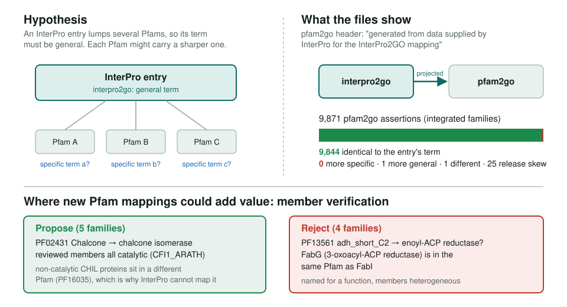
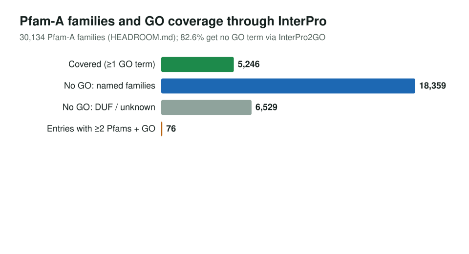

<!-- _class: lead -->

# Does pfam2go add precision?

Testing Pfam's GO mapping against InterPro2GO, and where new mappings could help

AI Gene Review · projects/PFAM · 2026

---

<!-- _class: bluf -->

## Bottom line

- **No hidden precision:** of 9,871 pfam2go assertions, 9,844 match the parent InterPro entry and **0 are more specific**. pfam2go is generated from InterPro2GO.
- **The real gap is coverage:** 24,888 of 30,134 Pfam-A families (**82.6%**) get no GO term through InterPro, including SH2 and EGF.
- We curated **9 Pfam families** as entries: **5 proposed** mappings, **4 rejected** on same-family counter-examples.

---

## Why ask

- Gene reviews lean on **InterPro2GO** (GO_REF:0000002) for IEA rows.
- An InterPro entry can **lump several Pfams**, so its term must cover all of them.
- If pfam2go kept sharper per-family terms, it would be a free source of precision.
- Method: map each Pfam to its parent entry via `interpro.xml` `<member_list>`, compare terms over the GO `is_a`/`part_of` DAG.

---

## Hypothesis versus files

---

## Part 1 result

| Category | Assertions | Families |
|---|---:|---:|
| SAME as InterPro entry | 9,844 | — |
| **MORE_SPECIFIC** | **0** | **0** |
| MORE_GENERAL | 1 | 1 |
| DISJOINT, genuine | 1 | 1 |
| DISJOINT, release skew | 25 | 13 |

The one genuine difference runs the other way: PF08214 has GO:0004402 while its entry IPR016849 has the more specific GO:0010484. Skew: InterPro 109.0 membership vs a 28 Apr 2026 GO mapping snapshot.

---

## Part 2: headroom is in coverage

Only 76 GO-bearing InterPro entries have ≥2 Pfam members, mostly redundant HMMs of one domain. Splitting lumped entries yields almost nothing.

---

## Nine Pfam entry reviews

| Proposed (5) | Rejected (4) |
|---|---|
| PF27512 LeuD: GO:0003861, GO:0009098 | PF14681 UPRTase: uridine kinases in family |
| PF02431 Chalcone: GO:0045430 | PF16363 GDP_Man_Dehyd: GALE, UXS1 in family |
| PF07228 SpoIIE: GO:0030435 | PF13360 PQQ_2: RqkA kinase, PedH in family |
| PF09043 Lys-AminoMut_A: GO:0047826 | PF13561 adh_short_C2: FabG beside FabI |
| PF16552 OAM_alpha: GO:0047831 | |

`interpro/pfam/<PFAM>/<PFAM>-review.yaml`, schema `pfam_entry_review.yaml`; all nine pass `just validate-pfam-reviews`. Proposals are candidates for curator validation.

---

## Status and next steps

- ✅ Part 1 and Part 2 scripts, committed results (`RESULTS.md`, `HEADROOM.md`)
- ✅ 9 curated Pfam entry reviews, validated
- ⬜ Author mappings for the ~18k named unmapped families (curation or grounded prediction)
- ⬜ Compare subfamily-grained sources (NCBIfam, PANTHER) against InterPro2GO

**Read more:** `projects/PFAM.md` · `projects/PFAM/HEADROOM.md` · `projects/PFAM/PROPOSED_MAPPINGS.md`
