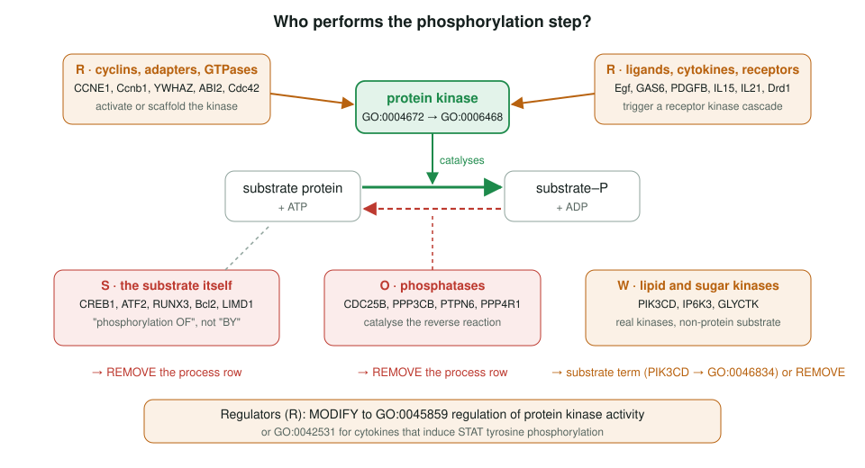
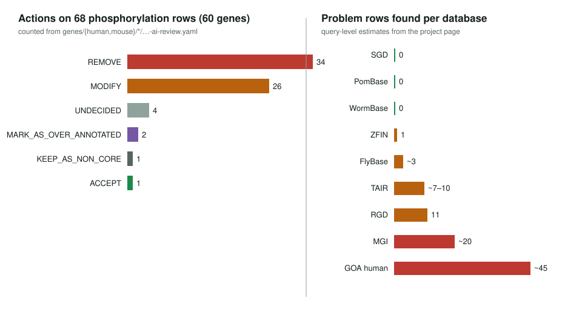

<!-- _class: lead -->

# Phosphorylation refactor

Finding genes annotated to "protein phosphorylation" that are not kinases

AI Gene Review · projects/PHOSPHORYLATION_REFACTOR · 2026

---

<!-- _class: bluf -->

## Bottom line

- Query: genes with a **phosphorylation process** term (GO:0016310 branch) but **no protein kinase activity** (GO:0004672), across **9 MODs**.
- **60 mouse and human genes** reviewed; of **68** flagged rows, **34 REMOVE** and **26 MODIFY** (mostly to GO:0045859 regulation of protein kinase activity).
- Errors cluster: **substrates** called enzymes, **regulators** called catalysts, **phosphatases** on the opposite reaction. SGD, PomBase and WormBase had **none**.

---

## Why this filter works

- A **kinase activity** MF annotation is a direct claim with strong evidence; it is rarely over-annotated.
- A **phosphorylation** BP annotation is heterogeneous: the gene may catalyse, regulate, scaffold, or **be** the substrate.
- So the set difference *BP phosphorylation minus MF kinase* is **a priori suspect**: cheap to compute in the GO DuckDB files, precise to review.
- Lipid and sugar kinases fall out of the same query as a separate class.

---

## Who performs the step?

---

## Error taxonomy

| Code | Error | Examples | Usual action |
|---|---|---|---|
| **S** | substrate annotated as enzyme | CREB1, ATF2, RUNX3, Bcl2, LIMD1 | REMOVE |
| **R** | regulator (cyclin, ligand, adapter) | CCNE1, GAS6, IL15, YWHAZ | MODIFY → GO:0045859 |
| **W** | lipid/sugar kinase on protein term | PIK3CD, IP6K3, GLYCTK | MODIFY or REMOVE |
| **O** | phosphatase, opposite reaction | CDC25B, PPP3CB, PTPN6 | REMOVE |
| **C** | scaffold of a kinase-bearing complex | COPS2, COPS8 | MODIFY |
| **U / A / X** | E3 ligase, ATPase, wrong PMID | MEX3B, MORC3, TOLLIP | REMOVE |

---

## Results

---

## Worked examples

- **CDC25B** (IDA, PMID:17332740): the paper calls it "the phosphatase required for activation of mitotic cyclin/Cdk1 complexes". A phosphatase on *protein phosphorylation* → **REMOVE**.
- **TOLLIP**: the cited PMID:1085432 is a 1976 lymphoma paper → **REMOVE** (wrong reference).
- **COPS2 / COPS8**: the COP9 signalosome co-purifies with CK2 and PKD; the PCI scaffold subunits do not phosphorylate → **MODIFY**.
- **ABI3**: the only **ACCEPT** is a NOT row: the paper found Abi-3 "had no such effect" on c-Abl phosphorylation.

---

## Status and next steps

- ✅ Mouse (15 genes) and human (45 genes) reviews in `genes/mouse/`, `genes/human/`.
- ⚠️ The page's per-gene lists predate later edits: Ang2, BIRC6 now **UNDECIDED**; ADM2 **REMOVE**; Egf, Ednra **over-annotated**; Drd1 **non-core**.
- ⬜ Fly, zebrafish, Arabidopsis, rat findings are **query-level only**; no reviews yet (e.g. TAIR TOPP4, RGD Ppp3cb, 29 TAIR IEA rows).
- ⬜ Feed the taxonomy back to GO as ISS-transfer and training guidance.

**Read more:** `projects/PHOSPHORYLATION_REFACTOR.md`
