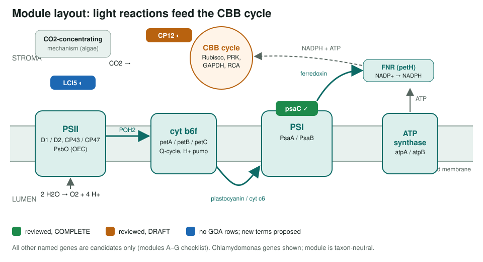
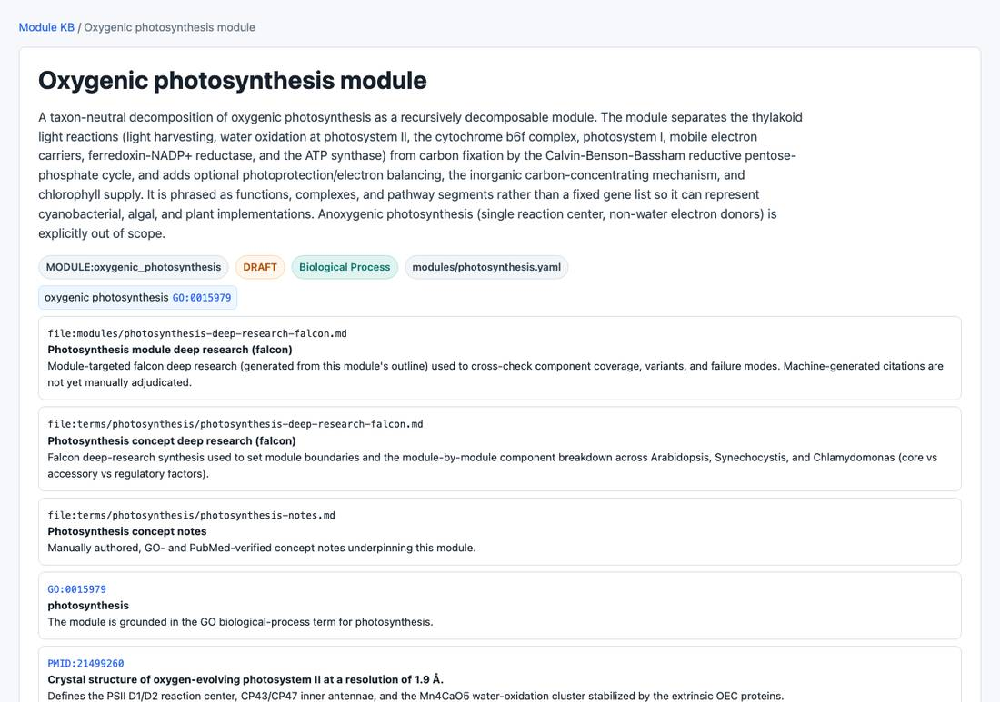

<!-- _class: lead -->

# Photosynthesis

Concept notes, a taxon-neutral module, and a candidate-gene checklist

AI Gene Review · projects/PHOTOSYNTHESIS · 2026

---

<!-- _class: bluf -->

## Bottom line

- Oxygenic photosynthesis moves electrons from **water → PSII → cyt b6f → PSI → NADP+** and spends NADPH + ATP fixing CO2 in the **CBB cycle**.
- First pass done: **concept notes**, falcon deep research, a **DRAFT photosynthesis module**, and a checklist over **7 functional modules**.
- **Gene reviews have not started** beyond three Chlamydomonas genes already in the repo: **psaC** (complete), **CP12** (draft), **LCI5** (draft).

---

## What the module covers

---

## Why concept first

- Photosynthesis spans cyanobacteria, algae and plants; no single organism is best for every part.
- Mixed strategy: **Synechocystis** (SYNY3) for reaction centres, **Chlamydomonas** (CHLRE) for CBB and CO2 concentration, **Arabidopsis** (ARATH) for antenna and photoprotection.
- Fixing the **GO representation** first avoids wrong-organism accessions and generic terms later.

---

## Annotation watch-points

- Prefer **GO:0019253** *reductive pentose-phosphate cycle* over broad **GO:0015977** *carbon fixation* for CBB enzymes.
- Reaction-centre subunits often inherit **GO:0009765** *light harvesting* or **GO:0016168** *chlorophyll binding* from pipelines: consider over-annotated / modify.
- Non-catalytic structural subunits (e.g. PsbO) may inherit catalytic MF terms from family rules.

---

## The module

modules/photosynthesis.yaml (DRAFT): light reactions, CBB cycle, photoprotection, CCM and pigment supply; identifiers grounded only where verified.

---

## The three seeded reviews

| Gene | Status | GOA Rows | Outcome |
|---|---|---|---|
| **psaC** (PSI Fe-S subunit) | COMPLETE | 9 | 5 accept, 2 over-annotated, 2 **removed** (generic metal ion binding, oxidoreductase) |
| **CP12** (CBB redox switch) | DRAFT | 11 | 6 accept, 2 non-core, 3 `protein binding` → *enzyme binding* |
| **LCI5** (CCM thylakoid protein) | DRAFT | 0 | no GOA rows; 7 tentative `NEW` rows |

---

## Status and next steps

- ✅ Concept notes, deep research, DRAFT module.
- ⬜ Module A PSII: psbA, psbD, psbB/C, psbO · Module B PSI: psaA/B
- ⬜ Module C electron transport: petA/B/C, petE, petF, petH, atpA/B
- ⬜ Modules D–G: LHCB1, PsbS; rbcL/S, rca, PRK, GAPDH; LCIA/B, CCM1; CHLH, POR
- ⬜ Candidate review pass tracked in ai-gene-review#3998

**Read more:** `projects/PHOTOSYNTHESIS.md` · `modules/photosynthesis.yaml` · `terms/photosynthesis/`
