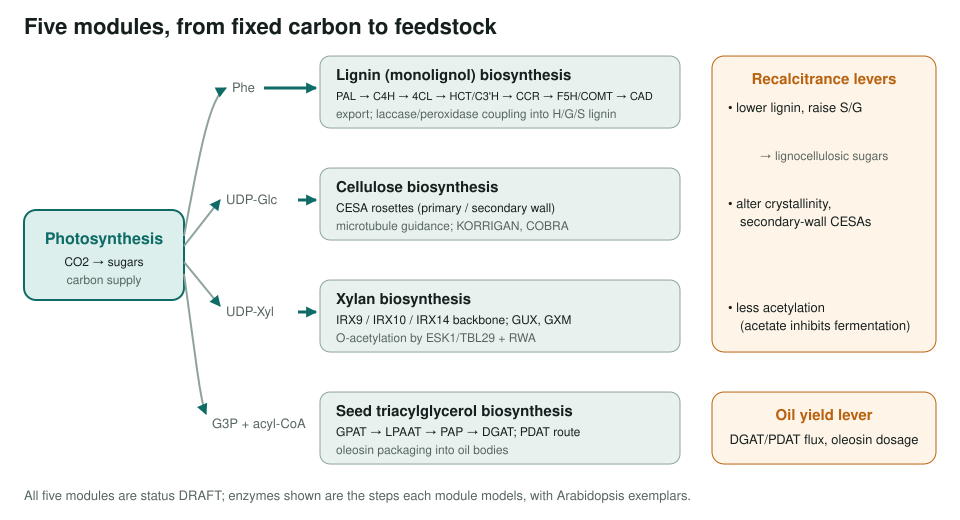
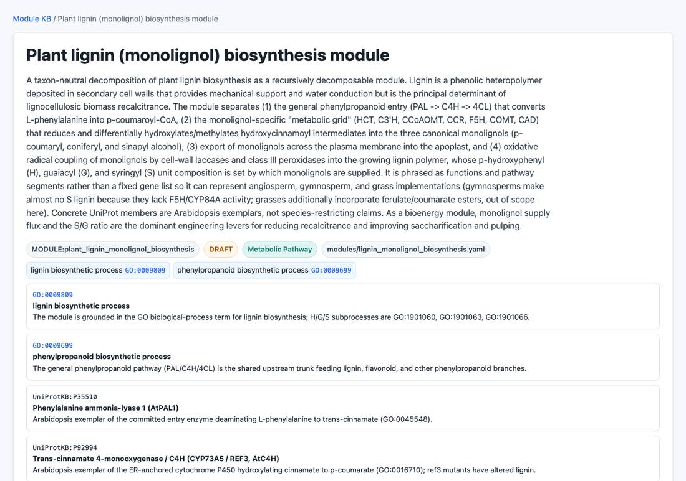

<!-- _class: lead -->

# Plant bioenergy modules

Taxon-neutral modules for cell-wall recalcitrance and seed oil

AI Gene Review · projects/PLANT_BIOENERGY · 2026

---

<!-- _class: bluf -->

## Bottom line

- Biofuel yield depends on **cell-wall recalcitrance** (lignin, xylan acetylation, cellulose crystallinity) and, for oilseeds, **triacylglycerol** flux and packaging.
- We curated **three new modules** (lignin, xylan, seed TAG; PR #2066) and grouped them with the existing **cellulose** and **photosynthesis** modules.
- All five validate and are **DRAFT**; together they ground **48 UniProt exemplars**. Feedstock-species gene reviews **have not started**.

---

## The five modules

---

## Why modules first

- The enzymes are well characterized in **Arabidopsis**, but the feedstocks are **poplar, sorghum, maize, rice, soybean**.
- A taxon-neutral module gives each later ortholog review a **shared, verified map** of steps and GO terms.
- Identifiers are grounded **only where verified**; members are exemplars, not species restrictions.

---

## Module inventory

| Module | Scope | UniProt exemplars | Status |
|---|---|---|---|
| Lignin (monolignol) | PAL → CAD grid, export, radical coupling | 14 | DRAFT |
| Xylan | IRX9/10/14 backbone, GUX, GXM, O-acetylation | 10 | DRAFT |
| Seed TAG | Kennedy pathway, PDAT, oleosins | 9 | DRAFT |
| Cellulose | CESA rosettes, KORRIGAN, COBRA | 9 | DRAFT |
| Photosynthesis | light reactions + CBB cycle | 6 | DRAFT |

Distinct UniProtKB ids counted in each modules/*.yaml.

---

## A module page

pages/modules/lignin_monolignol_biosynthesis.html: grounded in GO:0009809 lignin biosynthetic process, with Arabidopsis exemplars such as PAL1 and C4H.

---

## Engineering levers

| Use case | Module(s) | Lever |
|---|---|---|
| Lignocellulosic sugars | lignin, xylan, cellulose | lower lignin, raise S/G, less acetylation, alter crystallinity |
| Fewer fermentation inhibitors | xylan | reduce O-acetylation (acetate) |
| Biodiesel / oleochemicals | seed TAG | DGAT/PDAT flux, oil-body capacity |
| Feedstock productivity | photosynthesis | upstream carbon assimilation |

---

## Status and next steps

- ✅ Five modules curated and validated (all DRAFT).
- ⬜ Grass-specific modules: mixed-linkage glucan (CSLF/CSLH), arabinoxylan arabinosylation / feruloylation.
- ⬜ Suberin and cutin biosynthesis.
- ⬜ Per-gene reviews for poplar / sorghum orthologs of the exemplar enzymes.

**Read more:** `projects/PLANT_BIOENERGY.md` · `modules/{lignin_monolignol,xylan,seed_triacylglycerol,cellulose}_biosynthesis.yaml`
