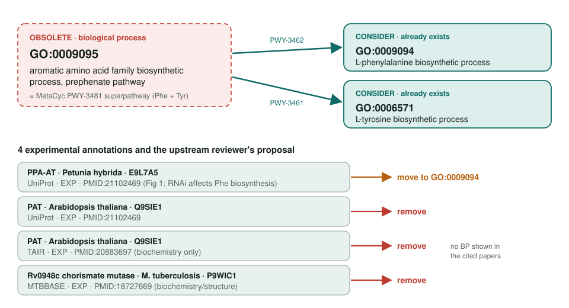
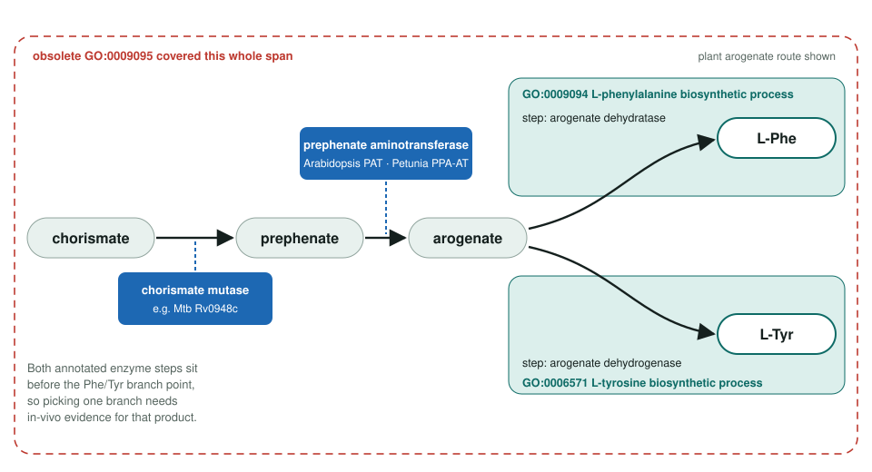

<!-- _class: lead -->

# Prephenate pathway obsoletion

GO:0009095 → GO:0009094 L-phenylalanine and GO:0006571 L-tyrosine biosynthetic process

AI Gene Review · projects/PREPHENATE_PATHWAY_OBSOLETION · 2026

---

<!-- _class: bluf -->

## Bottom line

- GO **obsoleted GO:0009095**, a pre-composed Phe + Tyr superpathway; the two component pathways already exist as separate terms.
- **4 experimental annotations** on 3 proteins must move; upstream proposes **removal for 3** and **GO:0009094 for Petunia PPA-AT**.
- **Scoped, not yet started:** none of the three proteins is reviewed in this repo.

---

## One superpathway, two existing terms

---

## Where the annotated enzymes act

---

## Why most rows are removals

- A move to a replacement is valid **only if the paper shows a role in Phe or Tyr biosynthesis** specifically.
- PMID:20883697 (Arabidopsis PAT) and PMID:18727669 (Rv0948c) are **biochemical or structural**: no process claim.
- Chorismate mutase acts **upstream of both branches**; mapping it to either needs in-vivo data.
- No InterPro2GO, UniProt keyword or UniRule mappings point at GO:0009095, so there is **no mapping fan-out**.

---

## Next steps

1. **Petunia PPA-AT (E9L7A5)** first: check Fig 1 of PMID:21102469 supports Phe specifically; record MODIFY → GO:0009094.
2. **Arabidopsis PAT (Q9SIE1)**: both rows, likely REMOVE.
3. **M. tuberculosis Rv0948c (P9WIC1)**: likely REMOVE.

Each starts with `just fetch-gene <organism> <gene>`.
**Upstream:** go-annotation#6395 + go-ontology#32005 (closed)
**Local tracker:** ai-gene-review#547
**Read more:** `projects/PREPHENATE_PATHWAY_OBSOLETION.md`
