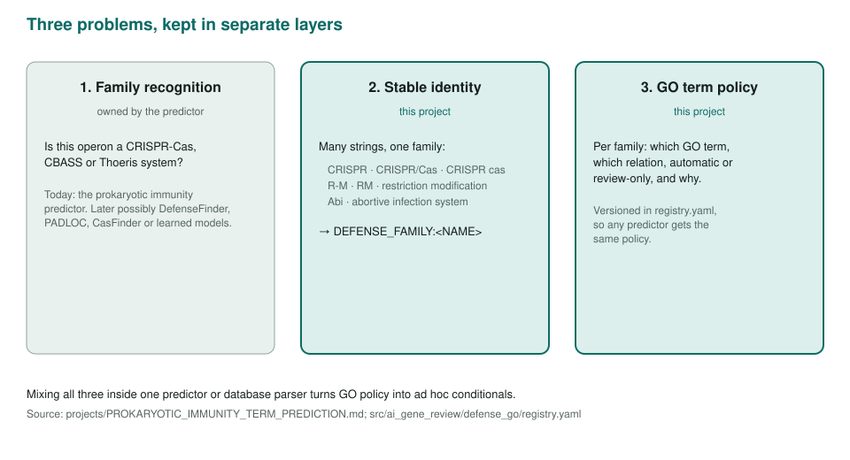
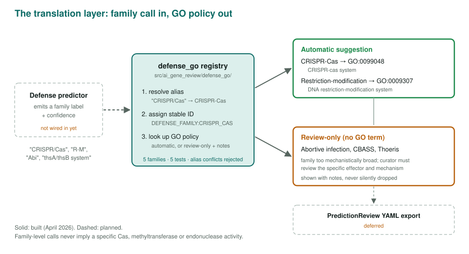

<!-- _class: lead -->

# Prokaryotic immunity term prediction

From anti-phage family calls to review-ready GO suggestions

AI Gene Review · projects/PROKARYOTIC_IMMUNITY_TERM_PREDICTION · scoping

---

<!-- _class: bluf -->

## Bottom line

- **Scoped, first unit built:** a registry that maps defense-family calls to stable IDs and a per-family GO policy.
- **Conservative:** only CRISPR-Cas (GO:0099048) and restriction-modification (GO:0009307) map automatically; abortive infection, CBASS and Thoeris are **review-only**.
- **Not connected yet:** no predictor or export code calls the layer.

---

## Why a separate layer

---

## How it works

---

## Status and next steps

- ✅ `defense_go` package, versioned `registry.yaml`, alias conflict detection, 5 tests (April 2026).
- ⬜ Wire into the prokaryotic immunity predictor branch.
- ⬜ Export suggestions as `PredictionReview` YAML.
- ⬜ More families and GO policies; evidence-code and provenance payloads.

**Read more:** `projects/PROKARYOTIC_IMMUNITY_TERM_PREDICTION.md` · `src/ai_gene_review/defense_go/` · `tests/test_defense_go.py`
