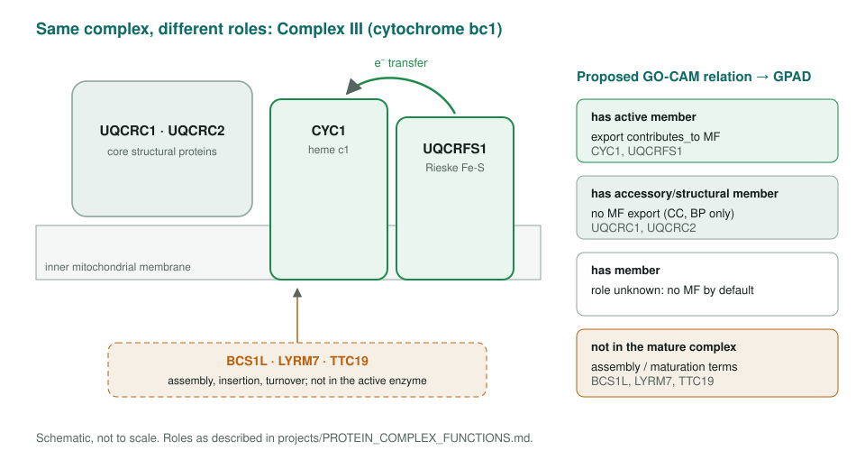
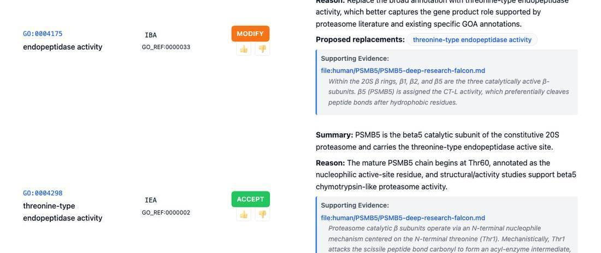
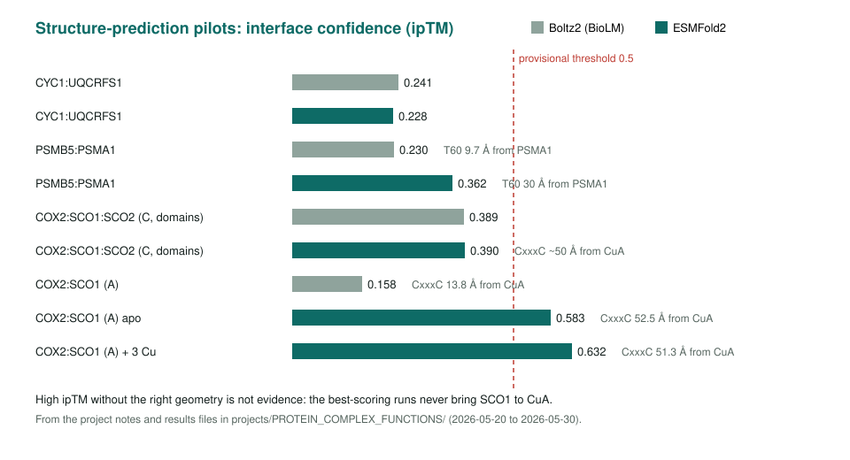

<!-- _class: lead -->

# Protein complex functions

Which subunits should carry a complex's molecular function?

AI Gene Review · projects/PROTEIN_COMPLEX_FUNCTIONS · 2026

---

<!-- _class: bluf -->

## Bottom line

- Complex activities get assigned to **every subunit**, turning membership into a false catalytic function.
- We wrote a **decision framework** and backed a GO-CAM split into **active** vs **accessory/structural** members, so only active members export MF.
- Tested on the proteasome (**PSMB5 vs PSMA1**) and BGC heterodimers; structure prediction gave **no curation-grade interface**.

---

## Same complex, different roles

---

## Working principles

1. Complex membership alone is **not evidence** for a molecular function.
2. Essential for an activity ≠ the **executor** of it.
3. `contributes_to` only for direct participants: catalytic core, electron relay, substrate binding, mechanical coupling.
4. Assembly factors get **assembly** terms unless they stay in the active complex.
5. Multi-activity complexes (ribosome, proteasome): assign roles **per activity**.

---

## A catalytic subunit, reviewed

PSMB5 (β5): threonine-type endopeptidase activity ACCEPTed; generic endopeptidase MODIFY to the specific term. Its alpha-ring partner PSMA1 carries no peptidase rows.

---

## Worked examples from BGC heterodimers

| Complex | Catalytic member (`enables`) | Partner's role |
|---|---|---|
| PqsBC | PqsC, acyltransferase | PqsB: `contributes_to` |
| Act KS-CLF | ActI-ORF1, polyketide synthase | CLF: chain-length factor |
| EryCII-EryCIII | EryCIII, glycosyltransferase | EryCII: `enzyme activator activity` |

All three had the catalytic MF on the non-catalytic partner in GOA via domain-signature propagation.

---

## Can structure prediction assign roles?

---

## Status and next steps

- Done: framework, rubric, GO-CAM export position, PSMA1/PSMB5 reviews, Boltz2 and ESMFold2 pilots.
- Open: **OXPHOS attribution matrix**; audit OXPHOS reviews for `contributes_to` and assembly-factor consistency; guidance for enrichment and ML-label users.

**Read more:** `projects/PROTEIN_COMPLEX_FUNCTIONS.md` · `projects/OXPHOS.md` · `projects/PROTEIN_COMPLEX_FUNCTIONS/esmfold2/`
